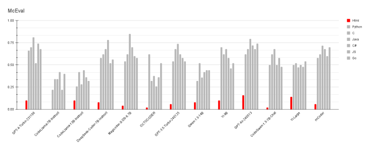

*DALL-E*

---

State-of-the-art language models (LLMs) have achieved outstanding results generating code for languages well represented in training data—Python, JavaScript, and others. Recent multilingual benchmarks tell a different story for **HTML**: model performance is significantly lower, and many evaluation suites (HumanEval, MultiPL-E) omit HTML altogether because automatic scoring is hard ([continue.dev on languages omitted from benchmarks](https://blog.continue.dev/llms-are-helpful-with-python-but-what-about-all-of-the-other-programming-languages/)).

Building on my earlier piece, [How to Train an AI to Use Your Own Design System](https://www.linkedin.com/pulse/how-train-ai-use-your-own-design-system-benjamin-maggi-8uyuf/), this article explores **why** HTML lags: syntactic rigidity, structural complexity, shallow tag semantics, benchmark effects, and practical paths to improve generation.

## The McEval gap

The [McEval](https://arxiv.org/abs/2311.16788) benchmark covers 40 languages. Even GPT-4 reaches only about **32% pass@1** on HTML tasks, versus **76%** on Python in the same evaluation. GPT-3.5 lands around **18–20%** on HTML—well below its scores on JavaScript or Java.

*McEval HTML performance compared to other languages*

That gap is not a footnote. It reflects real failure modes that show up the moment you ask a model to produce markup for a design system or a full page—not a twenty-line function.

## HTML’s syntactic constraints

HTML is a markup language with strict rules: tags must close, nesting must be valid, and many elements only belong in certain contexts. LLMs generate token by token without a built-in guarantee of grammatical correctness.

A single mistake—an unclosed `
`, a list item outside a list—can invalidate the entire output. In automated benchmarks, **any** deviation from the reference often scores zero, which drags averages down sharply.

Deep nesting makes this worse. Models that struggle with complex JSON hierarchies ([discussion on structured JSON with GPT-4](https://genai.stackexchange.com/questions/123/chatgpt-how-to-generate-structured-data-like-json-with-llm-models)) show analogous failures in HTML when they lose track of open tags across long spans.

Traditional languages have constraints too (braces, indentation), but models often handle them more reliably. Markup is structural, not executable—and balancing errors are common during free-form generation.

## Structural complexity

Beyond syntax, HTML pages are **deep trees**: sections, lists, tables, forms, nested containers. Coherence over hundreds of tokens is hard; the farther the model gets from an opening tag, the more likely a slip.

Many evaluated Python or JavaScript tasks are compact algorithms with clear start and end points. HTML asks for global planning—`<head>`, `<body>`, landmarks, nested components—without a compiler rejecting invalid structure mid-stream.

Practical studies note that LLMs are reliable for **simple** HTML fragments but degrade as document complexity grows ([GDELT on LLM code generators](https://blog.gdeltproject.org/the-challenges-of-llm-powered-code-generators-early-observations-from-the-trenches/)). A three-item list is easy; a multi-section page with navigation, forms, and tables is where coherence breaks.

## Semantic understanding of tags

Good HTML is not only valid—it is **meaningful**. A prompt for “a navigation bar with links” should yield `<nav>` and a list structure, not a pile of paragraphs with anchor tags that happen to work in a browser.

LLMs lack visual and usability grounding. They may reach for a table for layout when a form is required, or pick the wrong landmark element, because training examples surface superficial patterns rather than intent.

[MultiCodeBench](https://arxiv.org/abs/2406.12316) evaluates LLMs across application domains; **web development** (HTML/JS) was among the weakest for GPT-4 (~34.5% success), while desktop or blockchain domains scored higher (~40–47%). Front-end generation is harder than back-end logic not because the syntax is impossible, but because **structure and semantics** must align with human expectations.

Tags are not interchangeable: `<header>` and `<aside>` carry different meaning. Nesting rules (`<li>` inside lists) are strict. Syntactically valid output that misses the intended organization still fails rigid benchmark comparisons—and frustrates developers using design systems.

## Evaluation rigidity

Part of the measured gap is **how** we score HTML. Python correctness often reduces to unit tests and expected outputs. HTML “correctness” is more subjective: many structures can render similarly yet differ from a single reference solution.

Benchmarks that penalize any deviation disproportionately hurt markup languages, where multiple valid implementations exist. That does not excuse model failures—but it explains why HTML looks worse on paper than it might in a human review.

## Paths to better HTML generation

Several strategies can close the gap:

**Domain-specific training or fine-tuning.** More well-formed HTML in training—or targeted fine-tuning—sharpens adherence to markup conventions. [Understanding HTML with Large Language Models](https://openreview.net/forum?id=8OysIfWad2) (Gur et al., EMNLP 2023) shows models fine-tuned on web interaction data solving substantially more tasks with far less data than prior baselines.

**Grammar-guided decoding.** Constrain generation with a valid HTML grammar (similar to JSON schema enforcement) so unbalanced tags never appear. Inline validators during decoding reduce trivial syntax errors, even if deeply nested structures remain challenging.

**Task decomposition and scaffolding.** Ask for an outline first, then generate section by section. Provide an HTML5 skeleton and have the model fill inner content—models often perform better completing code inside a template than inventing global structure from scratch (as practitioners in [r/ChatGPTCoding](https://www.reddit.com/r/ChatGPTCoding/) often note when discussing templates and scaffolding).

Combine templating (common in web frameworks) with LLMs: generators emit structure; models enrich content and semantics.

**Iterative feedback and validation.** Run output through an HTML5 validator or a second pass that reports “unclosed `<ul>`” and let the model fix it—Self-Refine-style loops exploit the fact that LLMs often **edit** code more reliably than they **author** it perfectly on the first try.

## Conclusions

LLM performance is uneven across languages, and **HTML is a consistent weak spot**. Strict syntax, hierarchical structure, semantic tag choice, and evaluation metrics that treat markup like algorithmic code all contribute. Web tasks challenge models more than many back-end domains—a pattern visible in McEval, MultiCodeBench, and everyday design-system workflows.

The gap is closable: domain-aware training, constrained decoding, scaffolding, and validation loops already show gains in research and practice. As benchmarks and datasets for web markup mature—and as structural tooling pairs with linguistic capability—HTML generation should approach the reliability models already demonstrate in Python and JavaScript.

## References

- Chai, Linzheng, et al. [McEval: Massively Multilingual Code Evaluation](https://arxiv.org/abs/2311.16788) (2023).
- continue.dev. [LLMs are helpful with Python, but what about all of the other programming languages?](https://blog.continue.dev/llms-are-helpful-with-python-but-what-about-all-of-the-other-programming-languages/) (2023).
- GDELT Project. [The Challenges Of LLM-Powered Code Generators: Early Observations From The Trenches](https://blog.gdeltproject.org/the-challenges-of-llm-powered-code-generators-early-observations-from-the-trenches/) (2023).
- Zheng, Dewu, et al. [How Well Do LLMs Generate Code for Different Application Domains?](https://arxiv.org/abs/2406.12316) (MultiCodeBench, 2024).
- Gur, Izzeddin, et al. [Understanding HTML with Large Language Models](https://openreview.net/forum?id=8OysIfWad2) (EMNLP 2023).
- GenAI Stack Exchange. [How to generate structured data like JSON with LLM models?](https://genai.stackexchange.com/questions/123/chatgpt-how-to-generate-structured-data-like-json-with-llm-models) (2023).

---

Published originally on [LinkedIn](https://www.linkedin.com/pulse/decoding-html-overcoming-semantic-challenges-llm-code-benjamin-maggi-ftnuf/).
