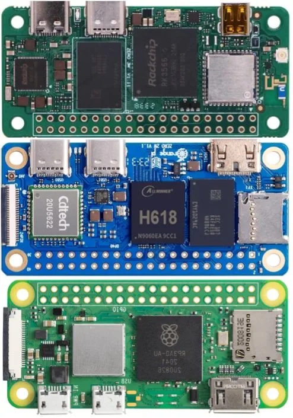

*Small SBC*

---

En la guerra de las SBC yo prefiero la **Raspberry Pi Zero 2 W**. Sus specs son modestos (se lanzó en 2021), pero la elijo por lo que hay detrás: una comunidad enorme, un ecosistema maduro y un precio muy accesible.

## Qué me gustaría ver en la próxima versión

- Un procesador más rápido y eficiente
- Más memoria—más rápida y eficiente—empezando con 1 GB
- Mejor GPU, por ejemplo con hardware encoding de AV1
- Puertos USB-C
- Una NPU, para acelerar modelos CNN e incluso pequeños LLM

Y sobre todo, **al mismo precio**.

---

En los comentarios del [post original](https://www.linkedin.com/posts/maggiben_en-la-guerra-de-las-sbc-yo-prefiero-a-la-activity-7321184372487794691-AHTY), [Cesar Casas](https://www.linkedin.com/) planteó un proyecto que me resonó: un robot con LLM y síntesis de voz, micrófono amplificado, sin depender de WiFi, con SSH para actualizar el software—"uno de esos proyectos que nunca termino porque nunca tengo tiempo." Suena exactamente al tipo de cosa que una Pi con NPU haría más plausible.

Publicado originalmente en [LinkedIn](https://www.linkedin.com/posts/maggiben_en-la-guerra-de-las-sbc-yo-prefiero-a-la-activity-7321184372487794691-AHTY).
