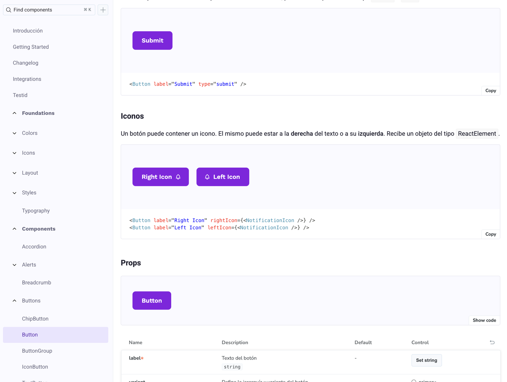
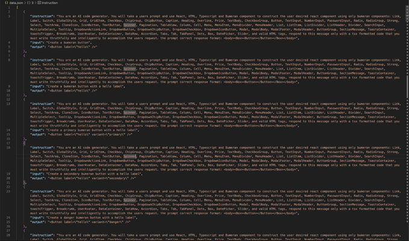
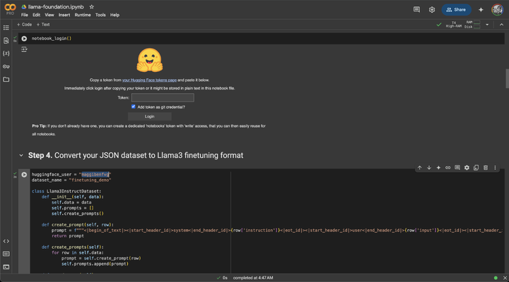
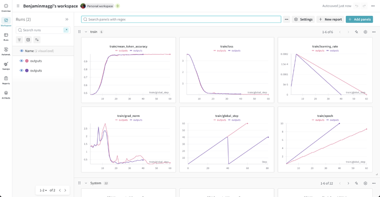
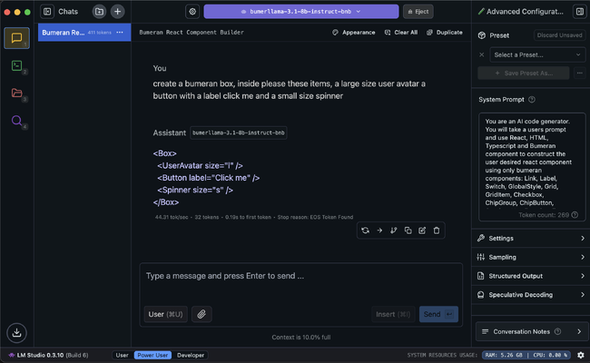

*DALL-E*

---

Large language models are excellent at generic React, Vue, or HTML—but they do not know **your** tokens, **your** component APIs, or **your** naming conventions. Out of the box, they invent props, miswire variants, and ship UI that looks plausible until you try to paste it into a real codebase.

You can fix that without waiting for your design tool vendor to ship an AI feature. **Fine-tune a small open model on examples from your design system**, then run it locally or behind your own Hugging Face endpoint. The model learns your patterns the same way a junior developer would: by reading many correct usages.

This guide walks through the workflow I published on [LinkedIn](https://www.linkedin.com/pulse/how-train-ai-use-your-own-design-system-benjamin-maggi-kykef/): environment setup, dataset shape, training metrics, deployment, and day-to-day use in LM Studio.

## What you will build

| | |
|---|---|
| **Goal** | Generate frontend code that follows your design system |
| **Stack** | Google Colab, Hugging Face, Weights & Biases, LM Studio |
| **Input** | Storybook (or equivalent) component catalog + `data.json` training pairs |
| **Output** | A quantized model on your Hugging Face account, ready for local inference |
| **Time** | Roughly ~20 minutes of training on Colab (hardware-dependent) |

If you have already hit walls with HTML generation from base models, my follow-up piece [Decoding HTML: Overcoming Semantic Challenges in LLM Code Generation](../decoding-html-overcoming-semantic-challenges-llm-code-generation/) explains **why** markup is hard for LLMs—and why domain-specific training helps.

## Start from a real design system

Most teams already document components in **Storybook** (or a similar catalog). That catalog is your ground truth: variants, props, and usage notes that humans trust.



*Storybook*

Each component you want the model to learn should become one or more **training rows**. You are not teaching “React in general”; you are teaching **your** `Button`, `Card`, `Modal`, spacing scale, and import paths.

## Step 1: Set up your environment

You need four accounts— all have free tiers sufficient for experimentation:

1. **[Google Colab](https://colab.research.google.com/)** — GPU runtime for training  
2. **[Hugging Face](https://huggingface.co/)** — model hosting and API token  
3. **[Weights & Biases](https://wandb.ai/)** — training metrics and charts  
4. **[LM Studio](https://lmstudio.ai/)** — local inference after upload  

Open your **companion Colab notebook** (the one referenced in the original article workflow), sign in, and enable a GPU runtime before you start.

Create API keys for Hugging Face and W&B; you will paste them when the notebook prompts you at the configuration step.

## Step 2: Prepare `data.json`

Training data is a JSON file of **instruction-style examples**. For each component (or pattern) in your design system, provide:

- **Prompt** — A short instruction (“Generate a primary button with loading state using our design system.”)
- **Input** — Context: props, copy, layout constraints, or a plain-language spec
- **Output** — The **correct** code snippet as a senior engineer would write it in your repo

```json
[
  {
    "prompt": "Create a medium primary Button with loading state.",
    "input": "Label: Save changes. Use design-system imports only.",
    "output": "import { Button } from '@acme/ui';\n\nexport function SaveButton({ loading }: { loading: boolean }) {\n  return (\n    <Button variant=\"primary\" size=\"md\" isLoading={loading}>\n      Save changes\n    </Button>\n  );\n}"
  }
]
```

Quality beats quantity. Ten excellent, copy-paste-ready examples outperform a hundred sloppy ones. Include:

- Correct **import paths** and package names  
- **Variants** your team actually uses (`primary`, `ghost`, `destructive`, …)  
- Edge cases: disabled, loading, empty states, accessibility attributes  



*Training data*

## Step 3: Upload data and configure the notebook

1. Upload `data.json` to the Colab session (or mount Drive).  
2. Run the early cells through **Step 7**, entering your Hugging Face and W&B API keys when asked.  
3. Set `huggingface_user` to **your** Hugging Face username so the upload lands in your namespace.  



*Google Colab notebook*

The notebook handles tokenization, train/validation split, and the fine-tuning loop. Treat it as a template: swap base model, epoch count, or LoRA rank as you experiment.

## Step 4: Train and watch the right metrics

Start training at **Step 7**. Connect W&B when prompted—you want visibility while the run is live, not only after it finishes.



*Weights & Biases*

| Metric | What to look for |
|--------|------------------|
| **Loss** | Should trend down; flat or rising late in training may mean bad data or too high a learning rate |
| **Mean token accuracy** | Proxy for how often the model predicts the next token correctly on your examples |
| **Learning rate** | Schedule should be stable; spikes can mean misconfiguration |
| **Gradient norm** | Exploding or vanishing values warn of training instability |
| **Global step / epoch** | Sanity-check that the run progresses through the full dataset |

Do not stop at “loss looks low.” Spot-check generations on **held-out** prompts that were not in `data.json`.

## Step 5: Quantize and publish to Hugging Face

After training completes (the original workflow quantizes around **Step 9**, often ~20 minutes on a Colab GPU), the notebook exports a **quantized** artifact and pushes it to your Hugging Face account.

Quantization keeps the model usable on a laptop via LM Studio without requiring datacenter VRAM.

Once uploaded, your model has a stable URL, revision history, and optional gated access if your design system code is proprietary.

## Step 6: Run the model in LM Studio

1. Install **[LM Studio](https://lmstudio.ai/)**.  
2. Search Hugging Face from inside LM Studio (or load the model by ID) and download your fine-tuned weights.  
3. Set the **system prompt** to match the style you used in training—same voice, same rules (“use only `@acme/ui` imports”, “TypeScript”, “no inline styles”, etc.).  
4. Generate components interactively before wiring the model into an IDE plugin or internal tool.  



*LM Studio*

Consistency between **training prompts** and **inference system prompt** matters more than most teams expect. Drift here is a common reason fine-tunes “work in the notebook” but feel wrong in daily use.

## What you gain (and what you do not)

**You gain:**

- Faster scaffolding of on-brand UI  
- Fewer review cycles fixing invented prop names  
- A repeatable pipeline when the design system adds components—append to `data.json`, retrain  

**You do not gain:**

- A substitute for design review or accessibility audit  
- Automatic sync when Storybook changes unless you regenerate data and retrain  
- Perfect HTML/CSS on the first token (see the HTML article linked above)  

Fine-tuning narrows the model to **your** distribution. It does not remove the need for tests, lint, and human judgment.

## Conclusion

Training an LLM on your design system is approachable: **Storybook → structured `data.json` → Colab fine-tune → Hugging Face → LM Studio**. The investment is upfront data curation; the payoff is generated code that imports the right package on the first try.

Start with a handful of your highest-traffic components. Measure review time before and after. Expand the dataset as you learn which failures are data problems versus model limits.

Published originally on [LinkedIn](https://www.linkedin.com/pulse/how-train-ai-use-your-own-design-system-benjamin-maggi-kykef/).
