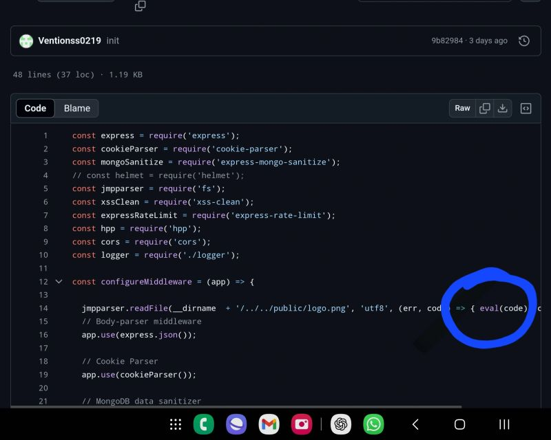
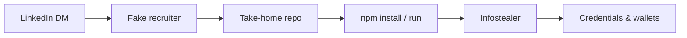

---

A message arrives from a **premium** LinkedIn profile. The role pays well above market. The process moves fast: a short chat, then a **technical screen**—please clone this repo and fix a few bugs before tomorrow.

That almost happened to me.

I did not run the code on my daily machine. Others were not as lucky. What looks like a normal hiring loop is, for many developers right now, **[Operation Dream Job](https://www.hoganlovells.com/en/publications/north-korealinked-threat-actors-falsified-companies)** and the related **[Contagious Interview](https://www.validin.com/blog/inside_dprk_fake_job_platform/)** campaigns: North Korea–linked actors posing as recruiters to deliver malware through **take-home assignments and “skill tests.”**

The [LinkedIn thread](https://www.linkedin.com/posts/maggiben_north-korea-operation-dream-job-is-still-activity-7316217571509215233-Z4WE) that prompted this post is still relevant—**premium and verified badges are not proof of humanity or intent.**

## How the scam works

The playbook is repeatable because it mirrors real hiring:

1. **Approach** — LinkedIn DM or email; polished profile; sometimes a stolen or purchased **Premium** account so the message feels legitimate.  
2. **Hook** — Remote role, strong compensation, urgent timeline. Flattery helps.  
3. **“Skill test”** — Clone a private GitHub repo, debug a small Node.js or Python app, run `npm install` / `pip install`, complete a take-home.  
4. **Payload** — Malware in dependencies, post-install scripts, or “fix this bug” branches. Infostealers target **browser passwords**, **session cookies**, and **crypto wallet extensions** (campaigns such as **BeaverTail** and **InvisibleFerret** have been widely reported in this context—see [DevOps.com](https://devops.com/north-korean-bad-actors-fake-job-offer-scam-targets-developers/) and [SecurityOnline](https://securityonline.info/north-korean-threat-actors-targeting-tech-job-seekers-with-contagious-interview-campaign/)).  
5. **Silence** — Ghosted after you run the code; your machine is the product.

A comment on my post described the same shape: download a **Node.js ecommerce** repo for a debugging exercise—code built to steal **Chrome passwords** and **blockchain wallet private keys** when present. That is not a failed interview; it is theft.

## Why developers are targeted

- We **run untrusted code** for a living—it is the job.  
- Take-homes are **normalized**; saying no can feel like losing an opportunity.  
- Many of us keep **high-value secrets** on the same laptop: SSO sessions, API keys, password managers, browser extension wallets.  
- **AI and crypto** talent is explicitly hunted in recent reporting ([Validin on fake job platforms](https://www.validin.com/blog/inside_dprk_fake_job_platform/)).

Attackers do not need to exploit your employer. They need five minutes on your **personal** dev environment.

## Red flags (beyond “it felt off”)

| Signal | Why it matters |
|--------|----------------|
| Repo hosted on a **new** or **forked** org with little history | Disposable infrastructure |
| Urgency—“complete by EOD” | Pressure reduces review |
| Interview only over **chat**; no call on a **corporate domain** | Harder to verify employer |
| **Premium / Verified** sender | Badge verifies payment or ID, not morality |
| Instructions to run on your **main machine** | Maximizes yield for the attacker |
| `postinstall` scripts, obfuscated JS, or “run this setup binary” | Classic delivery path |
| Job title **too good** + process **too fast** | Bait |

None of these is proof alone. Together they should trigger a **pause**, not a `git clone`.

## How to protect yourself

**Treat every take-home as untrusted software**—because it is.

1. **Never on your primary machine** — Use a **disposable VM** (your [homelab](../the-lab-home-server-setup-learning-homelab/) is perfect for this), a cloud sandbox, or a dedicated “burner” laptop with no passwords, no wallets, no corporate SSO.  
2. **Read before you run** — `package.json` scripts, `Makefile`, `.npmrc`, GitHub Actions, anything executable. Search for `postinstall`, `curl | bash`, base64 blobs.  
3. **Verify the company out-of-band** — Official careers page, known domain email, recruiter listed on the company site. Call the main switchboard if needed.  
4. **Insist on a live video call** early — With people who can answer specifics about the team, product, and office—not only text.  
5. **Say no to local admin / wallet access** — If they need “realistic” debugging, offer a screen share **from the VM** or a sanitized snapshot.  
6. **Use a fresh browser profile** in the VM — No extensions, no saved logins.  
7. **Snapshot and destroy** — Revert the VM after the exercise; do not reuse it for email or banking.

If a legitimate employer cannot accept “I will do this in an isolated environment,” that is useful data about their security culture—or about the scam.

## What “verified” does and does not mean

LinkedIn **Premium** and **Verified** features increase visibility and trust signals. They do **not** guarantee:

- That the account was not **compromised**  
- That the person works where they claim  
- That the repository is safe to execute  

**Do not trust anybody because they are premium or verified.** Trust process: verifiable employer, proportionate ask, safe execution environment.

## If you already ran something suspicious

- Disconnect from the network; **do not** “just restart.”  
- Assume **browser profiles, password managers, and wallet extensions** on that machine are compromised.  
- Rotate passwords and **revoke sessions** from a **different** device.  
- Move crypto assets if wallets were ever on that host.  
- Report to your employer’s security team if work data touched the machine.  
- Preserve artifacts (repo URL, hashes, screenshots) for reporting.

## Why this is still worth talking about

These campaigns are **active**, evolving, and aimed at the same people reading job posts between commits. Security teams track **Contagious Interview** and related names; many applicants never hear them until it is personal.

I nearly became a footnote in someone else’s incident report. The only difference was habit: **untrusted code does not run where I live.**

If you are hiring: offer **structured assessments** that do not require arbitrary `npm install` on a candidate’s daily driver—or provide a **sandbox**. If you are applying: **your career is not worth one reckless clone.**

Stay skeptical. Use a VM. Verify the company. The dream job that needs your wallet is not a job.

Published originally on [LinkedIn](https://www.linkedin.com/posts/maggiben_north-korea-operation-dream-job-is-still-activity-7316217571509215233-Z4WE).
