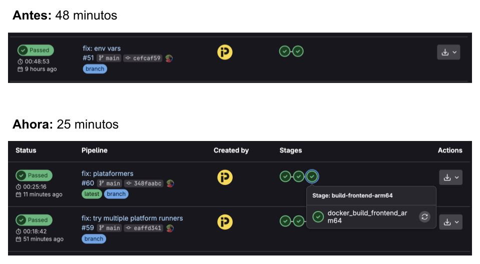

*GitLab Pipelines*

---

Tenía un cuello de botella silencioso en CI: **compilar y testear para arm64 en un runner amd64**.

Funciona—con QEMU, buildx, o imágenes multi-arch emuladas—pero cada job paga el impuesto de la emulación: más CPU, más minutos facturables, más espera en cada push.

La solución no fue un cluster nuevo ni un plan más caro. Fue una **Raspberry Pi** registrada como **GitLab Runner** y etiquetada para jobs `arm64`. Los builds corren en su arquitectura nativa; los de `amd64` siguen en el runner de siempre.

**Resultado:** tiempos de pipeline **aproximadamente a la mitad** en el tramo que antes emulaba ARM.

## Antes vs ahora

| | Antes | Ahora |
|---|--------|--------|
| **arm64** | Emulación en runner amd64 | Runner nativo en Raspberry Pi |
| **amd64** | Runner cloud / x86 | Sin cambio |
| **Coste** | Minutos de CI + CPU emulada | Hardware que ya tenías (o cuesta poco) |
| **Fidelidad** | “Casi” la misma arquitectura | La misma que muchos edge devices y SBC en prod |

La regla es simple: **cada arquitectura en su metal**. No mezclar si podés evitarlo.

## Cómo lo monté

### 1. Instalar GitLab Runner en la Raspberry Pi

En la Pi (Raspberry Pi OS 64-bit, arm64):

```bash
# Seguir la guía oficial para tu distro:
# https://docs.gitlab.com/runner/install/linux.html
curl -L "https://packages.gitlab.com/install/repositories/runner/gitlab-runner/script.deb.sh" | sudo bash
sudo apt-get install gitlab-runner
```

Registrar el runner contra tu instancia GitLab (gitlab.com o self-hosted):

```bash
sudo gitlab-runner register
```

Durante el registro:

- **URL:** la de tu GitLab
- **Token:** el de *Settings → CI/CD → Runners* del proyecto o grupo
- **Executor:** `docker` (o `shell` si preferís builds sin contenedor)
- **Tags:** por ejemplo `arm64`, `raspberry-pi` — **esto es lo importante**

### 2. Etiquetar y usar el runner en `.gitlab-ci.yml`

Jobs que deben correr en ARM llevan el tag del runner. El resto sigue en `amd64` (o sin tag, según tu configuración por defecto).

```yaml
# Build / test nativo arm64 — solo en la Pi
build:arm64:
  tags:
    - arm64
    - raspberry-pi
  image: arm64v8/node:20-bookworm
  script:
    - npm ci
    - npm run build
    - npm test

# Jobs x86 en el runner habitual
build:amd64:
  tags:
    - amd64
  image: node:20-bookworm
  script:
    - npm ci
    - npm run build
    - npm test
```

GitLab enruta cada job al runner con tags coincidentes. Sin tag `arm64`, el job no cae en la Pi por accidente.

### 3. Afinar (opcional pero útil)

- **Cache de dependencias** (`npm`, Docker layer cache) en volumen local de la Pi.
- **`concurrent`** en `config.toml` acorde a RAM (una Pi no es un datacenter; 1–2 jobs paralelos suele ser sensato).
- **Runner solo para arm64** — no mezclar jobs pesados de amd64 en la misma máquina.

## Por qué funciona tan bien

La emulación no es “lenta porque sí”: traduce instrucciones, infla CPU y a veces rompe edge cases (binarios nativos, tests que asumen arquitectura). Un runner **arm64 real** elimina esa capa.

Para equipos que publican contenedores multi-arch, imágenes para Raspberry Pi, o firmware en ARM, el beneficio es doble: **menos minutos** y **menos sorpresas** del tipo “pasó en CI emulado y falló en el dispositivo”.

## Cuándo tiene sentido (y cuándo no)

**Tiene sentido si:**

- Una parte relevante de tus builds o tests es `arm64`
- Tenés una Pi (o SBC arm64) estable en red y con alimentación fiable
- Querés bajar minutos de CI sin subir de tier en el proveedor

**Pensalo dos veces si:**

- Solo construís para `amd64`
- Necesitás runners con mucha RAM o GPU — la Pi tiene límites claros
- No podés mantener el hardware (SD desgastada, cortes de luz)

## En resumen

No hace falta infraestructura exótica: **GitLab Runner + tags + una Raspberry Pi** alcanzan para que arm64 deje de emularse en amd64.

Antes emulaba. Ahora compilo donde el binario va a vivir. Los pipelines lo agradecen.

Publicado originalmente en [LinkedIn](https://www.linkedin.com/posts/maggiben_use-una-raspberry-pi-para-bajar-los-tiempos-activity-7326638941367922690-oPUC).
