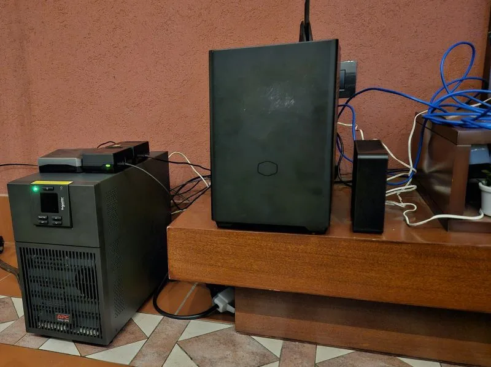
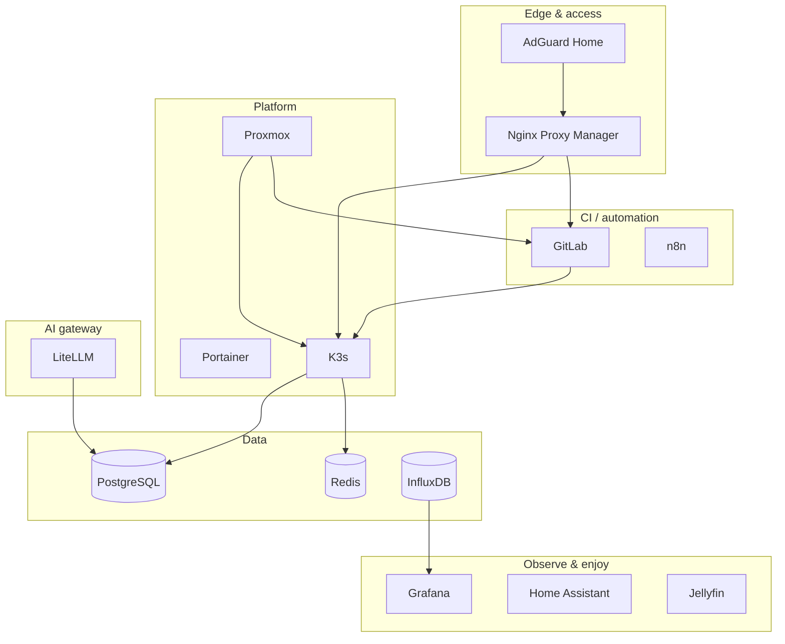

**The lab**

---

I posted a simple list on [LinkedIn](https://www.linkedin.com/posts/maggiben_the-lab-proxmox-adguard-nginx-proxy-manager-activity-7331369904568176640-jRTT): the services running in **the lab**—my home server. No pitch deck, no architecture diagram in the thread. Just names.

That list is more than software. It is a **private datacenter** where I break things safely, learn for free, and ship experiments that would cost real money in the cloud.

If you are a developer curious about DevOps, Kubernetes, networking, or automation, a home server is one of the highest-leverage investments you can make—not for mining or nostalgia, but for **education you own**.

## What “the lab” is

**The lab** is a homelab: infrastructure I run at home on hardware I control. The hypervisor is **Proxmox**; everything else is VMs or containers on top. I can snapshot before a bad upgrade, clone a service to test a migration, and reboot the router without filing a support ticket.

It is the opposite of a disposable cloud trial that expires in 30 days. The lab stays up, accumulates scars, and teaches you how production actually feels—messy dependencies, DNS that lied, disks that filled at 2 a.m.

## The stack (and what each piece teaches)

| Service | Role in the lab | What you learn by running it |
|---------|-----------------|------------------------------|
| **Proxmox** | Hypervisor, VMs, backups | Virtualization, storage, snapshots, VLANs |
| **AdGuard Home** | DNS filtering on the LAN | DNS, DHCP integration, privacy, blocklists |
| **Nginx Proxy Manager** | Reverse proxy + TLS | HTTPS, host routing, certificates |
| **Portainer** | Docker UI (where used) | Containers without jumping straight to K8s |
| **GitLab** | Git + CI/CD | Pipelines, runners, registries ([ARM runner on a Pi](../raspberry-pi-gitlab-runner-arm64-ci-mitad-tiempo/) included) |
| **K3s** | Lightweight Kubernetes | Deployments, services, ingress, Helm—without a managed control plane bill |
| **n8n** | Workflow automation | Integrations, webhooks, event-driven glue |
| **LiteLLM** | LLM API gateway | Routing models, keys, quotas—AI infra on your terms |
| **PostgreSQL** | Relational data | Backups, migrations, connection pooling in real apps |
| **Redis** | Cache / queues | Ephemeral state, pub/sub, performance patterns |
| **InfluxDB** + **Grafana** | Metrics & dashboards | Time series, alerting, SRE instincts |
| **Home Assistant** | Smart home hub | MQTT, automations, local-first IoT |
| **Jellyfin** | Media server | Storage, transcoding, LAN streaming—the “fun” workload that keeps you honest about bandwidth |

None of this requires an enterprise license. Almost everything on the list is **open source** or free for personal use. You pay for power, hardware, and your time—not per-vCPU billing anxiety.

## Benefits you do not get from tutorials alone

**1. End-to-end ownership**  
In the cloud, networking, DNS, and certificates are often pre-chewed. At home, *you* connect AdGuard → NPM → the service. When it breaks, you learn the full path a packet takes.

**2. Safe failure**  
Snapshot the VM. Break the cluster. Restore. No invoice, no account manager. That loop builds confidence faster than any certification slide deck.

**3. Real constraints**  
Limited RAM teaches right-sizing. A single disk teaches backups. A residential uplink teaches why you cache and why edge matters.

**4. Portfolio you can demo**  
“I run GitLab + K3s + observability at home” is a credible interview story—especially if you can explain trade-offs, not just name tools.

**5. Freedom to experiment**  
Spin up LiteLLM, wire n8n to webhooks, test a GitLab pipeline on native ARM—projects that would be awkward or expensive as always-on cloud sandboxes.

## Learning “for free” (what that actually means)

Free does not mean zero cost. You might spend on a used mini PC, a Raspberry Pi, or an old workstation. Ongoing cost is mostly **electricity** and **time**.

What you avoid:

- Monthly fees for five managed services you only needed to study
- Surprises when a forgotten load balancer runs all month
- Vendor-specific abstractions that hide how things work

What you gain:

- Skills that transfer to any employer’s stack
- Reusable automation (Ansible, Terraform, GitOps) tested on *your* metal
- Services you actually use daily—media, home automation, private CI—not just homework clusters

The lab is a **tuition-free campus** where the curriculum is whatever you need for work next quarter.

## How to start without my exact list

You do not need fourteen services on day one. A sane progression:

1. **One machine + Proxmox** (or bare Linux if you prefer simplicity)  
2. **AdGuard** or similar DNS control—immediate win for the whole household  
3. **Nginx Proxy Manager**—one HTTPS URL to one app; understand reverse proxies  
4. **One workload you care about**—GitLab *or* K3s *or* Jellyfin, not all at once  
5. **Metrics when pain appears**—InfluxDB + Grafana when “why is it slow?” becomes real  

Add K3s when containers outgrow docker-compose. Add GitLab when you want pipelines. Add LiteLLM when you are tired of juggling API keys in every script.

My list is what **my** lab grew into—not a shopping list for week one.

## Why K3s fits home labs

Lightweight Kubernetes distros like **K3s** matter because full Kubernetes on a NUC is homework; K3s is homework you can finish. You still learn Deployments, Services, Ingress, and upgrades—but without the control-plane overhead of a “real” cluster you cannot afford to leave running.

That is why stacks like mine show up more often in homelabs: the same concepts as production, fraction of the resources. (And yes—managed platforms exist if you outgrow DIY; the lab teaches you when you actually need them.)

## The lab in one sentence

**Proxmox underneath, sensible edge (DNS + proxy), then the services you would otherwise rent—CI, orchestration, data, observability, automation, media, and home control—on hardware you can reboot without a change advisory.**

It is not minimal. It is **deliberate**: a playground where every line on the list is a skill I wanted and could learn without asking permission.

If you have been thinking about a home server, start small, snapshot often, and let the stack grow with your curiosity. The cloud will still be there when you need scale—but you will understand what you are scaling.

Published originally on [LinkedIn](https://www.linkedin.com/posts/maggiben_the-lab-proxmox-adguard-nginx-proxy-manager-activity-7331369904568176640-jRTT).
