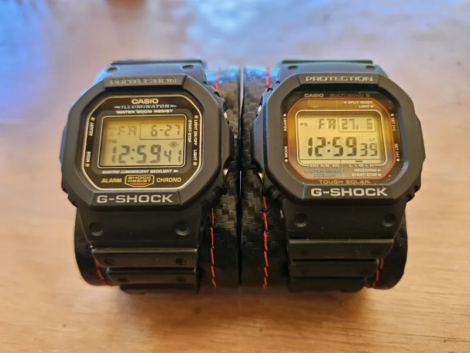

**G-Shock**

---

*Veinte años más tarde, si no está roto no lo arregles…*

---

En la foto hay dos relojes que parecen gemelos y no lo son del todo.

Mismo bisel octogonal. Mismo **PROTECTION** arriba, mismo **G-SHOCK** abajo. Misma pantalla digital, misma silueta que Casio patentó cuando el reloj tenía que sobrevivir a caídas, no a modas.

A la izquierda, un **5600 clásico**: *Illuminator*, resistencia a 200 m, cronómetro y alarma. Batería que cambiás cada ciertos años y listo. Es el reloj que mucha gente asocia con “el G-Shock de verdad”—simple, legible, indestructible en espíritu.

A la derecha, la **rama que evolucionó sin traicionar la forma**: *Tough Solar*, *Multi Band 6*, 20 bar. Misma caja, otra generación por dentro: carga solar, hora por radio, indicadores de señal y batería. La pantalla marca el mismo viernes, la misma hora—como si el tiempo hubiera acordado posarse igual en ambos.

## La rama 5600 como legado

El G-Shock no es un solo producto; es un **árbol**. La serie **5000/5600** es el tronco: el diseño que Kikuo Ibe imaginó en los ochenta y que Casio sigue refinando en lugar de reemplazar. No hace falta buscar un modelo llamado “Branch” en el catálogo; la *rama* es esta línea—la que prioriza la caja cuadrada, la resistencia y la lectura instantánea sobre pantallas táctiles o complicaciones de moda.

Por eso el dicho calza tan bien. **Si no está roto, no lo arregles** no es pereza: es respeto por un diseño que ya resolvió el problema. Casio no “renovó” el icono con otra forma; le sumó solar, multibanda y materiales nuevos **dentro** del mismo molde. Eso es legado bien entendido: continuidad visible, mejora invisible.

## Lo que sigue vigente

- **Forma antes que moda** — El octágono sigue siendo reconocible a kilómetros.
- **Función sobre espectáculo** — Agua, golpes, alarma, cronómetro; el resto es opcional.
- **Confianza** — Un reloj que no te pide atención hasta que lo necesitás.

Veinte años después, el reloj de la izquierda sigue siendo coherente. El de la derecha demuestra que se puede modernizar sin romper la promesa.

A veces el mejor producto no es el que cambia cada temporada, sino el que **sabe cuándo no tocar lo que ya funciona**.

Publicado originalmente en [LinkedIn](https://www.linkedin.com/posts/maggiben_20-a%C3%B1os-mas-tarde-si-no-esta-roto-no-lo-activity-7344432780086259715-_k0m).
