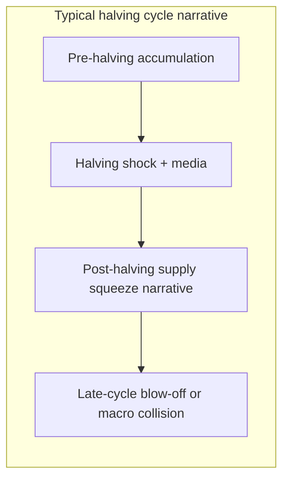

**Bitcoin**

---

In October 2008, Satoshi Nakamoto published what many of us still call *the* manifesto—not a political pamphlet, but a nine-page design note that reframed money as a protocol problem. The opening line is blunt:

> *"A purely peer-to-peer version of electronic cash would allow online payments to be sent directly from one party to another without going through a financial institution."*

A few pages later, the requirement is sharper still: *"What is needed is an electronic payment system based on cryptographic proof instead of trust."*

That was the promise: **cash for the internet**, censorship-resistant and settlement-final without a bank in the middle. Sixteen years on, Bitcoin still does that—but the world mostly talks about it as something else.

## When you could buy lunch (and everyone smiled)

The folklore everyone repeats is pizza, not burgers—and it matters because the story is about *absurdity becoming history*.

On **22 May 2010**, Laszlo Hanyecz paid **10,000 BTC** for two Papa John's pizzas. At the time it was a stunt to prove the network worked as **money**: mine coins, broadcast a transaction, receive real-world goods. Merchants experimented with burgers, coffee, and stickers; the vibe was "look, it clears."

Nobody treats 10,000 BTC as lunch money anymore. Volatility, tax friction, confirmation times for small purchases, and—frankly—the opportunity cost of spending an asset that institutions now size in **portfolio sleeves** pushed day-to-day commerce to layers (Lightning) and to other instruments (stablecoins). Bitcoin's base layer increasingly behaves like a **settlement and savings rail**, while stablecoins handle the "$3 coffee" use case.

That is not a failure of the manifesto so much as a **division of labor** inside "internet money." Peer-to-peer still exists; it is just not the headline use case at $80k+ per coin.

## Reserve of value, ETF bid, and the rallies of 2026

If 2010 was "prove it buys dinner," 2024–2026 is "prove it belongs next to gold in a 60/40 world."

U.S. **spot Bitcoin ETFs** crossed **$100B** in assets under management in 2026—a threshold that arrived without the circus of the January 2024 launch week. Cumulative net inflows since approval sit near **$59B**; the rest of AUM is price appreciation on coins the funds already hold. **April 2026** was the strongest month of the year for flows (~**$2.44B** net), including an eight-day streak that added roughly **$2.1B**. **BlackRock's IBIT** still concentrates the bid—on the order of **70%** of recent inflows—because pensions and wealth platforms default to liquidity and a familiar issuer.

That institutional plumbing helps explain why **2026 has felt like a bear market that cannot quite commit**. Bitcoin dipped from the **$126k** peak zone in late 2025, drew macro fear (tariffs, rates, war headlines), and still snapped back above **$80k** in May as ETF creations returned. My honest read: this year is **not** the clean four-year cycle chart Twitter remembers. It is a **grinding, macro-sensitive** market where **daily ETF flows** and **corporate treasuries** (Strategy and others still accumulating) matter as much as halving countdowns.

I am not publishing a price target. I am saying the **downside has been cushioned by regulated demand** in a way 2018 and 2022 were not. The risk is the opposite: if macro forces a broad de-risking, ETFs can transmit selling pressure just as efficiently as they transmit buys.

## The altcoin season that never came (and what died with it)

Every cycle used to have a script: Bitcoin runs, dominance peaks, retail rotates into **everything else**, and a thousand tickers pretend to be the next Ethereum. In **2026, the script broke.**

**Bitcoin dominance** pushed above **60%** in late April—an eight-month range breakout that trapped capital in the orange coin. The **Altcoin Season Index** (top alts outperforming BTC over 90 days) sits around **35–45**, not the **75+** that officially marks altseason. ETH dominance is flat to down. The long tail did not catch a bid; a few sectors (perps, RWAs, AI infra names) rotated quietly while **most alts bled in BTC terms**.

That is not a pause. It looks like **structural de-rating**:

- **Infinite supply narratives collapsed.** New L1s, forks, and "Ethereum killers" are reproducible in a weekend; the market stopped paying scarcity premiums for branding.
- **ETF plumbing favors BTC first.** Institutional sleeves do not naturally cascade into micro-cap altcoins the way 2021 DeFi summer did.
- **Regulatory fatigue.** Anything that smells like an unregistered security or a casino wrapper draws scrutiny faster than it can list on Binance.
- **Meme fatigue meets AI slop.** If a token is a joke, the joke needs a new punchline every week; if it is "AI," someone ships a clone by Thursday.

I do not mean **every** alt is dead—Ethereum still anchors DeFi and stablecoin settlement; Solana still wins flow in specific venues. I mean the **indiscriminate altcoin season**—buy the index, any index—may be over as a macro trade. Capital wants **one liquid hard asset with an ETF ticker**, not forty illiquid experiments.

For Bitcoin maximalists, that is vindication. For builders, it is a warning: **if you are not earning real fees or real users, you are not an investment—you are a call option on narrative**, and narrative is copyable too.

## Prediction markets: useful price discovery, uneasy omen

At the same time altcoins stalled, **prediction markets** went vertical. **Kalshi** and **Polymarket** landed on the **CNBC Disruptor 50**; sector volume estimates run from tens of billions annualized toward **hundreds of billions** in notional if the trend holds. Elections, Fed paths, war headlines, sports—everything becomes a **binary contract** you can trade at 2 a.m. on your phone.

I am not morally opposed to markets. Information wants a price. But the **timing** next to a dead altseason is a signal I do not like:

| What it looks like | What it might mean |
|--------------------|-------------------|
| Capital avoids long-horizon alt beta | Risk appetite moved to **short-dated bets** |
| Users want **odds**, not **roadmaps** | Patience for multi-year protocol stories is gone |
| Congress opens **insider-trading probes** (May 2026) | "Wild West" phase—Comer's words—before rules exist |
| Government-adjacent trades spike before headlines | **Information asymmetry** monetized faster than compliance |

House Oversight has asked **Kalshi** and **Polymarket** for records on identity checks, geo-fencing, and suspicious activity—exactly the playbook that followed crypto exchanges once size mattered. Platforms will argue they built surveillance; lawmakers will ask why a staffer can allegedly monetize a ceasefire headline before CNN.

Prediction markets are not **replacing** Bitcoin. They are competing for the same **speculative nervous system**. When the hot product is "will the strike happen by Friday?" instead of "will this L2 capture value over a decade?", the market is telling you it prefers **verifiable resolution soon** over **promises that can be forked**. That rhymes with Bitcoin's pitch—and with the death of altcoins that needed you to believe their whitepaper for five years.

## Scarcity when everything can be copied

Under all of this is a quieter shift: **investors are hunting scarcity in an era where reproduction is default.**

Code copies for free. Images copy from diffusion models. Token contracts copy from templates. Strategies copy from GitHub. Even **attention** copies—every feed runs the same outrage, the same chart, the same "breaking" banner.

In that world, **scarcity is not "rare because we said so on a landing page."** It is:

- **Credibly fixed supply** enforced by consensus, not a team's mint button
- **Liquidity deep enough to matter** (most alts fail here)
- **Settlement finality** without a committee unwinding your balance
- **Time**—a chain that survived long enough to become boring

Gold had geological scarcity. Bitcoin has **mathematical and social scarcity**: 21 million cap, halving schedule, node-enforced rules. That is why the ETF bid is not ironic—it is logical. Institutions are not buying "crypto"; they are buying the **one digital bearer asset whose copies do not dilute you** the way a new L1 does.

Altcoins died narratively because they violated that test at scale. Prediction markets boomed because they offer a different scarce thing: **a timed claim on a discrete outcome**—scarce in resolution date, even if the platform can spawn infinite new questions.

My read for Bitcoin holders: the **scarcity trade** strengthens when reproduction cheapens everything else. The **risk** is confusing scarcity of **coins** with scarcity of **returns**—halvings reduce issuance, but price still dances with macro liquidity.

## AI agents, machine economies, and why BTC keeps showing up

The strangest validation of Bitcoin in 2026 is not from a sovereign or a bank—it is from **software that pays software**.

Researchers at the **Bitcoin Policy Institute** ran **9,072** controlled experiments across **36** frontier models. When agents chose a monetary instrument with autonomy, **48.3%** picked **Bitcoin**; **33.2%** picked stablecoins; traditional fiat landed near **9%**. For long-horizon "store of value" prompts, Bitcoin exceeded **79%** of selections. Several models even proposed **energy- or GPU-denominated** units—joules, kilowatt-hours—suggesting machines reason about money in **compute-native** terms.

That aligns with hands-on experiments, not just surveys. The open **[lf-game-theory](https://github.com/pfergi42/lf-game-theory)** project put **16 LLM agents** in an economic arena with **real Lightning wallets**: transfers, alliances, betrayals, **100 rounds**, real sats at stake. Separately, infrastructure like **Lightning Agent Tools** and agent payment stacks (Paygent, x402-style HTTP 402 flows) treat Bitcoin as a **machine-verifiable settlement layer**—no chargebacks, no "call support," no account human opened in 2009.

Agents are not moral actors; they are **constraint solvers**. Bitcoin wins when the constraints are: global, 24/7, programmatic custody, verifiable settlement, and no reliance on a bank's API mood. Fiat fails the autonomy test even when it wins the compliance test—which is why **stablecoins** dominate *payments* in the same studies while **BTC** dominates *savings among machines*.

## Hormuz, sanctions, and money that still moves

Geopolitics in 2026 has been a reminder that **blockades are financial**, not only naval.

The **Strait of Hormuz** handles a material share of global oil transit. As conflict and insurance risk rose, Iran leaned into **crypto settlement** narratives—reports of **Hormuz Safe**, maritime insurance priced in **Bitcoin**, and earlier reporting on **IRGC-linked tolls** negotiated in **yuan or stablecoins**, with spokespeople also referencing **bitcoin** for speed and trace resistance. **OFAC** warnings are explicit: paying for passage or "insurance" tied to sanctioned entities is still sanctions exposure, regardless of rail.

The lesson for Bitcoin is uncomfortable and important: **protocol neutrality ≠ participant neutrality.** Bitcoin does not care why you moved sats; regulators care a great deal. Yet the flows persist because **banking rails are political** and Bitcoin rails are **geographically promiscuous**. Sanctions squeeze legal commerce; they do not turn off math. Chainalysis and exchanges add compliance friction at the edges, but the **base layer keeps clearing**—which is exactly why both dissidents and sanctioned states reach for it, and why democracies treat on-ramps as choke points.

Bitcoin is not "winning Hormuz." It is being **stress-tested as neutral settlement** in the harshest real-world laboratory there is.

## What trades like what—and why it feels like software

Ask ten traders what Bitcoin correlates with and you get eleven answers. Empirically, in the ETF era, BTC often **rhymes with high-beta tech and liquidity**:

| Regime | Bitcoin often behaves like… | Why |
|--------|-----------------------------|-----|
| Risk-on liquidity | **Nasdaq / software equities** | Same marginal buyer (growth/liquidity), similar "long duration" narrative |
| Dollar stress / hedge episode | **Gold (imperfectly)** | Scarcity story, but with 3x the volatility |
| Credit scare | **High-beta risk asset** | Collateral gets sold; BTC rarely gets a humanitarian exemption |
| Institutional allocation | **ETF wrapper beta** | Flow-driven, creates/redemptions against spot |

It is **not** a mature bond alternative. It is **not** purely digital gold yet either—too young, too reflexive, too wrapped in futures and fund mechanics. The honest framing: **Bitcoin is a volatile, globally portable balance-sheet asset with a software industry's reflexes.** When Meta-scale capex headlines hit AI infra, miners' pivot stories pump; when the Fed scares duration, BTC wobbles with the Nasdaq cohort.

## Miners, pools, and the AI land grab

The **April 2024 halving** cut the subsidy from **6.25 → 3.125 BTC** per block. Margins tightened. Public miners did not vanish—they **repriced their balance sheets** as **powered real estate**.

**CoinShares** and sector press track **$70B+** in AI/HPC hosting deals across listed miners; some forecasts suggest **~70%** of leading miners' revenue could be **AI by end-2026**, up from ~30% today. Names like **Core Scientific**, **IREN**, **Cipher**, **Hut 8**, and **MARA** are selling BTC treasuries to fund **gigawatt-scale** AI sites—competing not only with each other but with **hyperscalers and neoclouds** (and headlines like **SpaceX/Colossus**-class clusters).

For **mining pools**, the second-order effects are structural:

- **Hashrate concentration** may shift toward operators who stayed **pure-play** (geography, power cost, ASIC efficiency)—pools that serve industrial farms still matter, but the "growth story" equity is elsewhere.
- **Fee pressure** rises if hash rate growth outpaces price—**transaction fees** become a larger fraction of miner revenue when subsidies shrink again in **2028**.
- **Pool diversification** accelerates: miners who also rent GPUs may **split fleets**—ASICs on pool A, AI clusters on cloud contracts—changing uptime patterns and stale-share economics.

Pools are not pivoting to AI; **miners are**. The pool business becomes a **commodity service for whoever still runs SHA-256 at scale**, while the sector's market cap migrates to **energy + data-center optionality**.

## 2027, 2028, and the fifth halving

The next halving is expected around **April 2028** at block **1,050,000**, dropping the subsidy from **3.125 → 1.5625 BTC**. We are in the **second half of the 2024–2028 issuance cycle**—the first where **spot ETFs** existed for the entire post-halving year.

Historical pattern (with a grain of salt):

**2027 (my baseline, not prophecy):** Pre-halving positioning meets **ETF stickiness**. If global liquidity improves, BTC likely trades as a **high-beta expression of "hard asset + tech"**—volatile, but with a **bid underneath from scheduled creations** and advisor platforms finally wiring crypto sleeves (Morgan Stanley's **MSBT** launch at **0.14%** fee is a tell: banks compete on basis points once they decide the asset is permanent).

**First half 2028:** Halving narratives return. Issuance math gets religious again—but **ETF inventories** may absorb shock faster than opaque OTC desks did in 2012. Watch **miner treasuries**: if AI pivots mean more **forced selling** to fund capex, halving "supply shock" can coexist with **corporate supply**.

**After mid-2028:** The market discovers whether **fees + ETFs + nation-state games** define the era more than **block subsidies**. If transaction demand does not grow, security budgeting shifts further toward **fees and off-chain economies** (Lightning, custodial wrappers)—another way Bitcoin stays Bitcoin while looking less like "cash" and more like **infrastructure**.

## What to expect from products and policy

The product map into 2027–28 is clearer than the price map:

- **More bank-branded ETFs and SMAs**, competing on fees (MSBT vs IBIT vs FBTC) and **advisor distribution**, not on whether Bitcoin exists.
- **Wealth platforms** treating BTC as a **1–3% sleeve** rather than a lottery ticket—still small percentages, but on **trillions** of AUM that moves slowly and sticks.
- **Agent rails** (Lightning, x402, stablecoin hybrids on AWS Bedrock AgentCore) sitting **alongside** BTC as **savings/settlement** for machines.
- **Regulatory clarity** as the gating variable for pensions—less about "is it legal" and more about **operational compliance at scale**.

## Closing thought

Satoshi's manifesto asked for **electronic cash without institutions in the middle**. We got something larger: a **global, auditable scarcity asset** that institutions now package into ETFs, that agents choose when they need trustless settlement, and that geopolitics drags into chokepoints whether we like it or not.

The same year altcoin season failed to show up, **prediction markets** became the casino lobby—and Congress noticed. Both are symptoms of a copy-paste economy starving for things that cannot be duplicated at will. Bitcoin's halving schedule is one of the few clocks that still ticks the same way after a million forks.

I still use Lightning for small experiments. I still track on-chain fees when mempools spike. But I do not lie to myself: **most of the world now touches Bitcoin as a reserve candidate, not as burger money.** The interesting years ahead are not about convincing a pizza shop—they are about whether **programmatic issuance cuts**, **machine economies**, **regulated flows**, and a market obsessed with **real scarcity** can coexist without breaking the thing that made pizza day possible in the first place: **final settlement, without asking permission.**

*This post is market commentary and personal opinion, not financial advice.*
