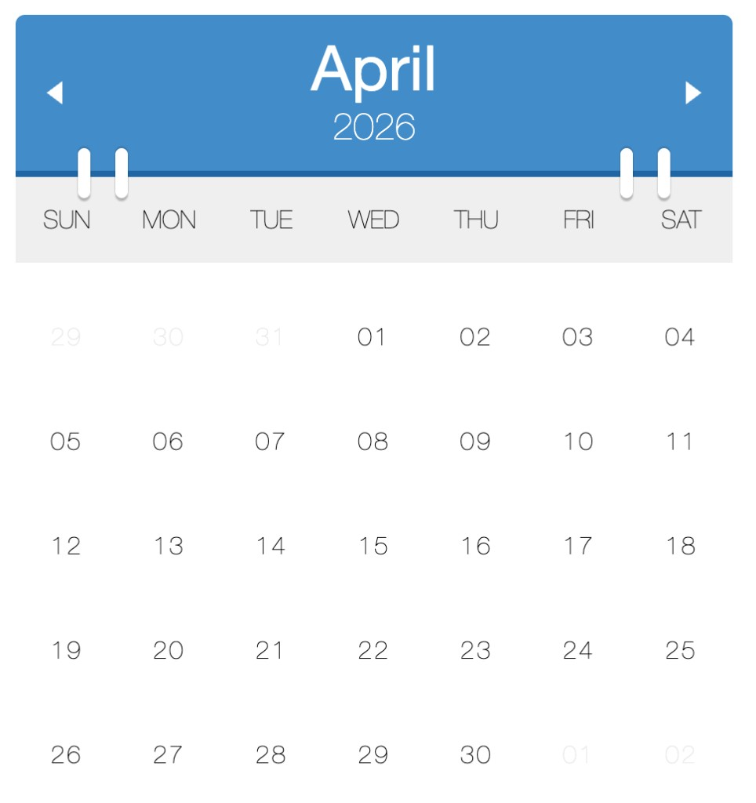

**Event-density calendar**

---

I wanted a calendar that felt like something on a desk—not a spreadsheet, not a dense agenda list.

So I built a small **flip-calendar** widget on [CodePen](https://codepen.io/maggiben/pen/OPmLBW): a blue header with month and year, white “binder” rings bridging into the grid, thin sans-serif day numbers, and ghosted leading/trailing dates so the current month stays in focus. Arrow controls slide the month in and out. Under that calm surface, each day can carry a **blue circle** whose size encodes **how many events** landed that day; tap a busy day and a detail panel opens in the week row below.

No backend, no build step—**Moment.js**, vanilla DOM, and CSS that still holds up years later.

## Try it live — CodePen embed

The iframe keeps the pen’s own styles isolated from this site’s dark theme. Use the header arrows, click a day with a blue circle, and open the detail strip under that week.

<link rel="stylesheet" href="assets/demo/styles.css" />

<div class="blog-embed blog-embed--codepen">
  <iframe
    height="560"
    style="width: 100%;"
    scrolling="no"
    title="Calendar"
    src="https://codepen.io/maggiben/embed/OPmLBW?default-tab=result"
    frameborder="no"
    loading="lazy"
    allowtransparency="true"
  >
    See the Pen <a href="https://codepen.io/maggiben/pen/OPmLBW">Calendar</a> by Benjamin (<a href="https://codepen.io/maggiben">@maggiben</a>) on <a href="https://codepen.io">CodePen</a>.
  </iframe>
</div>

<p><em>Blank iframe? <a href="https://codepen.io/maggiben/pen/OPmLBW" target="_blank" rel="noopener noreferrer">Open the pen on CodePen</a>.</em></p>

## Also on this page — inline (fixed for dark theme)

Same widget rendered here with blog-local CSS: explicit text colors so day labels and event titles stay readable, no extra white card around the widget.

<div class="blog-embed calendar-event-demo">
  <div class="calendar" id="calendar"></div>
</div>

<script src="assets/demo/calendar.js"></script>

<p><em>Having trouble with the inline version? Use the CodePen embed above.</em></p>

The pen ships with **January 2017** sample data (originally a threat-intel calendar—malware and bot names on busy days). Fork it and swap in deploys, habits, or incidents; the mechanic stays the same.

## The look: flip calendar, flat UI

The cover is the quiet state: **minimal grid, tactile header**.

| Element | Role |
|---------|------|
| **Blue header** | Month in large white type, year beneath, prev/next triangles |
| **Binder rings** | Four white bars overlapping the header edge—desk-calendar affordance |
| **Weekday bar** | Light gray band, uppercase SUN–SAT |
| **Grid** | Centered day numbers; adjacent-month dates faded |
| **Circles** | Hidden when empty; scaled blue dots when events exist |
| **Detail panel** | Expands under the week row with colored event rows and a pointer arrow |

That hierarchy matters: you read the month first, then **volume** (circle size), then **titles** (only after a click). It is intentional progressive disclosure—not everything shouting at once.

## Why time widgets are still worth building

Dates are the one coordinate system every user already knows. That makes the month grid a **universal canvas** for data:

| Pattern | What the user reads instantly |
|---------|-------------------------------|
| **Dot calendar** | Something happened (binary) |
| **Heat map** | Intensity across days (GitHub contributions) |
| **Agenda list** | Exact schedule (Google Calendar) |
| **Event-density grid** | *How heavy* a day was, then drill-down on demand |

The density approach trades all-day precision for **pattern recognition**. You are not answering “What time is my dentist?” You are answering “Which week in Q1 looked like a dumpster fire?” or “When did incidents cluster?”

Security dashboards, habit trackers, and release calendars all flirt with the same idea: **encode volume in the cell before you encode detail in a tooltip**.

## What is running under the hood

The widget is a small state machine drawn with DOM APIs:

```
events[] → draw month grid → scale circle by count / maxCount → click → inject .details row
```

**1. Normalize dates.** On each redraw, event entries are converted with Moment so comparisons use `isSame(day, 'day')`.

**2. Build the grid.** The current month is filled day by day; leading and trailing cells come from `backFill` and `fowardFill` so the grid is always six rows of weeks. Each cell gets a `day-number` and a `circle` span.

**3. Density encoding.** The code finds the busiest day in the dataset (`maxEvents`), then scales each circle:

```javascript
var size = (1 / this.maxEvents) * todayEvents.events.length;
circle.style.transform = 'scale(' + size + ')';
```

Quiet days keep a zero-scale circle (invisible). Busy days approach full size. It is a linear map, not a log scale—honest and easy to reason about when you have five events, not five hundred.

**4. Interaction model.** Only days with events are clickable. `openDay` injects a `.details` block as a sibling inside the **week row**, positions a triangular `.arrow` under the clicked cell, and lists colored event rows. Switching days in the same week reuses the container and animates the list out/in.

**5. Month transitions.** Changing month sets `next` or `prev`, re-draws, and applies CSS classes `month out` / `month in` with keyframed slides.

**6. Angular wrapper (original).** The CodePen shipped an `ng-app` directive that passed sample data into `new Calendar('#calendar', data)`. The calendar engine itself is plain DOM; Angular was only the glue.

A blog-side copy of the vanilla engine lives in [assets/demo/](assets/demo/) if you want to read or fork without CodePen’s iframe.

## The stack (CodePen era)

- **[Moment.js](https://momentjs.com/)** — month boundaries, `isSame`, add/subtract months
- **Vanilla `Calendar` constructor** — explicit `createElement` and class toggles
- **LESS → CSS** — binder rings, header typography, month slide animations
- **CodePen** — instant share link, zero build step

The pen’s README still says the quiet part out loud: *“A calendar that tells you how many events happened on a particular date.”* That one sentence is the product spec.

## What I would change today

If I refreshed the project now:

- **Temporal or Luxon** — Moment is in maintenance mode; modern codebases should start elsewhere.
- **Accessibility** — keyboard focus per day, `aria-expanded` on the detail panel, `aria-label` that reads “3 events” not only a bigger circle.
- **Responsive width** — the original fixed ~480px layout; fluid `max-width` would help on large screens.
- **Data API** — accept `events: { date, items[] }[]` from JSON fetch instead of hard-coded arrays; keep the renderer dumb.
- **Reduced motion** — respect `prefers-reduced-motion` and skip month slides for users who need it.

None of that undermines the core idea: **time is not only a list—it is a shape**, and circles that breathe with workload are a legible shape.

## The lesson I still keep

The best widgets do not add a new metaphor. They **bend one you already know**—the wall calendar, the month view—and add one extra channel (density) before they ask for a click.

This pen was never a SaaS. It was a **visual argument**: you can see busy season without reading every title. In a world of infinite agenda scroll, that is still a gift.

Fork it, pipe CI failures into the array, and watch release week swell. You will learn more about your timeline from the circles than from another notification badge.

---

*CodePen: [codepen.io/maggiben/pen/OPmLBW](https://codepen.io/maggiben/pen/OPmLBW) · Source copy: [assets/demo/](assets/demo/) · Sample data: January 2017 threat-intel theme*
