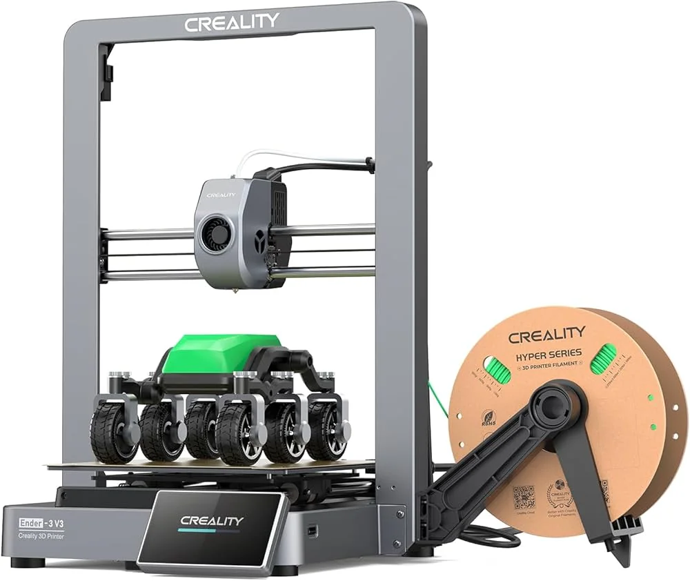

**Creality Ender 3 V3 · Review**

---

I did not buy the **Creality Ender 3 V3** to collect spec-sheet trophies. I bought it to print things—brackets, enclosures, gifts, the occasional ridiculous toy—and to spend less time babysitting a machine than my last printer demanded. After months of real use, the short version is simple: **it has worked flawlessly**. Not “flawless for a budget printer.” Flawless in the boring way you want: power on, slice, print, peel, repeat.

That does not mean Creality nailed every headline feature. The online ecosystem is polished but skews toward **fidgets and desk toys**; the **AI camera** still feels early; and I would trade a bit of cloud convenience for **local-first control** any day. None of that has made me regret the purchase. It has made me honest about what this machine is—and what you should budget beside it.

## What the reviews promise (and what actually matters)

If you have read any **Ender 3 V3 review** from the last year, you already know the pitch deck:

| What Creality and reviewers emphasize | What I care about day to day |
|---------------------------------------|------------------------------|
| **CoreXZ** motion vs classic bed-slinger wobble | Stable layers when I crank speed |
| **Klipper-based** Creality OS, input shaping | Less ringing without a tuning rabbit hole |
| Peak **600 mm/s** marketing | Shorter wall-clock time on practical profiles |
| **220 × 220 × 250 mm** volume | Enough for household and project parts |
| Wi‑Fi, touchscreen, cloud model library | Nice when they work; annoying when they do not |

Community tests generally agree on the nuance behind the big numbers: peak speed is a **ceiling**, not a daily setting. Most sensible profiles land closer to **~200–300 mm/s** for quality work; push higher when the geometry forgives it. My experience matches that. The V3 is **genuinely fast** compared with older Enders and many “beginner” boxes—but the win is not winning a benchmark. The win is finishing a functional part before I lose interest.

Out of the box, bed leveling and first-layer behavior were uneventful. I have had the usual minor failures every FDM owner gets (adhesion on a cold morning, a nozzle clog from dusty filament). Nothing that blamed the frame, the extruder, or the motion system. For a printer in the **~$300–$400** band, that reliability is the whole game.

## Speed: the feature you feel in the calendar

Creality positions the V3 as a **speed upgrade** for the Ender line, and in daily use that is fair. Profiles labeled for faster printing do not feel like a gimmick—they feel like someone actually tuned acceleration and input shaping instead of only updating the sticker on the box.

I still slow down for:

- Fine vertical details and small perimeters
- Materials that punish hurry (some PETG days, flexibles)
- Anything I plan to sand, tap, or screw into something else

But the default experience is **“finish tonight”** energy. If you are coming from an older Cartesian that topped out around 60–80 mm/s in practice, the V3 will spoil you.

## Creality Cloud: good UX, toy-heavy catalog

Creality’s **online services** are a real product, not an afterthought. Browsing models, sending jobs, and using the integrated workflow on the touchscreen is smoother than the old “export gcode, find a USB stick, hope” ritual. For newcomers, that lowers friction in a good way.

My gripe is curation, not capability. Scroll the library and you meet an army of **fidgets, dragons, lithophane lamps, and mini figurines**—fun, printable, and everywhere. Harder to find are the boring heroes of a home shop: **drawer dividers, hose clamps, wall mounts, replacement knobs, jigs**. The cloud is nice to have; I just wish it balanced **useful parts** the way it balances **toy culture**.

There is a second wish buried in the same complaint: **I want more of this experience local**. Cloud slicing and model sync are convenient until the internet hiccups, Creality’s servers feel slow, or you simply do not want your print history living on someone else’s account. The machine is capable enough to be a **workshop appliance**; the software story still leans **phone-app consumer**. I would love a mode that treats my LAN as home base and treats the cloud as optional sync—not the default spine.

## AI failure detection: promising label, uneven results

The V3 ships with the kind of **AI camera monitoring** that sounds like peace of mind: spaghetti detection, maybe pause-on-failure, fewer ruined overnight prints.

In practice, it **still leaves a lot to be desired**. It has caught obvious disasters. It has also let ambiguous failures run, or nagged at benign stringing that was not worth stopping. I do not disable it—but I do not **trust** it the way I trust a human glance at layer two. Treat it as a **second opinion**, not a babysitter. If you print unattended often, budget mental insurance: enclosure, fire-safety habits, and sane materials—not only the camera checkbox.

## The filament dryer: not optional in humid air

The single best accessory purchase alongside this printer was Creality’s **filament dryer** (heater box for spools).

If you live anywhere humidity is not a joke, it is close to a **must-have**:

- Fresh PLA stops hissing and popping mid-print
- PETG and nylon behave more predictably
- **Old filament gets a second life** instead of going in the “maybe someday” bin

Even in a moderately damp room, drying changed results more than tweaking retraction for the fifth time. Wet filament looks like a tuning problem; drying often *is* the tuning. Pair a fast printer with dry filament and you unlock the speed the machine advertises.

## Creality filament: surprisingly good, wood especially

I run a lot of **Creality Hyper Series** filament—the spool in the product photos is not props. It feeds cleanly at the speeds the V3 likes, and color consistency has been solid across rolls.

The standout for me was **wood-filled PLA**. I expected decorative texture and got **genuinely beautiful surfaces**: grain-like variation, matte finish, and layer lines that read as intentional rather than “plastic pretending.” For gifts and display pieces, it punched above what I thought branded filament would do.

That said, branded filament is not magic. You still earn good results with dry storage, sensible temperatures, and profiles matched to the material. Creality just made it easier to stay inside their ecosystem without feeling punished for it.

## Verdict: a good machine—with honest asterisks

The **Creality Ender 3 V3** is a **good machine**. Not perfect, not the fastest CoreXY money can buy, but a strong daily driver if you want modern speed and fewer rituals than vintage Enders demanded.

**Buy it if** you want reliable FDM in the sub-$400 class, you will actually use the speed, and you are fine mixing Creality’s cloud conveniences with your own slicer habits.

**Budget extra for** a **filament dryer** if humidity is real in your space—and maybe mentally for a spool of **wood** filament if you care about finish.

**Keep expectations realistic on** the **AI camera** (helper, not oracle) and the **model library** (toy aisle first, hardware store second).

**Wish list for Creality** local-first workflows, richer functional models in the cloud, and failure detection that earns the “AI” label.

For me, the rover on the build plate in the cover photo is the right metaphor: not a benchy, not a fidget—a **real object with wheels and overhangs**, printed fast, in more than one color, while the machine quietly did its job. That is the Ender 3 V3 I wanted. That is the one I got.
