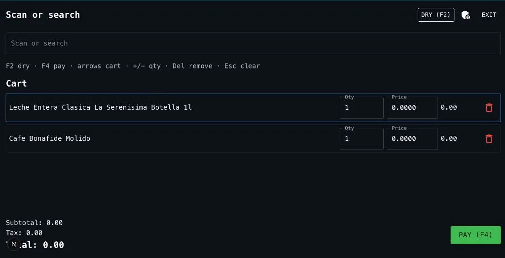
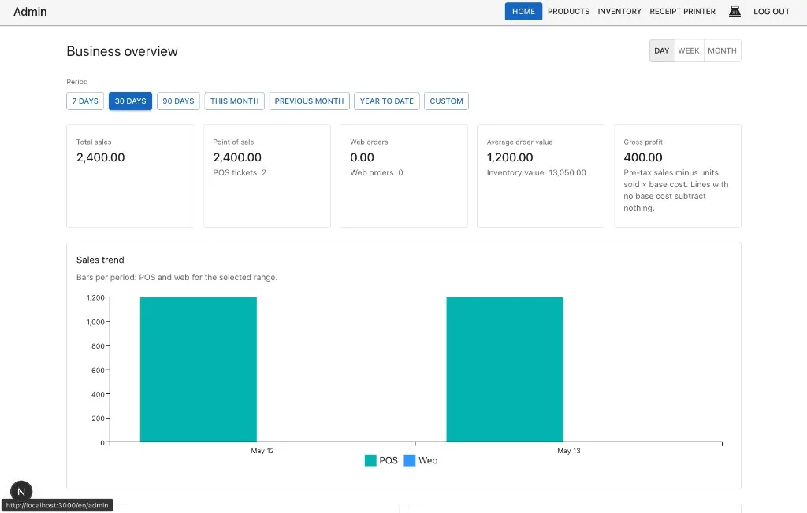
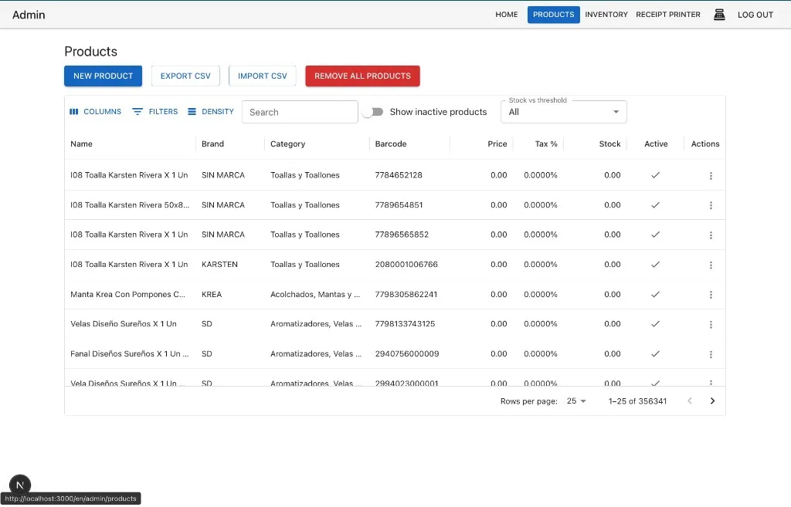

**La Esquina**

---

En [LinkedIn conté](https://www.linkedin.com/posts/maggiben_estoy-armando-un-erp-muy-b%C3%A1sico-para-un-almac%C3%A9n-share-7445611132058386432-Fhm4) que estaba armando un ERP muy básico para un almacén. Probablemente no me deje plata. Capaz sea un trueque, una **changa**. En un mundo de sueldos en dólares, decks de AI y sistemas que prometen resolverlo todo, suena casi ridículo.

Y sin embargo fue de los proyectos que más me **reconectaron** con por qué empecé en esto.

El almacén se llama **La Esquina**. No necesitaba “un senior backend con diez años en Kubernetes”. Necesitaba que la compu le diera una mano: cobrar sin enredarse, saber qué hay en góndola, ver si el mes cierra un poco mejor que el anterior, imprimir un ticket legible. Nada más. Nada menos.

## El mostrador real y la fachada

Un ERP no vive solo en GitHub. Vive entre **ladrillos**, **pintura gastada** y un mostrador donde el cable USB importa tanto como el schema de Postgres.

Arriba en la foto: lo que armé para la caja—impresora térmica Xprinter con el ticket que acaba de salir (`completed`), lector de barras en la base, teclado numérico para cargar rápido, la compu chica que corre API y front, y los rollos de papel que siempre se terminan un viernes a las 18:01.

Abajo: **La Esquina** de afuera. Puerta verde, vidrios viejos, cartel de chapa oxidado. Nada de “startup glass office”. Un almacén de barrio que ya estaba ahí antes de que existiera Next.js 16.

Esa yuxtaposición es el proyecto entero: software moderno al servicio de un negocio que no necesita parecer Silicon Valley—necesita **cerrar el día sin dolores de cabeza**.

## Lo que no era el pedido

No era:

- Un SAP a medias  
- Un marketplace con recomendaciones neurales  
- Un pitch para Y Combinator  

Era **operación diaria** en un negocio chico, con urgencias chicas y cero paciencia para pantallas confusas.

Ahí aparece [**Abasto**](https://github.com/maggiben/abasto)—así lo bauticé en el repo: un ERP **barebone** (a propósito), armado con **FastAPI** (Python), **PostgreSQL** y **Next.js**. Docker para levantar todo junto; en desarrollo, API en la máquina cuando hace falta USB para la impresora térmica.

## Punto de venta: rápido, teclado primero

La caja no compite con Instagram. Compite con la fila del mediodía.

La pantalla de **POS** está pensada para manos ocupadas:

- **Escanear o buscar** arriba de todo—lector de barras o tipeo.  
- Atajos visibles: `F2` dry run, `F4` cobrar, flechas en el carrito, `+` / `-` cantidad, `Del` sacar línea, `Esc` limpiar.  
- Líneas con nombre, cantidad, precio y total; basura roja para borrar sin drama.

Productos reales del negocio—leche La Serenísima, café Bonafide, lo que sea del día—no datos de demo genéricos. Si el cajero tiene que pensar *cómo* funciona la UI, ya perdimos.

## Admin: números que importan, no vanity metrics

Detrás del mostrador, alguien tiene que mirar el negocio con calma.

El **overview** no presume ser consultoría McKinsey. Responde preguntas concretas:

| Métrica | Para qué sirve |
|--------|----------------|
| Ventas totales / POS / web | Separar lo que pasa en mostrador de pedidos online (cuando existan) |
| Ticket promedio | Tamaño de compra típica |
| Valor de inventario | Cuánto capital está parado en estantería |
| Ganancia bruta | Ventas menos costo base (con tooltip honesto: si falta costo, no inventa números) |
| Tendencia por período | Barras POS vs web en el rango elegido |

Filtros de **7 / 30 / 90 días**, mes actual, anterior, año—porque un almacén piensa en “¿cómo vino abril?” más que en “Q3 roadmap”.

## Catálogo: muchos productos, pocas sorpresas

Un almacén serio no tiene “unos cientos” de SKUs. Tiene **muchos**.

La grilla de **productos** muestra la escala: decenas de miles de filas importadas desde catálogo mayorista (CSV), con marca, categoría, código de barras, precio, IVA, stock y estado activo. Herramientas que sí se usan:

- **Alta manual** y **import/export CSV**  
- Búsqueda, columnas, densidad, filtro de inactivos  
- **Stock vs umbral** para ver qué reponer antes del “se nos acabó”

No hace falta que el dueño entienda normalización 3FN. Hace falta que el lunes a las 7 encuentre la yerba.

## Detalles “chicos” que no son chicos

En un negocio así, lo crítico suele ser aburrido:

- **Impresora térmica USB** (tipo XP-58) en el checkout—ticket con total en negrita, nombre del local, opcional logo. Si falla USB, **la venta igual se guarda**; el error queda en log, no en cara del cliente.  
- **Inventario** y movimientos en admin.  
- **JWT y staff**: el catálogo sensible no es público; promover un usuario a staff en Postgres es feo pero explícito—herramienta interna, no SaaS multitenancy.  
- **Impresión de etiquetas** con código de barras para góndola—otro día salvado con ESC/POS y paciencia.

Corré todo con `docker compose up --build` o Postgres en Docker y API + front en local si estás en macOS peleando con libusb. Está documentado en el [README del repo](https://github.com/maggiben/abasto).

## Por qué esto me humilla (en el buen sentido)

Llevé años en productos donde el riesgo es escalar a millones de usuarios, pasar audits, discutir si el botón va en `#4B5563` o `#6B7280`.

La Esquina me devolvió otra escala:

- ¿Se entiende sin manual?  
- ¿Aguanta el sábado a las 12?  
- ¿El ticket sale antes de que el cliente suspire?

No hay demo day. Hay **confianza** de alguien que te deja tocar su caja registradora.

En [un post anterior en LinkedIn](https://www.linkedin.com/posts/maggiben_estoy-armando-un-erp-muy-b%C3%A1sico-para-un-almac%C3%A9n-share-7445611132058386432-Fhm4) lo dije claro: capaz no pague las cuentas. Pero me recuerda que la tecnología no nació para inflar egos ni para acumular frameworks en el CV. Nació para **problemas reales, concretos, humanos**.

En tiempos de hype, layoffs y miedo a la AI, **volver a lo básico también es avanzar**. No todo tiene que ser gigante para ser valioso.

## Si te sirve el código

El proyecto es abierto: [github.com/maggiben/abasto](https://github.com/maggiben/abasto). Copialo, forkealo, adaptalo a tu almacén, kiosco o ferretería de barrio. Si te sobra complejidad, tirá capas hasta que duela menos.

Y si lo tuyo es otro tipo de “herramienta honesta”—un tracker de inversiones en el navegador, un bot de paper trading que no promete oráculos—también escribí sobre [Elliott](../i-built-elliott-portfolio-tracker-stays-on-your-device/) y [Shredder](../i-built-shredder-algo-trading-framework-no-perfect-algo/). Misma filosofía: **menos teatro, más utilidad**.

## Cierre

**La Esquina** no necesitaba que la tecnología la impresione. Necesitaba que la acompañe.

Eso es un ERP, en el fondo: no una catedral de módulos, sino **un lugar donde el negocio respira un poco más tranquilo**.

Gracias a quienes del otro lado entienden que a veces la mejor arquitectura es la que mañana abre a la hora que tiene que abrir.

---

*Publicado originalmente en [LinkedIn](https://www.linkedin.com/posts/maggiben_estoy-armando-un-erp-muy-b%C3%A1sico-para-un-almac%C3%A9n-share-7445611132058386432-Fhm4). Código: [Abasto](https://github.com/maggiben/abasto).*
