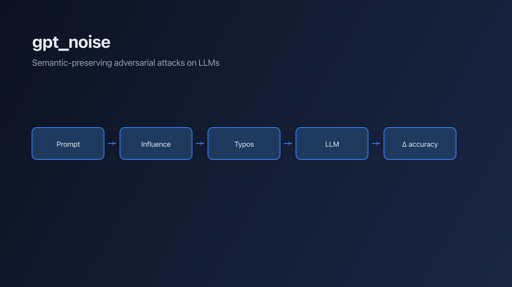
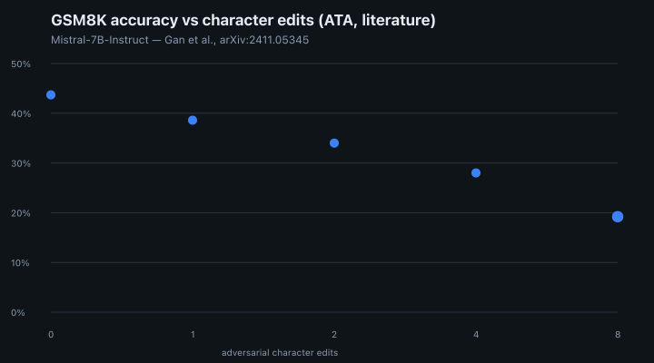
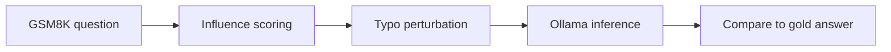
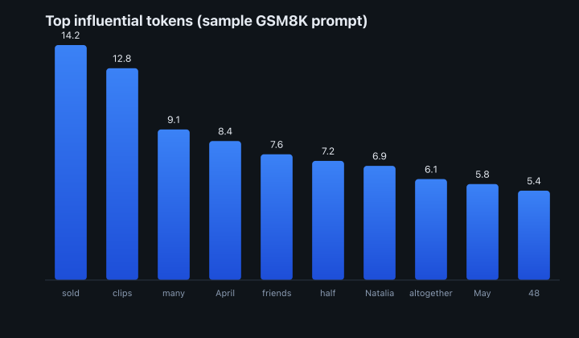
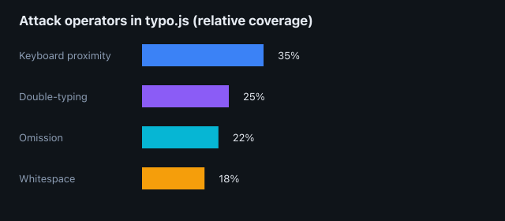
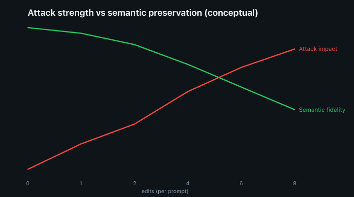

**gpt_noise**

---

Papers on adversarial typos against LLMs are easy to find. Runnable implementations you can fork, tune, and benchmark locally are not.

I built **[gpt_noise](https://github.com/maggiben/gpt_noise)** to close that gap: a small Node.js research repo that reproduces the *spirit* of semantic-preserving, typo-based attacks—identify high-impact tokens, perturb them with realistic keyboard noise, and measure whether reasoning still holds on **[GSM8K](https://huggingface.co/datasets/openai/gsm8k)** through a local **[Ollama](https://ollama.com/)** model.

The work is inspired by the **Adversarial Typo Attack (ATA)** line of research, especially [Gan et al., *Reasoning Robustness of LLMs to Adversarial Typographical Errors*](https://arxiv.org/abs/2411.05345) (arXiv:2411.05345). Their paper shows how few character-level edits can crater chain-of-thought accuracy; my repo is a practical sandbox to explore that phenomenon without waiting on a black-box API.

## Why typos are a serious attack surface

Typos are not random noise in user queries—they are **structured**, often **invisible** to spell-checkers, and they ride along with otherwise sensible prompts. Gan et al. report that on GSM8K, **Mistral-7B-Instruct** drops from **43.7%** to **38.6%** accuracy with a **single** adversarial character edit, and to **19.2%** with **eight** edits—while the sentence still reads like something a human might have typed.



*GSM8K accuracy vs adversarial character edits. Points at 0, 1, and 8 edits from [Gan et al., arXiv:2411.05345](https://arxiv.org/abs/2411.05345); intermediate values interpolated for visualization.*

That matters for any product that trusts LLM reasoning on raw user text: support bots, copilots, grading pipelines, agent tool inputs. If a handful of keystrokes can derail math reasoning, robustness is not only a safety topic—it is a reliability one.

## What gpt_noise does

The pipeline has three stages:



1. **Score influence** — `influential.js` tokenizes the prompt, tags parts of speech with Brill tagging (`natural`), and ranks words by a weighted heuristic: verbs and nouns weigh more, rare tokens weigh more, and tokens near the “center” of the sentence get a slight boost.
2. **Perturb top‑k words** — `llm_attack.js` takes the top `edits` influential words and runs `deepattack()` from `typo.js` on each.
3. **Evaluate** — The clean and attacked prompts are sent to Ollama (`qwen2.5:7b` by default); answers are parsed for the `#### <number>` GSM8K format and compared to gold labels.

The design goal is **semantic preservation with behavioral degradation**: a human should still understand the question; the model should not.

### Example: before and after

**Clean (GSM8K #0):**

> Natalia sold clips to 48 of her friends in April, and then she sold half as many clips in May. How many clips did Natalia sell altogether in April and May?

**Attacked (`edits: 4`, illustrative):**

> Natalia **spld** clips to 48 of her **friemds** in April, and then she sold half as many clips in May. How many clips did Natalia sell altogether in April and May?

Four single-word typos. The story is intact; the model’s chain-of-thought may not be.

## Influential words are not always the “important” ones

A common mistake is to attack only long or rare words. The influence function blends **POS weight**, **inverse document frequency within the prompt**, and **position**:

| Signal | Rationale |
|--------|-----------|
| Verbs / nouns | Carry predicate and entity structure |
| Low frequency in prompt | Less redundancy for the model to recover from |
| Mid-sentence position | Often syntactic anchors |

On the Natalia problem, tokens like *sold*, *clips*, *half*, and *altogether* rise to the top—exactly the vocabulary a math solver leans on.



*Top influential tokens on a sample GSM8K prompt, using the scoring function in `influential.js`.*

> The word-relevance tables are **biased by design** (English POS priors, heuristic weights). For domain-specific studies—legal, medical, multilingual—you should retune weights or replace the scorer with gradient-based importance as in full ATA.

## Attack operators in `typo.js`

All perturbations mimic **plausible keyboard mistakes**, aligned with the error taxonomy in Gan et al.:



- **Keyboard proximity** — substitute a neighboring QWERTY key
- **Double-typing** — duplicate a character (`has` → `haas`)
- **Omission** — drop a character (`year` → `yar`)
- **Extra whitespace** — merge or split tokens visually

`deepattack(word, depth)` expands the typo lattice recursively. At `depth: 0`, it picks among candidates with similar Levenshtein distance to the original—favoring **subtle** edits. Higher `depth` compounds transformations: stronger attacks, lower semantic fidelity.



*Conceptual trade-off between attack strength and semantic preservation as `edits` / `depth` increase—not measured from a full gpt_noise run.*

## Running an experiment

Requirements: Node.js, dependencies installed, and Ollama running locally.

```bash
git clone https://github.com/maggiben/gpt_noise.git
cd gpt_noise
npm install
ollama pull qwen2.5:7b
node llm_attack.js
```

Configuration in `llm_attack.js`:

```javascript
const OPTIONS = {
  edits: 4,   // influential words to perturb per prompt
  depth: 0,   // recursive typo depth (0 = subtle)
};
```

The script serializes 100 clean and 100 attacked GSM8K items, writes `gsm8k_clean.json` and `gsm8k_attacked.json`, and logs accuracies. **Note:** the default runner includes a 20-second delay between Ollama calls—useful for thermal throttling on a laptop, slow for batch research. Trim it when you are ready to scale.

Swap in any Hugging Face reasoning dataset by replacing `gsm8k.json`; the attack layer is prompt-agnostic.

## How this differs from full ATA

[gpt_noise](https://github.com/maggiben/gpt_noise) is a **lightweight reproduction**, not a byte-for-byte reimplementation of ATA:

| Aspect | ATA (paper) | gpt_noise |
|--------|-------------|-----------|
| Token importance | Gradient-based (model loss) | Heuristic POS + frequency |
| Candidate selection | Batch loss evaluation per typo | Levenshtein-ranked random choice |
| Target models | Open + closed via R2ATA transfer | Local Ollama models |
| Goal | Benchmark reasoning robustness | Hackable research codebase |

That is intentional. The repo is a place to **experiment**: swap scorers, plug in gradient hooks, try BBH or MMLU, or pipe attacks into an agent framework.

## Research ethics

This code is for **defensive research and education**: understanding fragility, building evals, and hardening inputs—not for spamming production systems or bypassing safety filters. Run it on models and data you own or are permitted to test.

## What I learned

**Human-plausible attacks are underrated.** Glitch tokens get attention; typos are mundane—and everywhere.

**Influence scoring dominates outcomes.** Attack the wrong words and you waste edits; attack the right verbs with tiny noise and accuracy moves.

**Open weights + local inference lower the bar.** Ollama makes the GSM8K loop reproducible on a single machine without API keys.

**Papers need repos.** If we care about reasoning robustness, we need implementations next to the benchmarks—not just charts in PDFs.

Clone the repo, crank `edits`, and see how brittle your favorite local model is. Then fix the pipeline—or the prompt guard—that catches typos before they become wrong answers.

Repo: [github.com/maggiben/gpt_noise](https://github.com/maggiben/gpt_noise)
