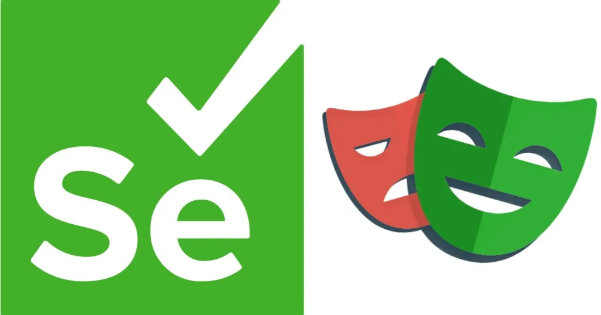
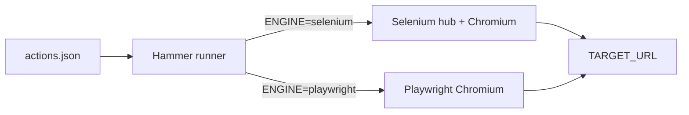

**Hammer**

---

Every few years the front-end world crowns a **new default** for browser automation. Playwright arrives with crisp APIs, auto-waiting, and a reputation for speed. Selenium looks like the previous chapter—WebDriver hubs, grid YAML, screenshots through noVNC. The discourse is loud. The useful question is quieter: **for the workflows you actually run, which engine fails less often and costs less to operate?**

I did not want another opinion thread. I wanted a **controlled testbed**—same steps, same assertions, two backends—so comparisons stay honest. That testbed is [**Hammer**](https://github.com/maggiben/hammer): a small TypeScript runner where you describe a browser session as JSON, flip `ENGINE=selenium` or `ENGINE=playwright`, and watch the same script execute through either stack. Bun for the runtime, Docker Compose for reproducible grids, and an experimental recorder that turns real clicks into action lists.

This post is about what Hammer is, how the JSON model works, and what I learned when I stopped cheering for the new school and started reading the logs.

## Why I built it

Most e2e suites marry you to one driver. Your tests become **Playwright tests** or **Selenium tests**, and cross-engine benchmarks turn into rewrite projects. That makes it easy to **confirm your existing bias** instead of measuring tradeoffs.

Hammer inverts the coupling:

| Layer | Responsibility |
|-------|----------------|
| **JSON `actions`** | Declarative steps: navigate, click, wait, assert |
| **`src/lib/selenium.ts`** | Maps each action to WebDriver calls against a remote hub |
| **`src/lib/playwright.ts`** | Maps the same action types to Playwright locators on local Chromium |
| **`ENGINE` env var** | Chooses the backend without touching the scenario file |

The goal was never to replace Cypress or Playwright Test. Hammer is a **laboratory**: smoke flows, scripted walkthroughs, scraping-style checks, and side-by-side timing on identical markup. One browser per process today—fairness comes from **replaying the same JSON**, not from parallel sessions inside a single run.

## Declarative actions, not framework ceremony

Hammer expects a single JSON file with an `actions` array. Each step is a small object with a `type` and optional `description` (printed before the step runs). Selectors are **CSS** in both engines.

Below is a **fictional storefront scenario**—the shape of a real smoke test, with URLs and copy standing in for a production site you are allowed to automate:

```json
{
  "actions": [
    { "type": "deleteAllCookies" },
    { "type": "goto", "url": "https://demo.northwind-books.example" },
    { "type": "wait", "ms": 2000 },
    {
      "type": "click",
      "selector": "#cookie-accept",
      "description": "Dismiss cookie banner"
    },
    { "type": "wait", "ms": 1500 },
    {
      "type": "click",
      "selector": "#enter-store",
      "description": "Enter the catalog"
    },
    { "type": "exists", "selector": "h1", "description": "Storefront heading" },
    {
      "type": "contains",
      "selector": "h1",
      "text": "Northwind Books"
    },
    {
      "type": "contains",
      "selector": ".hero-subtitle",
      "text": "New arrivals this week"
    },
    {
      "type": "count",
      "selector": ".product-card",
      "$gte": 24,
      "description": "Catalog shows enough products"
    },
    {
      "type": "count",
      "selector": ".carousel__slide",
      "$gte": 6,
      "description": "Featured carousel populated"
    },
    { "type": "quit", "code": 0 }
  ]
}
```

For a minimal runnable version on a public page, the repository ships with [`example.com`](https://example.com) in mind:

```json
{
  "actions": [
    { "type": "deleteAllCookies" },
    { "type": "goto", "url": "https://example.com" },
    { "type": "wait", "ms": 2000 },
    { "type": "exists", "selector": "h1", "description": "Homepage has a heading" },
    { "type": "contains", "selector": "h1", "text": "Example Domain" },
    { "type": "quit", "code": 0 }
  ]
}
```

### Action vocabulary

Hammer supports navigation, interaction, timing, and assertions in one flat list:

| Type | Role |
|------|------|
| `goto` / `navigate` | Open a URL; hostname must match |
| `click`, `type`, `submit` | Interact with CSS targets |
| `wait` | Sleep `ms` milliseconds |
| `exists`, `contains` | Soft assertions on presence and text |
| `count` | Compare element counts with `$eq`, `$gt`, `$lt`, `$gte`, `$lte` |
| `deleteAllCookies` | Reset session state |
| `quit` | Exit; optional `code`, else failure count |

Count operators borrow MongoDB-style names—familiar if you already think in query documents:

```json
{ "type": "count", "selector": ".product-card", "$gte": 24, "description": "At least 24 products" }
```

### Soft assertions for honest CI signal

For `exists`, `contains`, `count`, and failed navigations, Hammer **does not abort on the first miss**. It logs the error, appends to a `failures` array, and continues. On `quit`, the process exit code defaults to the number of collected failures unless you set `"code"` explicitly.

That design matches how I used Hammer in practice: **see the whole story**—which selectors broke under which engine—instead of a single stack trace that hides the second failure.

## Two engines, one switch

```bash
# Playwright — embedded headless Chromium, no grid
ENGINE=playwright \
TARGET_URL=https://example.com \
CONFIG_PATH=./config/actions.json \
bun run dev

# Selenium — remote WebDriver hub
ENGINE=selenium \
SELENIUM_REMOTE_URL=http://localhost:4444/wd/hub \
TARGET_URL=https://example.com \
CONFIG_PATH=./config/actions.json \
bun run dev
```

Docker Compose defines **profiles** so you do not accidentally mix stacks:

- **`selenium` profile** — `selenium/standalone-chromium` on port **4444**, noVNC on **7900**, plus an app container wired to `http://browser:4444/wd/hub`
- **`playwright` profile** — Hammer image with `ENGINE=playwright` and browsers baked in

Both mount `./config` and `./recordings` from the host. Edit `actions.json` once; rerun with either profile.

Connection logic retries for up to ~60 seconds (30 × 2s) so CI and Compose startups do not flake on a cold grid.



## Recording: sketch tests in the browser

Writing selectors from DevTools alone is tedious. Hammer includes an **experimental Selenium recorder** (`src/lib/recorder.ts`) that injects a small overlay into the page, listens for clicks and inputs, and writes `{ "actions": [...] }` to `RECORDINGS_DIR/<uuid>.json` when you hit **Stop & Save**.

The main entrypoint still has `MODE=record` **commented out**—recording is a roadmap feature, not the default path—but the code is there on purpose: **the best DSL for testers is often the site itself**, captured and replayed as data.

## What the data said (and what bias wanted to say)

I came in expecting Playwright to win everything. It is newer, ergonomically pleasant, and often **slightly faster** on straight-line flows in my runs—clean launches, locators that feel modern, less grid ceremony for local dev.

Then I put Hammer against **harder** targets: proxies, middleboxes, bot mitigation, and pages that behave more like **scraping workloads** than happy-path SPAs. The story flipped in ways Twitter threads rarely mention:

| Observation | Selenium (remote WebDriver) | Playwright (embedded) |
|-------------|----------------------------|------------------------|
| Local dev ergonomics | Heavier (hub, ports, noVNC) | Lighter—`ENGINE=playwright` and go |
| Raw step speed (simple sites) | Often a touch slower | Often a touch faster |
| Proxies and traffic shaping | More predictable in my tests | More fragile when the path is constrained |
| Bot / blocker tolerance | Better survival rate for my scenarios | More frequent hard stops |
| Scraping-style extraction | Felt like the tool that had seen this war before | Excellent when the page cooperates |

**Important:** these are *my* measurements on *my* targets—not a universal benchmark paper. Your CDN, your WAF, and your auth flows will disagree. That is exactly the point.

### Let the data decide, not the brand

The industry trains us to treat framework choice like team sports. Hammer exists to make that habit expensive. When the JSON is identical, “Playwright feels faster” must compete with “Selenium still reached the DOM behind that proxy” and “this `count` assertion passed on both.”

If you only test on `example.com`, Playwright looks like the obvious default. If you test where **network reality** matters, Selenium’s age stops being embarrassment and starts being **operational memory**—remote browsers, grid scaling, sessions that survived real-world friction before Playwright existed.

Neither logo on the cover image wins by pedigree. **The run wins by evidence.**

## Old school vs new school, without nostalgia

Selenium is the **distributed systems** answer: hub URLs, standalone Chromium images, noVNC when a human must see the session, WebDriver as a lingua franca every platform team already operates.

Playwright is the **productized runtime** answer: ship browsers with the tool, opinionated APIs, headless defaults that respect developer time.

Hammer keeps both in the same repo because generational replacements are rarely pure upgrades. They are **tradeoffs** you should replay on your own JSON fixtures:

- Prefer **Playwright** when you own the stack end-to-end and pages are cooperative.
- Prefer **Selenium** when you already run a grid, need noVNC debugging, or live behind infrastructure that punishes “clever” clients.
- Prefer **Hammer’s JSON layer** when non-engineers need to tweak steps, when you want one artifact in CI matrixed across engines, or when you are tired of rewriting the same smoke flow twice.

## Honest limitations

Hammer is a lab, not a platform:

- One browser per process—no built-in parallel pool (orchestrate multiple containers yourself if you need throughput).
- `CONFIG_PATH` must point to the **file** (e.g. `./config/actions.json`), not the directory.
- `PLAYWRIGHT_WS_ENDPOINT` is declared but unused; Playwright launches locally.
- No first-class screenshots or video—yet.
- The `test` script expects a `tests/` folder that is not in the repo.

Those boundaries are fine. The project’s value is **comparability**, not feature maximalism.

## Try it yourself

Clone the repo, install with Bun, and run the same `actions.json` twice:

```bash
git clone https://github.com/maggiben/hammer.git
cd hammer && bun install

ENGINE=playwright TARGET_URL=https://example.com CONFIG_PATH=./config/actions.json bun run dev
```

Then bring up the Selenium profile and repeat with `ENGINE=selenium`. Watch the console descriptions, compare exit codes when you deliberately break a `contains` step, and only then update your team’s default engine.

MIT licensed. Source, Docker files, and the full action reference live on GitHub: [**github.com/maggiben/hammer**](https://github.com/maggiben/hammer).

---

*The cover image is Selenium and Playwright in dialogue—not a verdict. Run the JSON, read the failures, and let your infrastructure pick the winner.*
