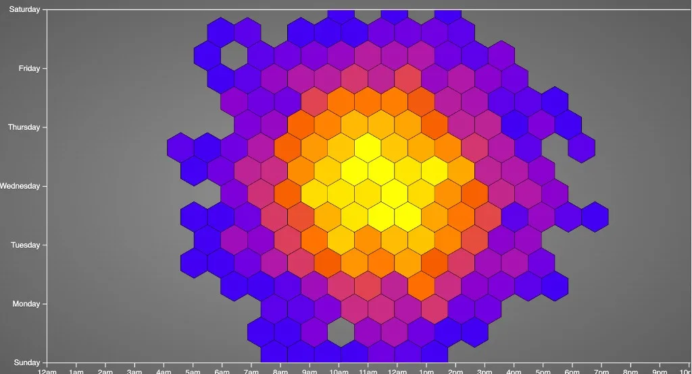

**Hex scatterplot**

---

A plain scatterplot with three thousand points is not a chart. It is **confetti**.

Every marker fights its neighbor. Overplotting hides structure. You squint, toggle opacity, and still cannot tell whether the cluster is one hot region or twenty unlucky coincidences stacked on the same pixel.

**Hex binning** is the elegant fix: snap the plane into a honeycomb grid, count what lands in each cell, and paint the hexagons by that count. You keep the **spatial honesty** of a scatter—where things pile up still matters—but you trade per-point ink for **readable density**. I built one years ago in pure **D3** on [CodePen](https://codepen.io/maggiben/pen/AgjzOZ): three thousand synthetic points, **d3.hexbin**, a blue-to-coral scale, and axes that read like a week-by-hour grid. It is still one of the most satisfying small demos in my notebook.

## Try it live — CodePen embed

The iframe keeps the pen’s styles isolated from this site’s theme. Pan your eyes across the hive: cool blues where only a few points fell, warm reds where the bin filled up.

<link rel="stylesheet" href="assets/demo/styles.css" />

<div class="blog-embed blog-embed--codepen">
  <iframe
    height="590"
    style="width: 100%;"
    scrolling="no"
    title="HEX scatterplot"
    src="https://codepen.io/maggiben/embed/AgjzOZ?default-tab=result"
    frameborder="no"
    loading="lazy"
    allowtransparency="true"
  ></iframe>
</div>

<p><em>Blank iframe? <a href="https://codepen.io/maggiben/pen/AgjzOZ" target="_blank" rel="noopener noreferrer">Open the pen on CodePen</a>.</em></p>

The data here is **synthetic**: `d3.random.normal` draws *x* and *y* in pixel space so the cloud blooms around the center of the plot. The hour and day axes are **scaffolding**—labels and grid lines that echo the punch-card charts I was building at the time—not a literal mapping from timestamp to position. Swap in real `(hour, weekday)` pairs and the same hex layer becomes a **temporal density map** without changing the core idea.

## What a hex scatterplot is

Think of it as a **2D histogram with hexagonal buckets**:

| Piece | Role |
|-------|------|
| **Points** | Raw observations `(x, y)`—events, samples, sensors |
| **Hex grid** | Fixed cells; each point belongs to exactly one hex |
| **Fill color** | How many points landed in that cell (or a derived stat) |
| **Stroke** | Optional edges so cells stay visible when counts are low |

Unlike a heatmap on a rectangular grid, hex bins **pack without gaps** and feel less “spreadsheet.” Neighbors share edges evenly; your eye reads **blobs and ridges** instead of chunky squares.

It is **not** a substitute for exact point inspection—you lose individual outliers unless you highlight them. It **is** the right first pass when the question is **where is the mass?**

## Why hexagons beat naive dots

**Overplotting** is the enemy. Transparency helps until it does not; jitter lies about position; sampling hides rare events.

Hex binning:

- **Aggregates locally** so dense regions read as one saturated cell
- **Preserves geography** better than arbitrary rectangular bins on skewed clusters
- **Scales visually** with a single color channel—no legend of fifty overlapping alphas

In the pen, each hex’s fill comes straight from the bin’s population:

```javascript
var hexbin = d3.hexbin()
  .size([width, height])
  .radius(20);

// ...

.style("fill", function(d) {
  return color(d.length);
});
```

`d.length` is the count; `color` is a linear scale from blue (quiet) to `#E74C3C` (busy), interpolated in **Lab** so the ramp does not muddy in the middle:

```javascript
var color = d3.scale.linear()
  .domain([0, 20])
  .range(["blue", "#E74C3C"])
  .interpolate(d3.interpolateLab);
```

Radius `20` is the knob: smaller hexes, finer detail, more visual noise; larger hexes, smoother fields, less precision. There is no universal answer—tune it for your screen and your question.

## The stack (CodePen, D3 v3 era)

- **[D3 v3](https://d3js.org/)** — scales, axes, SVG paths
- **[d3.hexbin](https://github.com/d3/d3-hexbin)** — Mike Bostock’s layout plugin; `.hexagon()` path generator included
- **Clip path** — hexes clipped to the plot area so the honeycomb does not bleed into the margin
- **Radial gray background** — CSS gradient behind the SVG so the chart floats like a widget on metal

The drawing loop is short: generate points, `hexbin(points)`, enter/update paths with `transform` to each bin centroid. No canvas, no WebGL—just SVG and arithmetic. That was the point in 2013: **shareable, forkable, zero build step.**

## Hex bin vs cousins

| Approach | Best for |
|----------|----------|
| **Raw scatter** | Few hundred points; every dot must be visible |
| **2D histogram (square bins)** | Fast aggregation; axis-aligned dashboards |
| **Hex scatter / hexbin** | Medium-to-large clouds; smooth spatial density |
| **Kernel density (contours)** | Continuous “hills”; less literal about counts |
| **Point map (geo)** | Lat/long on a basemap—not interchangeable, but often paired with hex for city-scale counts |

Reach for hex when you have **too many points for ink** but still want people to **point at a neighborhood** on the plane. Reach for contours when the story is “probability landscape.” Reach for raw scatters when you have **twenty dots** and a meeting in ten minutes.

## Pairing with time (the punch-card connection)

The axes in this pen borrow the **day × hour** language of a [punch card](/2026/punch-card-d3-overtime-visualization/): white tick grid, `12am`–`11pm` along the bottom, weekdays up the side. In production you would:

1. Parse timestamps into **weekday** and **hour** (mind the time zone).
2. Map those to **x** and **y** with `d3.scale`—not random normals.
3. Run the same `hexbin` and color by count or by mean of a third variable.

Suddenly the honeycomb answers: **Tuesday afternoons are thick; Sunday morning is cool.** The geometry does the compression; the color does the emphasis.

## What I would change today

If I refreshed the pen now:

- **D3 modules** — `d3-hexbin` as an import; drop the v3 global and `d3.svg.axis`
- **Real data** — `fetch` events, bin in the client or pre-aggregate on the server
- **Tooltips** — `mouseover` with count (the handlers are commented out in the original—easy win)
- **Accessible color** — sequential palette tested for color vision; document the count range in the title
- **Radius control** — slider bound to `hexbin.radius` so readers feel the bias/variance tradeoff
- **Align data to axes** — either map points through the scales or strip the decorative grid

None of that changes the lesson: **when points stack, bin them; when bins tessellate, hexagons are a beautiful choice.**

## The lesson I still keep

The best density charts do not ask you to count dots. They ask you to **feel weight**—where the cloud is heavy, where it thins, where a hot hex might deserve a follow-up query.

This pen was never meant to be a production dashboard. It was a **love letter to hexbin**: a few lines of D3, a radial backdrop, and a hive that turns chaos into pattern. Fork it, pour your logs or coordinates into the bin, and watch the red cells tell you where your system actually lives.

---

*CodePen: [codepen.io/maggiben/pen/AgjzOZ](https://codepen.io/maggiben/pen/AgjzOZ)*
