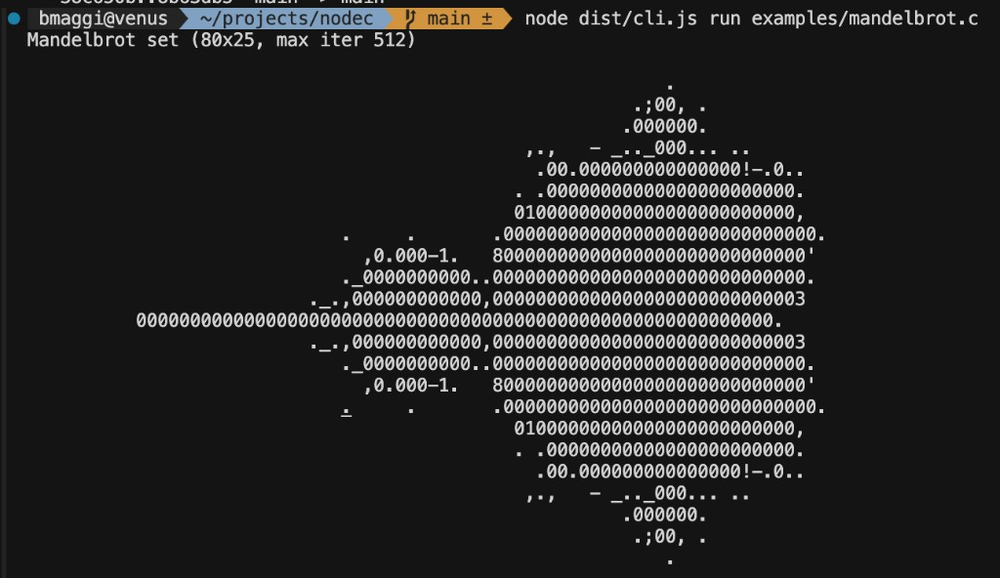

For a long time, I used compilers every day without really feeling how they worked.

I'd write TypeScript, run a command, and get JavaScript.

I'd write C in school, compile it, and get an executable.

It all worked, but the compiler itself still felt like a black box.

So I decided to build one!

Not a production-grade replacement for GCC or Clang, but a learning project: **NodeC**, a C11-oriented compiler written in TypeScript that emits JavaScript and runs on Node.js with a linear memory model.

And this experiment changed the way I think about software.

## Why I started this project

I wanted to stop treating compilation as "magic."

I wanted to understand, end-to-end:

- how source code becomes structured data,
- how that structure becomes executable behavior,
- and where things break when your mental model is wrong.

Building NodeC gave me exactly that.

## What NodeC actually does

The pipeline is simple to describe, hard to implement:

- Tokenize C source code
- Preprocess macros and includes
- Parse into program structure
- Lay out memory for globals, literals, and heap
- Generate JavaScript that runs inside a Node VM runtime

Every phase taught me something different, and exposed different failure modes.

## The biggest lesson: tokenizing and parsing are everything

Before this project, tokenizing and parsing felt like "compiler theory topics."

Now I see them as the foundation of almost every dev tool we use.

If tokenization is wrong, everything downstream is fragile.

If parsing is incomplete, code generation becomes guesswork.

If structure is wrong, behavior is wrong, even when the code looks right.

That lesson applies far beyond compilers: linters, formatters, transpilers, static analysis tools—all depend on the same core ideas.

## Why did I choose C11?

I picked C11 because it forces clarity.

C is small enough to start, but deep enough to humble you quickly:

- Pointer arithmetic
- Memory layout
- Integer behavior
- Preprocessing edge cases

C11 also remains relevant. Even if most developers don't write C daily, it still underpins huge parts of our ecosystem: runtimes, operating systems, embedded software, database engines, and ABI boundaries.

Learning C11 semantics made me a better engineer even in higher-level stacks.

## What was harder than expected?

A few things were surprisingly tough:

- The preprocessor has more edge cases than it seems.
- Bridging C semantics to JavaScript requires very explicit memory operations.
- "Partial support" is dangerous unless limitations are clearly documented.
- Compiler correctness is not "it runs my example"; it requires broad, adversarial thinking.

This project made me much more careful about assumptions, especially around tooling and runtime behavior.

## Why does this experiment matter to me?

I started NodeC as a learning exercise.

It became a mindset shift.

I now think more clearly about:

- Data representation,
- Execution models,
- Performance trade-offs,
- And the real cost of abstraction.

Even if I never build another compiler, this was one of the most valuable projects I've done as a developer.

If you're curious about compilers, I highly recommend building a small one. You don't need to finish a full language implementation. Just building the pipeline once will change how you write software.

## Example: Mandelbrot

Example running the Mandelbrot set:

If you're interested in the experiment, check out the repo: [github.com/maggiben/nodec](https://github.com/maggiben/nodec)
