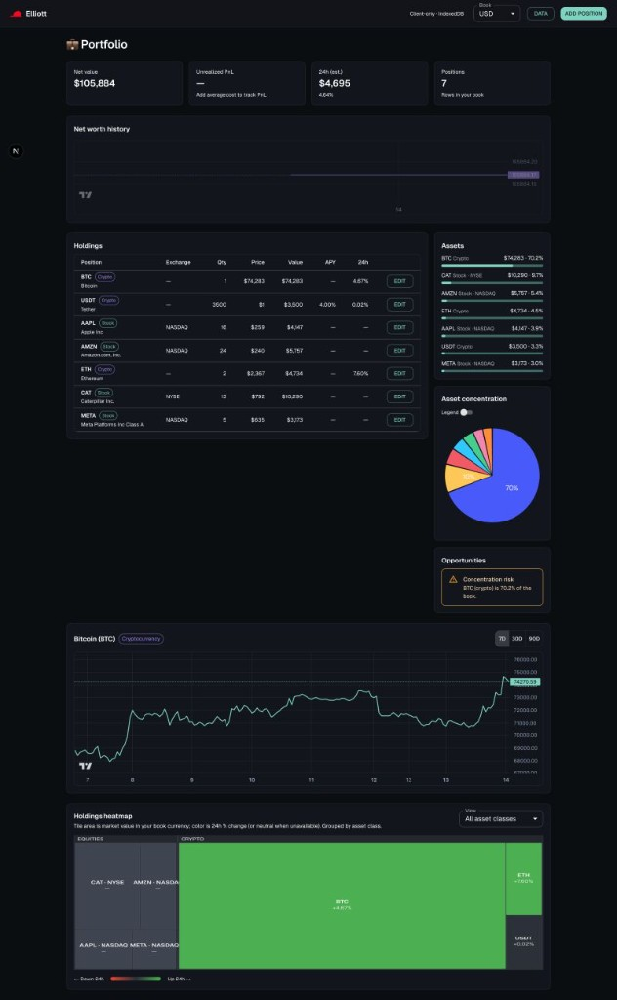

**Elliott**

---

I used to check my investments in three different places.

Stocks in one app. Crypto in another. A term deposit I tracked in a spreadsheet because nothing else modeled it the way I wanted.

Each tool was fine on its own. None of them gave me a single, honest picture of what I actually owned—and I was never fully comfortable signing up for another service whose business model is "trust us with your entire net worth."

So I built **Elliott**: a portfolio tracker that runs in the browser, keeps your positions on **your device**, and only talks to **public** market data so the numbers can update.

## What Elliott is (and what it is not)

Elliott is not a brokerage, a robo-advisor, or a social trading feed.

It is a **client-side dashboard** for people who want to see everything in one place:

- **Equities** (NYSE, NASDAQ, and other venues—including BCBA and other exchanges via listing integrations)
- **Crypto** (with sensible fallbacks when one public API is blocked in the browser)
- **Fixed income** you describe yourself (rate, dates, currency)—no external quote feed, because the terms are yours

What you enter stays in **IndexedDB**. There is no Elliott account database of your holdings. Optional API keys (for example TwelveData) live in your own `.env.local` and follow the same `NEXT_PUBLIC_*` tradeoff every static app has: convenience in a no-backend architecture, documented openly in the repo.

That constraint was deliberate. I wrote it down in [docs/constraints.md](https://github.com/maggiben/elliott/blob/main/docs/constraints.md) so future me (and any contributor) would not accidentally turn Elliott into "yet another SaaS with a Postgres of everyone's portfolios."

## A dashboard that answers real questions

When you open Elliott, the goal is not to dazzle you with widgets. It is to answer questions you actually ask:

- **What am I worth right now?** Net value, position count, and a net-worth history chart.
- **How did today go?** An estimated 24h change across the book, weighted by position size.
- **Where is the risk?** Allocation breakdown, a concentration pie chart, and **opportunity hints**—small, explainable rules like "BTC is over 70% of the portfolio" rather than opaque AI scores.
- **What is each line doing?** A holdings table with quantity, price, value, and optional APY where it applies; click through to a per-asset chart with 7D / 30D / 90D ranges.
- **What dominates visually?** A holdings heatmap (treemap) sized by value and colored by 24h move, grouped into equities vs crypto so you can spot both concentration and momentum at a glance.

If you add average cost, unrealized PnL lights up. If you do not, Elliott still works—it just does not pretend to know what you paid.

## How the pieces fit together

Under the hood, Elliott is a Next.js **16+** app (App Router, React 19, strict TypeScript) with a clear split of concerns:

| Concern | Mechanism |
|--------|-----------|
| Portfolio & holdings | **Jotai** atoms synced to IndexedDB |
| Live quotes & charts | **TanStack Query** with interval refetch and a local quote cache |
| UI-only state | Separate Jotai atoms (selected symbol, chart range, dialogs) |
| Market data | Normalized into one `MarketData` shape after fetch |

The market pipeline is intentionally boring in a good way: fetch from allowed public sources (CoinGecko, Binance, TwelveData, and—where configured—InvertirOnline listing pages for certain exchanges), normalize, cache snapshots in IndexedDB so the UI is never empty while the network catches up, then render.

Crypto tries Binance first and falls back to CoinGecko when CORS says no—because **the browser is the runtime**, not an excuse for a hidden server. Equities can prefer IOL listing HTML for venues you configure, then TwelveData. Fixed income is pure math from fields you type.

Charts use **TradingView Lightweight Charts** (client-only lifecycle). KPIs and opportunity rules live in pure functions under `lib/calculations/` and `lib/opportunities/` so they stay testable and auditable.

If you want the full diagram and folder map, see [docs/architecture.md](https://github.com/maggiben/elliott/blob/main/docs/architecture.md).

## Why "no backend" was a feature, not a shortcut

A portfolio tracker is a tempting place to add "just a small API."

Store positions server-side. Hide API keys. Proxy every vendor. Ship mobile sync for free.

I resisted that—not because backends are bad, but because the product promise is **your portfolio, on your device**. Elliott is a static-friendly client bundle. Route handlers are not the core story; the browser calling public endpoints (and documented CORS proxies where listing HTML requires it) is.

That choice has costs. Keys in the client are a tradeoff. Some feeds fail in the browser and degrade gracefully. You are responsible for your own backup/export story (the **Data** panel is there for that).

It also has benefits. No signup funnel. No vendor lock-in on your position list. No wondering which employee can query your holdings table. The app can be forked, audited, and run locally with `npm install && npm run dev`.

## What I learned building it

**Normalization matters more than the number of integrations.** Three different vendors will give you three different shapes; one `MarketData` model and one quote-key scheme keep the dashboard from turning into `if (source === 'x')` soup.

**Client-side persistence is a product decision.** IndexedDB via `idb`, debounced writes after hydration, and a merged quote cache mean Elliott feels alive even when quotes are stale for a few seconds.

**Explainable alerts beat black-box insights.** The concentration warning in the screenshot is not magic—it is a documented rule with a stable id. I can disagree with it, turn it off later, or add another rule without retraining a model.

**Dark-first UI is not vanity.** Financial data is dense. A restrained MUI theme, high contrast, and responsive layout make long sessions less tiring.

## Try it yourself

Elliott is open in the repo (private flag in `package.json` today—adjust the license if you ship it wider):

```bash
git clone https://github.com/maggiben/elliott.git
cd elliott
npm install
cp env.example .env.local   # optional: TwelveData, IOL venues, Corsfix
npm run dev
```

Open [http://localhost:3000](http://localhost:3000), add a position, and watch the book come together.

If you have been juggling spreadsheets and half a dozen apps for the same problem, I hope Elliott gives you the same calm I was after: **one view, your data, public prices only.**

Repo: [github.com/maggiben/elliott](https://github.com/maggiben/elliott)
