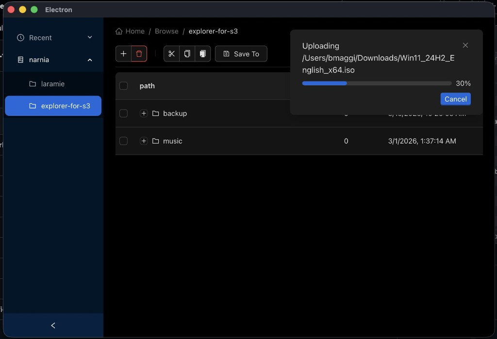

**Explorer for S3**

---

I reach for S3 constantly—backups, build artifacts, media, the odd ISO I swear I will boot "this weekend."

The AWS Console is fine when I need IAM policies or lifecycle rules. The CLI is perfect in scripts. Neither feels like **moving files** when I already know what I want: open a folder, drag something in, watch the progress bar, done.

So I built **[Explorer for S3](https://github.com/maggiben/explorer-for-s3)**—a desktop app that treats your bucket like a drive on your machine.

## The problem I was solving

S3 is object storage, not a filesystem. That distinction is correct—and also annoying when your muscle memory says *Finder* or *Explorer*.

I kept bouncing between:

- **AWS Console** — powerful, but web-heavy and not where my local files live
- **`aws s3 cp`** — great in CI, tedious for "upload this folder and tell me when it finishes"
- **Third-party clients** — often closed-source, subscription-shaped, or missing the workflows I care about (custom endpoints, local dev against Garage, cancelable multipart uploads)

I wanted something I could **run locally**, **trust with keys**, and **ship for macOS, Windows, and Linux** without rewriting the UI three times.

## What it feels like to use

The screenshot above is the real app: dark UI, bucket tree on the left, breadcrumb path across the top, and a file table in the middle.

Day to day, it behaves the way you'd expect from a file manager:

- **Browse** buckets and prefixes in a tree table (folders expand; files show size and last modified)
- **Upload** by drag-and-drop onto the window—or onto a specific folder row
- **Download** selected objects (including folder trees) to a path you pick
- **Cut, copy, and paste** objects inside the bucket (S3 copy + optional delete for move)
- **Delete** with confirmation through the toolbar
- **Recent** locations in the sidebar so you can jump back quickly
- **Save To** links a connection into a saved bucket profile for faster switching

Large uploads surface as **persistent notifications** with a live progress bar and a **Cancel** button. Yes, that progress panel is uploading a Windows 11 ISO—because if the tool can't handle a multi-gigabyte multipart upload without freezing the UI, it's not done.

## Under the hood (without the black box)

Explorer for S3 is an **Electron** app scaffolded with **electron-vite**, with a clean split:

| Layer | Role |
|--------|------|
| **Renderer** (React 19 + Ant Design) | File browser UI, Jotai state, React Router, i18next |
| **Preload** | Typed bridge to the main process |
| **Main** (Node) | AWS SDK v3 calls, SQLite cache, encrypted secrets, native drag |

### S3 operations that respect real files

The main process uses **@aws-sdk/client-s3** and **@aws-sdk/lib-storage** so uploads are **multipart** with `httpUploadProgress` events streamed back over IPC. Downloads and uploads both support **AbortController**—when you hit Cancel, the in-flight transfer actually stops.

Custom endpoints (MinIO, **Garage**, LocalStack, etc.) work via `forcePathStyle` when you configure a non-AWS endpoint—handy for local dev.

The repo ships a **Garage** setup script: one command spins up S3-compatible storage in Docker and prints access keys you can paste into the app. That loop—`./garage/setup.sh`, add connection at `http://localhost:3900`, browse—is how I dogfood without touching production buckets.

### A local index so browsing stays snappy

Listing a large prefix from S3 on every click gets old fast. After you connect, the app **syncs** object metadata into **SQLite** (via Sequelize) and serves the table from that cache. Keyword search, pagination cursors, and folder parent checks all run against the local model; mutations update S3 and the DB together.

### Credentials that stay on your machine

Access keys are not stored in plain text. The main process uses Electron **safeStorage** for a master key, then **AES-256-GCM** for sensitive fields at rest. If secure enclave storage isn't available on a platform, the app fails loudly rather than pretending.

### Desktop affordances you don't get in a web console

- **Drag out** a file to the OS (signed URL when possible; native drag fallback otherwise)
- **Drag in** local paths resolved through the preload API (browser `File` objects don't expose full paths—Electron does)
- **Tray icon** and standard window lifecycle on macOS vs Windows/Linux
- **Auto-updates** wired through electron-updater with GitHub releases

## Quality bar: tests and builds

This is a utility people will run with real data, so I kept the bar practical:

- **Vitest** for path/tree utilities and other pure logic
- **Playwright** end-to-end tests against the packaged Electron app
- **GitHub Actions** for CI and release artifacts

Build targets are first-class in the README:

```bash
git clone https://github.com/maggiben/explorer-for-s3.git
cd explorer-for-s3
npm install
npm run dev          # development
npm run build:mac    # or build:win / build:linux
```

## What I learned building it

**Progress UX is part of the product.** S3 uploads are inherently async and chunked; if the UI doesn't show per-file progress and let you abort, users assume the app hung.

**A cache is a feature, not a cheat.** Object storage APIs are optimized for scale, not for "click folder, see children in 16ms." A synced SQLite mirror makes the UI feel native—as long as you reconcile on connect and after mutations.

**Path-style endpoints matter.** Supporting Garage and other S3-compatible backends forced `forcePathStyle` and explicit regions into the connection model early, which saved pain later.

**Electron is still the right hammer for this nail.** File paths, native drag-and-drop, encrypted local storage, and one React codebase across three OSes—hard to replicate in a pure web app without giving up something important.

## Try it

If you live in S3 buckets but think in folders, Explorer for S3 is for you.

Clone the repo, point it at AWS or a local Garage instance, and drag a big file in. Watch the progress bar. Cancel it halfway if you're feeling chaotic.

Repo: [github.com/maggiben/explorer-for-s3](https://github.com/maggiben/explorer-for-s3)
