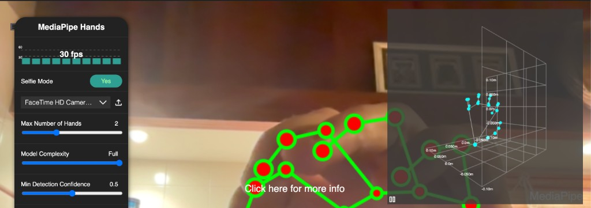

**MediaPipe Hands**

---

There is a specific thrill in watching **your own hands** turn into geometry in real time—not a prerecorded clip, not a server round-trip, just the GPU, a webcam, and a loop that refuses to drop frames.

Back in November 2021 I published exactly that on CodePen: [**MediaPipe Hands**](https://codepen.io/maggiben/pen/MWvVYqy). It was a fork of Google's official sample, tightened into something I could share with a link and no install step. Green lines for the right hand, red for the left. A tiny **3D landmark grid** in the corner. Sliders for model complexity and confidence. Selfie mode, because everyone tests these things in front of a laptop camera.

Years later, computer vision moved on—bigger models, WASM bundles, hand landmarkers in new APIs—but the pen still does the thing that hooked me: **perception as a live UI**.

## Try it live

Allow webcam access when your browser prompts you (inside the embed). Use the panel on the left—**Selfie Mode**, camera picker, hand count, model complexity, confidence sliders. Chrome desktop is what I originally targeted.

<iframe
  height="520"
  style="width: 100%; min-height: 520px; border: 0;"
  scrolling="no"
  title="MediaPipe - Hands"
  src="https://codepen.io/maggiben/embed/MWvVYqy?default-tab=result"
  loading="lazy"
  allow="accelerometer; autoplay; camera *; clipboard-read; clipboard-write; display-capture *; encrypted-media; gyroscope; microphone *; picture-in-picture; web-share"
  allowfullscreen
>
  See the Pen <a href="https://codepen.io/maggiben/pen/MWvVYqy">MediaPipe - Hands</a> by Benjamin (<a href="https://codepen.io/maggiben">@maggiben</a>) on <a href="https://codepen.io">CodePen</a>.
</iframe>

<p><em>Camera blocked in the frame? <a href="https://codepen.io/maggiben/pen/MWvVYqy" target="_blank" rel="noopener noreferrer">Open the pen on CodePen</a>—browsers often only grant webcam access on the top-level tab.</em></p>

**What you should see:** your video feed with 21 landmarks per hand, connectors between joints, an FPS counter, and the 3D grid in the corner—like the capture above.

## Why this pen mattered to me

Before every product had "AI" in the subtitle, **MediaPipe** was the quiet proof that serious vision could run **in the tab**. No Python server. No frame upload. The model weights loaded from a CDN; `hands.send({ image })` did the rest.

CodePen was the perfect showroom:

| Piece | Role |
|-------|------|
| **TypeScript** | Types for `Results`, options, and landmark arrays—small safety net on a demo that would otherwise rot |
| **SCSS** | Nested layout for fullscreen canvas, loading spinner, corner grid |
| **CDN scripts** | `@mediapipe/hands`, drawing utils, control panel, 3D grid—same stack Google documented |
| **Instant share** | One URL for recruiters, friends, or future me who forgot this existed |

I did not invent hand tracking. I **curated** it: kept the 3D grid, wired device detection, left the sliders that make the demo feel like a lab bench instead of a GIF.

## What is running under the hood

The flow is the classic MediaPipe pattern—predictable once you have seen it once, addictive forever:

```
webcam frame → Hands.send(image) → onResults → canvas 2D + 3D grid
```

**1. Model load.** `Hands` resolves WASM and model files from jsDelivr using `locateFile` and the package `VERSION`—so the pen tracks whatever `@mediapipe/hands` version CodePen pins.

**2. Per-frame inference.** The control panel's `SourcePicker` grabs camera frames, resizes the canvas to the viewport aspect ratio, and awaits `hands.send({ image })`.

**3. 2D overlay.** In `onResults`, the code clears the canvas, draws the camera image, then for each detected hand:

- Classifies **left vs right** (`multiHandedness`)
- Draws connectors along `HAND_CONNECTIONS`
- Draws landmarks with depth-aware radius via `drawingUtils.lerp` on `z`—joints closer to the camera read slightly larger

Right hand: green strokes, red fills. Left hand: the inverse. Small choice; big readability when both hands overlap.

**4. 3D world landmarks.** The corner grid is the clever bit. `updateLandmarks` only accepts **one** merged landmark list, but you may have two hands. The pen **concatenates** world-space points and **offsets** connection indices so finger bones still line up:

```javascript
const offset = loop * mpHands.HAND_CONNECTIONS.length;
const offsetConnections = mpHands.HAND_CONNECTIONS.map((connection) => [
  connection[0] + offset,
  connection[1] + offset,
]);
```

That is the kind of glue code tutorials skip and demos need.

**5. UX polish.** A spinner fades when the first frame lands (`body.loaded`). `device-detector-js` warns if you are not on Chrome—MediaPipe was picky in 2021 and honesty beat silent failure. Selfie mode mirrors the hidden `<video>` with `transform: scale(-1, 1)` so movement matches intuition.

## The stack (2021 edition)

- **[@mediapipe/hands](https://www.npmjs.com/package/@mediapipe/hands)** — 21 3D landmarks per hand, up to four hands
- **control_utils** — FPS readout, sliders, camera / image source picker
- **controls_3d** — `LandmarkGrid` for world coordinates
- **drawing_utils** — connectors and landmark circles on Canvas2D
- **device-detector-js** (ESM from esm.sh) — lightweight UA gate

The pen's parent on CodePen is Google's reference; mine kept the spirit and the **interactive panel** front and center.

## What I would change today

If I refreshed the project now:

- **Hand Landmarker** — MediaPipe's newer Tasks API is the maintained path; the classic `Hands` solution still works but is legacy territory.
- **HTTPS and permissions** — embeds need `allow="camera"` (included above); some readers will still need a top-level tab on CodePen.
- **Mobile** — thermal throttling and smaller GPUs hurt; default `modelComplexity` to Lite on narrow viewports.
- **Privacy copy** — one line: frames stay local, nothing is uploaded. Obvious to us; not to every visitor.

None of that diminishes what 2021 felt like: **research-grade tracking as a front-end afternoon**.

## The lesson I still keep

Not every experiment needs a monorepo. Some need a **camera, a canvas, and a link you send at midnight** because the result is too cool to keep on localhost.

MediaPipe Hands was that for me—a reminder that the browser is not only forms and fetch; it is a place where **geometry can follow your fingers** at sixty frames per second.

If you build something similar, fork the pen, break the sliders, and see how fragile confidence thresholds are. That is how you learn vision—not from a slide deck, but from watching landmarks jitter when the light is wrong.

---

*CodePen: [codepen.io/maggiben/pen/MWvVYqy](https://codepen.io/maggiben/pen/MWvVYqy) · Published November 2021*
