**Bienestar digital · Screen time**

---

Hace un tiempo activé el tracker de tiempo de uso del celular.

No para volverme productivo ni convertirme en un monje digital. Simplemente quería entender a dónde se me estaban yendo las horas.

La respuesta me pegó bastante fuerte: **más de 4 horas por día** mirando una pantalla que muchas veces ni siquiera recordaba haber usado.

Entonces empecé a hacer cambios pequeños.

## Sacar el trabajo del bolsillo

Primero saqué todas las apps del trabajo del teléfono.

Slack afuera. Mail afuera. Todo afuera.

Y pasó algo raro: el mundo no se terminó.

Nadie murió porque tardé un rato más en responder. Los mensajes siguieron ahí cuando volví. Las urgencias reales siguieron siendo pocas.

También eliminé casi todas las redes sociales. Hoy uso el teléfono principalmente para **música**, **Google Maps** y **WhatsApp** para hablar con amigos y familia.

Pasé de usar el celular más de 4 horas por día a **una hora y media o menos**—y en las mejores semanas, **menos de 45 minutos** de promedio diario.

Y sinceramente siento que recuperé una parte de mi cabeza.

Tengo más tiempo para pensar. Para meditar. Para aburrirme un poco. Para estar presente en conversaciones sin sentir la necesidad de mirar la pantalla cada 30 segundos.

Antes me costaba ver una película entera sin revisar mensajes. Ahora puedo sentarme en un bar a tomar un café y hablar tranquilo sin actuar como si estuviera manejando una central nuclear desde el bolsillo.

## Los reportes semanales (las capturas no mienten)

No me creas a mí: mirá lo que va guardando **Digital Wellbeing** en el Samsung. Cada captura es un reporte semanal; el número grande es el **promedio diario** de esa semana.

No es una curva perfecta. Hay semanas en **1 h 30 m**, otras en **43 m**, y algún miércoles rebelde que se va a **2 h** o más. Pero la tendencia es clara: de “muchas horas sin darme cuenta” a un rango que puedo defender sin autoengaño.

<link rel="stylesheet" href="assets/styles.css" />

<em>Deslizá horizontalmente en cada fila →</em>

Noviembre–diciembre 2025

  <figure class="blog-screenshot-strip__card" style="flex:0 0 auto;margin:0;width:142px;">
    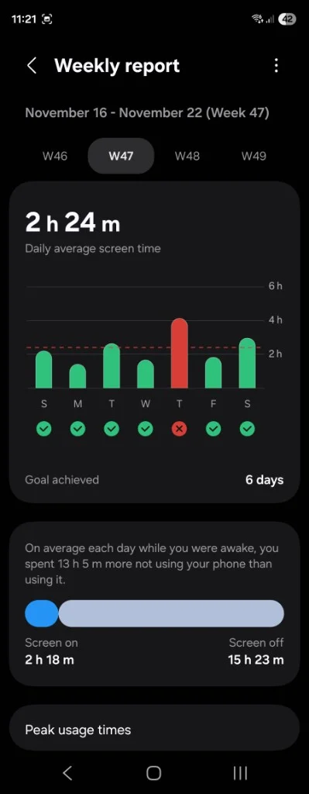
    <figcaption><strong>S47</strong> — 2 h 24 m</figcaption>
  </figure>
  <figure class="blog-screenshot-strip__card" style="flex:0 0 auto;margin:0;width:142px;">
    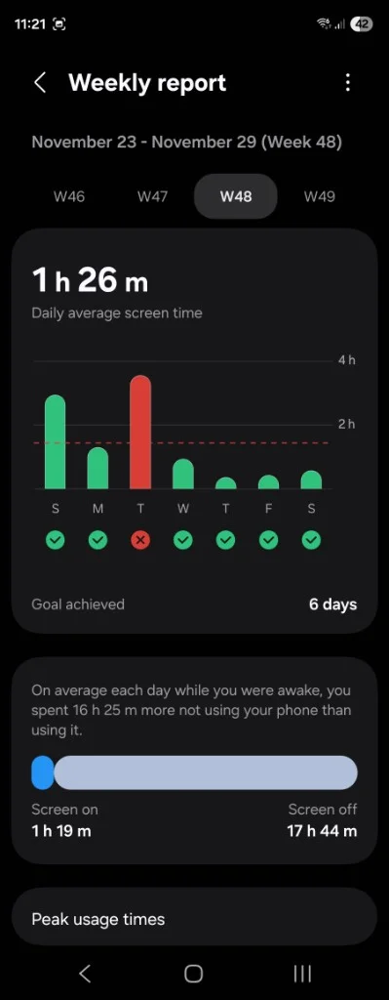
    <figcaption><strong>S48</strong> — ~1 h 26 m</figcaption>
  </figure>
  <figure class="blog-screenshot-strip__card" style="flex:0 0 auto;margin:0;width:142px;">
    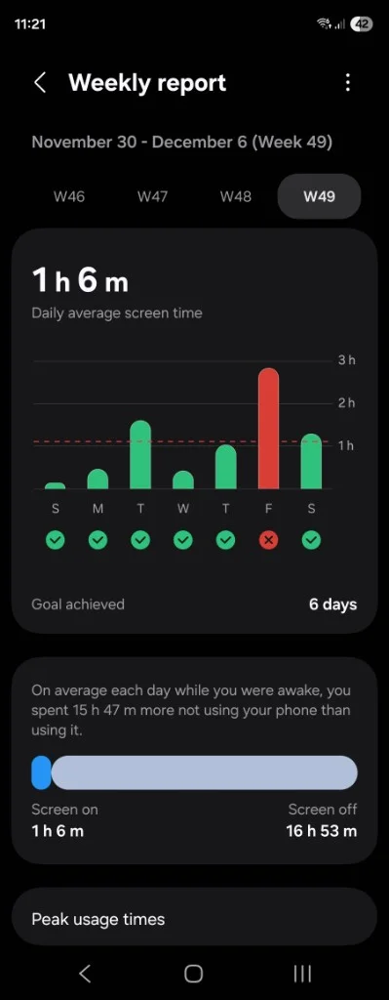
    <figcaption><strong>S49</strong> — ~1 h 6 m</figcaption>
  </figure>

Febrero–abril 2026

  <figure class="blog-screenshot-strip__card" style="flex:0 0 auto;margin:0;width:142px;">
    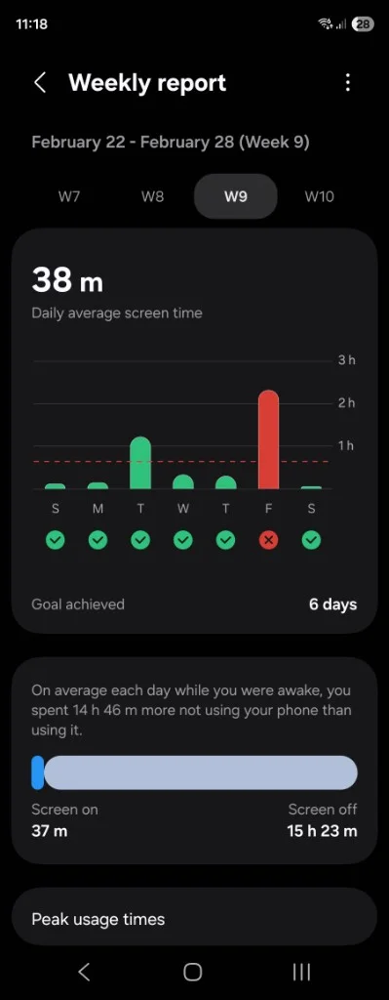
    <figcaption><strong>S9</strong> — 38 m</figcaption>
  </figure>
  <figure class="blog-screenshot-strip__card" style="flex:0 0 auto;margin:0;width:142px;">
    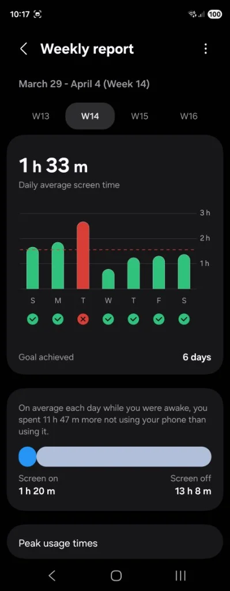
    <figcaption><strong>S14</strong> — ~1 h 33 m</figcaption>
  </figure>
  <figure class="blog-screenshot-strip__card" style="flex:0 0 auto;margin:0;width:142px;">
    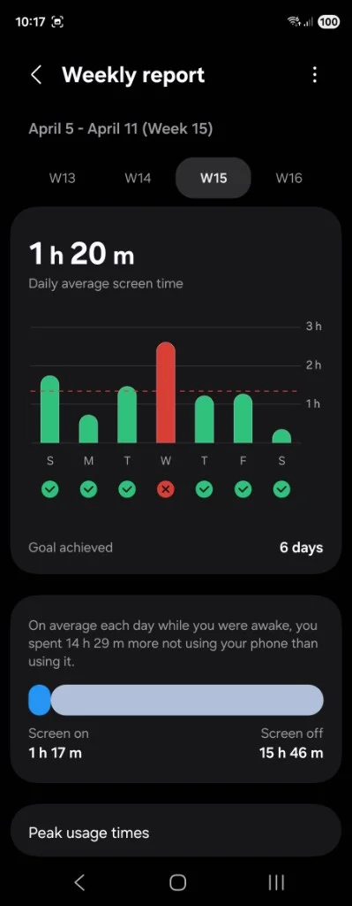
    <figcaption><strong>S15</strong> — ~1 h 20 m</figcaption>
  </figure>
  <figure class="blog-screenshot-strip__card" style="flex:0 0 auto;margin:0;width:142px;">
    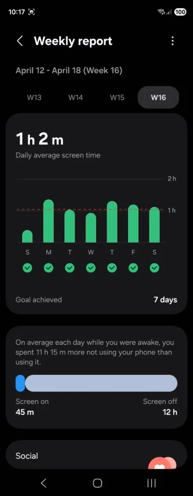
    <figcaption><strong>S16</strong> — ~1 h 2 m, 7/7</figcaption>
  </figure>
  <figure class="blog-screenshot-strip__card" style="flex:0 0 auto;margin:0;width:142px;">
    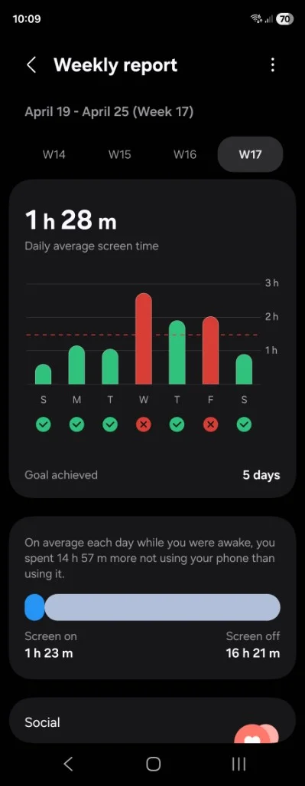
    <figcaption><strong>S17</strong> — ~1 h 28 m</figcaption>
  </figure>

Mayo 2026

  <figure class="blog-screenshot-strip__card" style="flex:0 0 auto;margin:0;width:142px;">
    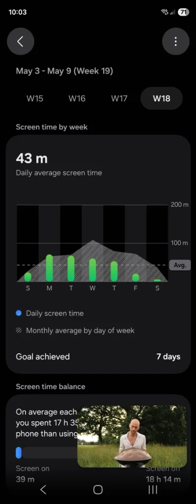
    <figcaption><strong>S18</strong> — 43 m, 7/7</figcaption>
  </figure>
  <figure class="blog-screenshot-strip__card" style="flex:0 0 auto;margin:0;width:142px;">
    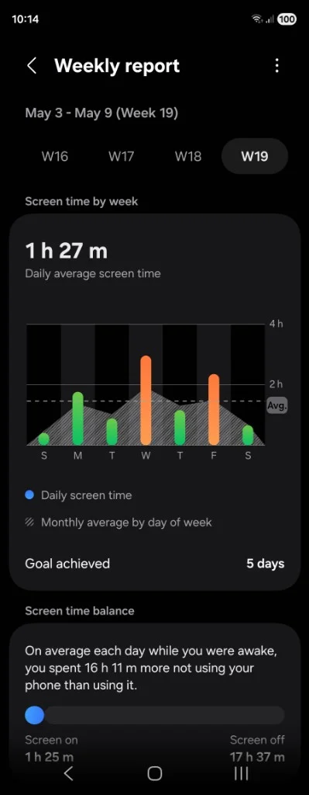
    <figcaption><strong>S19</strong> — ~1 h 27 m</figcaption>
  </figure>
  <figure class="blog-screenshot-strip__card" style="flex:0 0 auto;margin:0;width:142px;">
    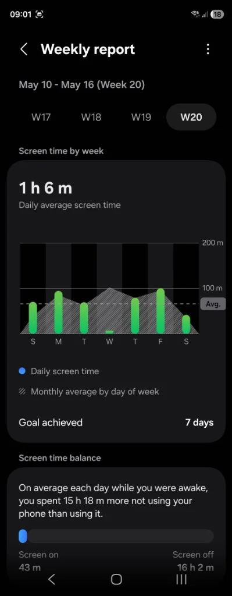
    <figcaption><strong>S20</strong> — ~1 h 6 m, 7/7</figcaption>
  </figure>
  <figure class="blog-screenshot-strip__card" style="flex:0 0 auto;margin:0;width:142px;">
    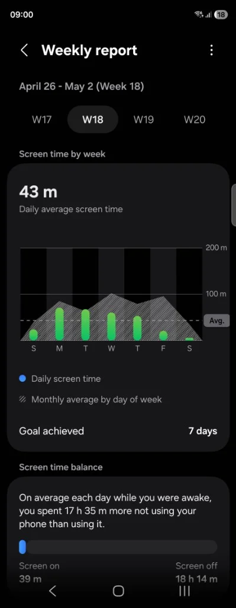
    <figcaption><strong>S21</strong> — 43 m, 7/7</figcaption>
  </figure>

Lo que más me gusta de estas pantallas no es solo el número: es la frase de abajo—*“pasaste X horas más sin el teléfono que usándolo”*—que te recuerda que el día es largo y que el scroll no es el default.

## La trampa de los videos cortos

Lo más difícil fue entender el tema de los videos cortos.

Creo que se convirtieron en una de las formas de adicción más normalizadas que existen.

Un video te entretiene. El siguiente te aburre. El otro vuelve a engancharte. Y así se te fue una hora sin darte cuenta.

Encima muchas redes mezclan contenido realmente interesante con toneladas de “slop”. Yo seguía varios YouTubers de tecnología que hacían análisis largos y profundos. De pronto mi feed estaba lleno de gente resumiendo lo mismo en 30 segundos con música de fondo y subtítulos gigantes.

Ahí entendí la trampa.

No es que todo el contenido sea malo. Es que el formato está diseñado para que **nunca termines de consumir**.

## Trabajo, caminatas y “no voy a estar por un rato”

También noté algo importante: cuando dejé de tener el trabajo en el teléfono, empecé a concentrarme mejor cuando realmente trabajaba.

Las escapadas para hacer un trámite o salir a caminar volvieron a ser tiempo mío. No momentos interrumpidos por notificaciones, mensajes y “ya que estoy respondo esto rápido”.

Entiendo perfectamente que hay trabajos donde la disponibilidad constante es parte de la realidad. Pero en mi caso empecé a decir algo mucho más simple:

**“No voy a estar por un rato.”**

Y listo.

Creo que bajaron muchísimo mis niveles de ansiedad. Antes estaba constantemente pendiente de dónde estaba el teléfono. Ahora a veces lo dejo tirado por ahí y tengo que llamarlo para encontrarlo.

Y honestamente… me gusta que sea así.

## Informarse sin scrollear la vida

Leer noticias y mantenerse informado no debería significar pasar horas scrolleando o mirando videos infinitos.

A veces **15 minutos bien usados** informan más que 3 horas de consumo automático.

No creo que el celular sea el enemigo. Pero sí creo que muchas apps compiten agresivamente por nuestra atención.

Y recuperar aunque sea una parte de ese tiempo cambia más cosas de las que uno imagina.
