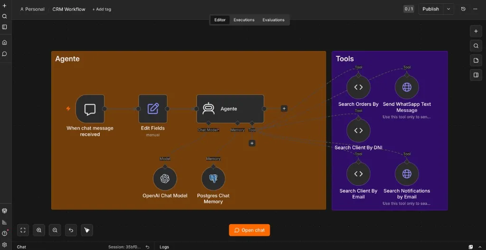
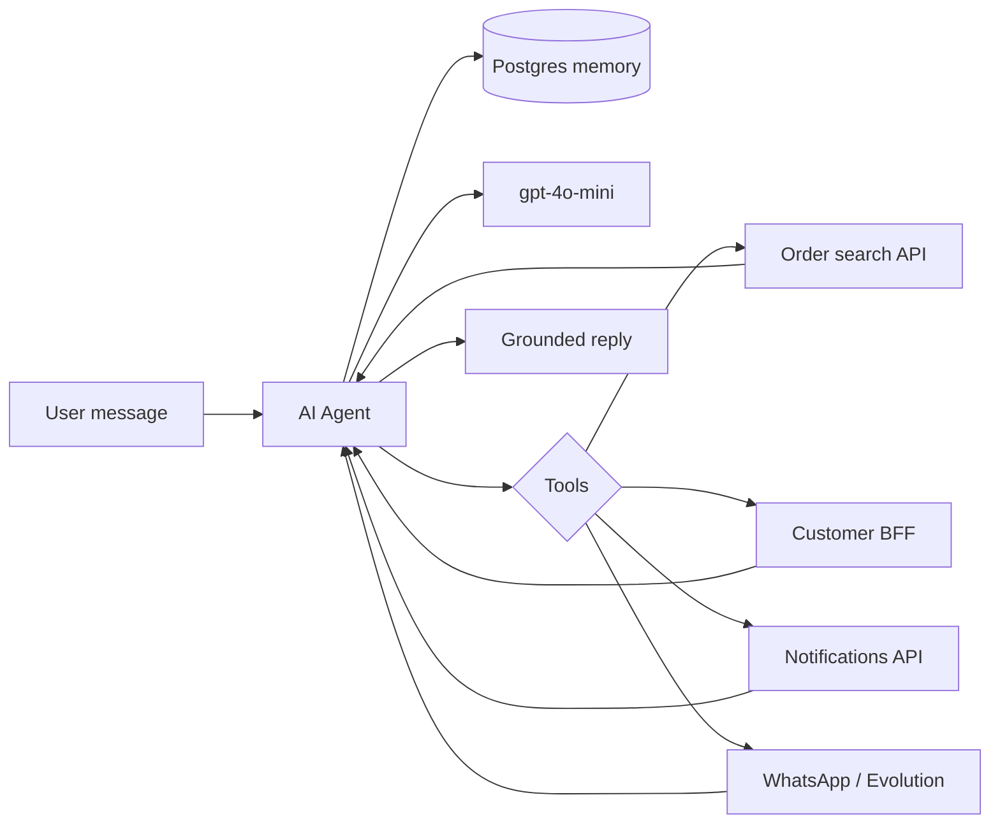

**n8n CRM Agent**

---

Customer support teams do not lack software. They lack **continuity**.

The order lives in the OMS. The customer profile sits in a BFF. Notifications went out through a separate messaging service. WhatsApp is yet another channel with its own API. Each system works. None of them talk to each other in a way a human on shift can use without opening six tabs and copying IDs between screens.

That fragmentation is what [**Darthmouth**](https://github.com/maggiben/darthmouth)—my self-hosted n8n stack—was built to collapse. The goal was not a chatbot demo. It was to **automate the CRM workflow end to end**: one conversational agent that can look up clients, pull orders, check notification history, and send WhatsApp replies—while remembering what was said five messages ago.

The screenshot above is the whole architecture on one canvas. Brown box: the agent loop. Purple box: the tools. Everything else is plumbing you do not want to rewrite every time a new API appears.

## Why n8n for agent automation

Most CRM automation stories start with a Python script and end with a brittle cron job nobody dares to touch.

n8n sits in a different place: **visual orchestration with real AI primitives**. The platform ships LangChain-backed nodes—AI Agent, chat triggers, Postgres memory, HTTP tools, code tools—and connects them to hundreds of integrations without forcing you to rebuild auth, retries, and webhook wiring from scratch.

For a CRM copilot, that matters because the hard part is not the LLM call. It is the **glue**:

| Concern | What n8n gives you |
|---------|-------------------|
| Entry point | Chat trigger (embedded UI or webhook) |
| Reasoning | AI Agent node with tool routing |
| Model access | OpenAI / Anthropic / local Ollama nodes |
| Persistence | Postgres chat memory, workflow DB |
| Side effects | HTTP Request tools, Code tools, Evolution API for WhatsApp |
| Ops | Execution logs, replay, credential vault |

You still write the business logic. You just stop re-implementing the agent harness every time.

## The stack behind the workflow

Darthmouth extends the [n8n self-hosted AI starter kit](https://github.com/n8n-io/self-hosted-ai-starter-kit) into something closer to production CRM plumbing:

- **n8n** — workflow engine and agent host
- **PostgreSQL** — n8n state, chat memory, LiteLLM metadata, Evolution API data
- **LiteLLM** — single OpenAI-compatible gateway for `gpt-4o-mini`, Claude, and embeddings with rate limits
- **Evolution API** — WhatsApp send/receive without Meta Business bureaucracy on day one
- **Open WebUI** — optional chat front-end via an [`n8n_pipe`](https://openwebui.com/f/coleam/n8n_pipe/) function that forwards messages to the workflow webhook
- **Redis** — Evolution session cache

Everything runs under `docker compose`. Workflows and credentials import on boot from `n8n/backup/`, so the CRM agent survives container rebuilds.

That last detail is easy to skip and painful to learn without: **treat workflows as code**. Export them. Version them. Import them in CI or on deploy. An agent that only exists in someone's browser tab is not infrastructure—it is a demo.

## Meet Frai: the agent loop

The workflow is called **CRM Workflow**. The agent answers to **Frai**—Spanish-first, 24×7 tone, polite but operational.

The loop is deliberately small:

1. **When chat message received** — chat trigger with session ID and user text
2. **Edit Fields** — normalize `chatInput` and `sessionId` so downstream nodes see a stable shape
3. **Agente** — the LangChain agent node
4. **OpenAI Chat Model** — `gpt-4o-mini` routed through LiteLLM
5. **Postgres Chat Memory** — conversation history keyed by session

The system prompt is intentionally minimal: use tool responses, do not invent facts, say "I don't know" when the APIs return nothing. That restraint is a feature. CRM agents fail loudly when they **hallucinate order statuses** or **fabricate tracking numbers**.

```text
You are a helpful assistant. You will use the tool response to respond to the user's query.
If you don't know the answer say I don't know.
```

Minimal prompts plus strong tools beat elaborate persona instructions when the job is lookup and action, not storytelling.

## Tool use: retrieval without a vector store

People hear "RAG" and picture PDFs chunked into Qdrant. That is one retrieval pattern. CRM automation needs another: **live retrieval from operational APIs**.

Each tool is a retrieval function the model can call when the user's question requires fresh data:

| Tool | Type | What it retrieves or does |
|------|------|---------------------------|
| **Search Orders By** | Code tool | Paginated order search against the OMS |
| **Search Client By DNI** | Code tool | Customer profile by national ID |
| **Search Client By Email** | Code tool | Customer profile by email |
| **Search Notifications by Email** | HTTP tool | Notification history for a destination address |
| **Send WhatsApp Text Message** | HTTP tool | Outbound message via Evolution API |

Two implementation styles show up on purpose:

**Code tools** wrap internal REST endpoints with `@langchain/core/tools` `DynamicTool`. They are ideal when the payload is ugly—nested filters, pagination defaults, domain-specific field names—and you want full control over the request shape. The order search tool posts a structured body with dozens of filter slots; only `searchBox` is exposed to the model.

**HTTP Request tools** are faster to wire for simpler POST/GET shapes. The WhatsApp tool maps `{phone}` and `{message}` placeholders straight into Evolution's `/message/sendText` endpoint.

From the agent's perspective, both are the same contract: **name, description, parameters in → JSON out**. The model decides *which* tool to call based on descriptions you write. That is the whole "tool use" loop—no fine-tuning, no hard-coded intent classifier, just function calling with guardrails.

### RAG vs. operational retrieval

Classic **RAG** (Retrieval-Augmented Generation) embeds documents, searches a vector store, injects chunks into context. The starter kit supports that path with Qdrant and embedding models through LiteLLM.

This CRM agent does not need policy PDFs in a index. It needs **authoritative rows from systems of record**. That is still augmentation—just with HTTP instead of cosine similarity:



When a support lead asks *"What happened with order 12345?"*, the agent does not guess from training data. It calls **Search Orders By**, reads the JSON, and summarizes. That is RAG in spirit—**retrieve, then generate**—even when the retriever is an OMS endpoint instead of a vector database.

In practice, mature deployments combine both: vector RAG for FAQs and runbooks, tool retrieval for live customer state. Darthmouth keeps the door open; the CRM workflow optimizes for the second path because that is where the pain was.

## Memory: why Postgres beats "just pass the thread"

Stateless agents feel clever for one turn. They fall apart on the third.

*"Look up this customer."* Done.  
*"What about their last order?"* Without memory, the model does not know who *this* is unless the user repeats the email or DNI.

**Postgres Chat Memory** stores the conversation per `sessionId`. Each turn reloads prior messages before the agent plans the next tool call. That enables natural follow-ups—pronouns, implicit references, multi-step investigations—without stuffing the entire CRM into the system prompt.

Sessions also map cleanly to channels. Open WebUI passes `chat_id` as `sessionId` through the pipe function; the embedded n8n chat UI uses its own session identifier. Same workflow, different front ends, consistent memory key.

The trade-off is familiar: long threads cost tokens. For CRM sessions, that is usually acceptable—support conversations are bounded, and summarization nodes can compress history if you outgrow raw replay.

## From chat to WhatsApp and back

The interesting moment is not lookup. It is **closing the loop**.

A support agent finds the customer's phone number via **Search Client By Email**, confirms the order status from **Search Orders By**, and then calls **Send WhatsApp Text Message** with a human-readable summary—all in one conversational flow orchestrated by the model.

Evolution API runs as its own service with Redis-backed session state and Postgres persistence. n8n treats it like any other HTTP tool: API key header, JSON body, done. No custom node required.

That pattern—**read from internal APIs, write to external channels**—is where agent automation pays rent. You are not replacing the CRM. You are giving operators a single interface that already knows how to reach every subsystem.

## What I would do differently next time

Shipping this taught a few lessons worth passing on:

1. **Tool descriptions are your API docs.** Vague descriptions produce vague tool selection. "Use this tool only to search for orders" beats "order tool."
2. **Return less JSON.** APIs love verbose responses. Truncate or map to the fields the model actually needs before returning tool output—token budget and answer quality both improve.
3. **Separate read and write tools mentally.** Lookups can be permissive; WhatsApp sends should require explicit user confirmation in the prompt or a human-in-the-loop step for production.
4. **LiteLLM early.** One gateway for OpenAI and Anthropic credentials, RPM limits, and model aliases saves pain when you swap models without rewiring every workflow.
5. **Export workflows on every change.** The JSON in `n8n/backup/workflows/CRM_Workflow.json` is the source of truth, not the UI state.

## The point

CRM automation is not one integration. It is **many integrations with a coherent story**.

n8n's agent nodes let you tell that story visually: chat in, memory attached, model connected, tools hanging off the side like a well-organized toolbox. RAG—whether vector-backed or API-backed—keeps answers grounded. Memory keeps conversations human. Tool use turns the LLM from a parrot into an operator.

Frai is not magic. It is a **workflow**—inspectable, versioned, and replaceable one node at a time. For a fragmented CRM stack, that is exactly the superpower you want.

---

*The Darthmouth stack and exported CRM workflow live on [GitHub](https://github.com/maggiben/darthmouth). Built on n8n's AI starter kit and extended for real CRM APIs, WhatsApp, and Postgres-backed memory.*
