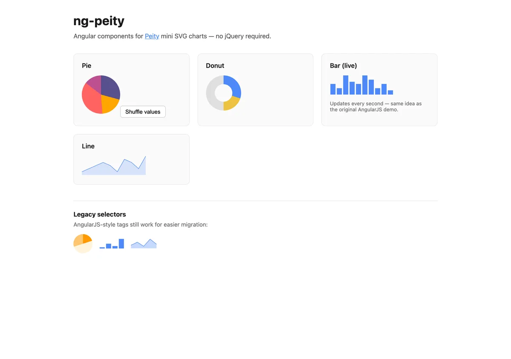
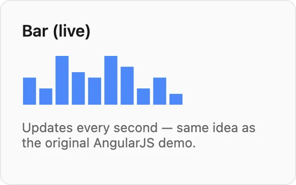
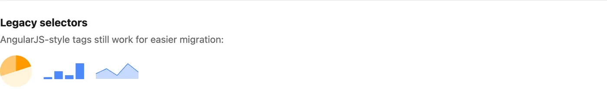

**ng-peity**

---

Some UI problems do not need a charting library the size of a small framework.

You want a **sparkline** in a table cell. A donut next to a KPI. A bar strip that ticks every second so a dashboard feels alive. Full D3 or Chart.js would be overkill—and in 2014, when I first shipped an AngularJS wrapper around [Peity](https://github.com/benpickles/peity), the whole point was exactly that: **turn a comma-separated string into an SVG in one line of markup.**

A decade later, dashboards are bigger, Angular is unrecognizable, and jQuery is no longer the default passenger in every front-end stack. The idea, though, is the same. I rebuilt the project as **ng-peity**: standalone Angular components on **Angular 19+**, wired to [peity-vanilla](https://github.com/railsjazz/peity_vanilla) so you get Peity’s look and API without pulling jQuery back in.

## What you get

Four chart types, each a small standalone component:

| Selector | Chart |
|----------|--------|
| `ng-peity-pie` | Pie |
| `ng-peity-donut` | Donut |
| `ng-peity-bar` | Bar |
| `ng-peity-line` | Line |

Bind a **required** `data` array and optional `options` (radius, colors, width, height, stroke, and the rest of the [Peity options](http://benpickles.github.io/peity/)). When either input changes, the chart redraws. Resize is handled too—`ResizeObserver` on the host element plus a debounced window `resize` listener—so sparklines survive responsive layouts without you writing glue code.

```typescript
import { Component, signal } from '@angular/core';
import { NgPeityBarComponent, NgPeityPieComponent } from 'ng-peity';

@Component({
  selector: 'app-dashboard',
  imports: [NgPeityPieComponent, NgPeityBarComponent],
  template: `
    <ng-peity-pie [data]="pieData()" [options]="pieOptions()" />
    <ng-peity-bar [data]="barData()" [options]="barOptions()" />
  `,
})
export class DashboardComponent {
  readonly pieData = signal([12, 8, 15, 6]);
  readonly pieOptions = signal({ radius: 48 });

  readonly barData = signal([5, 3, 9, 6, 5]);
  readonly barOptions = signal({ width: 120, height: 40 });
}
```

The demo app is deliberately boring in a good way: four cards, one live bar chart, and a **Shuffle values** button on the pie so you can see updates without opening DevTools.

## The live bar chart (still my favorite demo)

The original AngularJS [Plunker](http://embed.plnkr.co/ITWOx4CJnVpVaDmpHewY/preview) pushed a random value every second, shifted the array, and randomized the bar fill color. It was the quickest proof that Peity was not a static screenshot generator.

The modern demo does the same with signals:



```typescript
private readonly intervalId = window.setInterval(() => {
  const next = Math.round(Math.random() * 10);
  this.barData.update((values) => [...values.slice(1), next]);
  this.barOptions.update((opts) => ({
    ...opts,
    fill: [`#${Math.floor(Math.random() * 0xffffff).toString(16).padStart(6, '0')}`],
  }));
}, 1000);
```

No magic in the library here—just reactive data and a component that redraws when inputs change. That separation is intentional: ng-peity stays a thin adapter; your app owns the stream of numbers.

## How the adapter works

All four components extend a shared `PeityChartBase` directive class. On first render they:

1. Set the host `<span>` text to a comma-separated list of numbers (Peity’s expected input format).
2. Call `createPeityChart()` from `peity-vanilla`.
3. Register Angular `effect()` hooks on `data()` and `options()` to update text, merge options, and call `draw()`.

```typescript
effect(() => {
  const values = this.data();
  if (!this.peityInstance) return;
  this.host.nativeElement.textContent = values.join(',');
  this.peityInstance.draw();
});
```

`peity-vanilla` does not ship TypeScript types, so the runtime import is isolated in `peity-runtime.ts` with a single `@ts-expect-error`—the rest of the library stays strictly typed.

Each component also registers **legacy selectors** on the same class, so migration from AngularJS is mostly a template and module import change, not a rename of every tag in your app.

## From AngularJS 1.x to Angular 19

In November 2014 I published `ng-peity.js`: a tiny `angular.module` with a factory that generated `inline-pie-chart`, `inline-bar-chart`, and `inline-line-chart` directives, jQuery + `jquery.peity` in the bundle, and scope bindings for `data` and `options`. It was inspired by Brian Hines’s [angular-peity](https://github.com/projectweekend/angular-peity); the README lived on a Plunker and Bower was how you installed it.

That code still lives under [`legacy/`](https://github.com/maggiben/ng-peity/tree/master/legacy) in the repo—header comment, debounced resize, and all.

The new package keeps the old element names as aliases:



- `inline-pie-chart` → `ng-peity-pie`
- `inline-donut-chart` → `ng-peity-donut`
- `inline-bar-chart` → `ng-peity-bar`
- `inline-line-chart` → `ng-peity-line`

You bind `[data]` and `[options]` the same way; you just use signal or property bindings instead of `data="PieChart.data"` scope strings.

## When to reach for ng-peity (and when not to)

**Reach for it** when you need inline, lightweight SVGs—admin tables, status rows, compact cards, or “show me the last N points” without axes, legends, or export buttons.

**Reach for something else** when you need interaction (zoom, brush, tooltips on every point), multiple coordinated series, or accessibility features that go beyond a simple SVG. Peity was never trying to be Grafana.

## Try it

```bash
git clone https://github.com/maggiben/ng-peity.git
cd ng-peity
npm install
npm start
```

Open [http://localhost:4200](http://localhost:4200) for the demo. To use the library in your own app:

```bash
npm install ng-peity peity-vanilla
```

(`peity-vanilla` is a direct dependency of `ng-peity`; you normally only need the Angular package.)

Build the library with `npm run build` (output in `dist/ng-peity`). The demo production build is `npm run build:demo`.

---

I did not set out to maintain a chart library for ten years. I set out to stop copy-pasting Peity wiring into every Angular project. If you still have comma-separated numbers and a spare `<span>`, ng-peity is the modern version of that habit—**small charts, signal-driven updates, no jQuery.**

Repo: [github.com/maggiben/ng-peity](https://github.com/maggiben/ng-peity)
