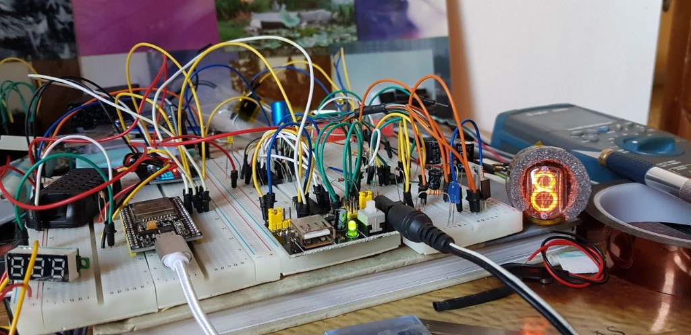
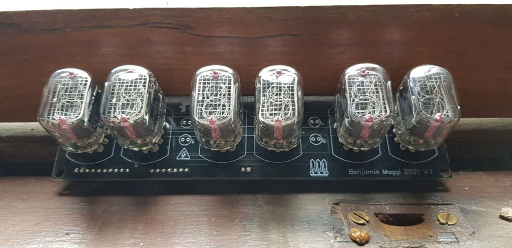

**Nixie clock**

---

There is a particular satisfaction when cold cathode digits **actually light up** on the bench—not in a datasheet, not in a render, but in front of you, orange and a little unreasonable.

This is a **nixie clock experiment**: tubes wired, multiplexing doing its time-sliced thing, firmware still very much in progress. No product pitch. No Kickstarter. Just glass, high voltage, and the quiet hope that the software will eventually be smarter than the tubes are old.

## Bench phase: breadboard chaos

<em>First light on the bench: ESP32, power module, and enough jumper wires to embarrass a schematic.</em>

Every nixie project starts somewhere undignified. One tube. A 7-segment display for debugging. A DHT sensor that has no business being in a clock but was **right there on the desk**. The digit **8** lit up and that was enough to keep going—proof that the high-voltage path, the drivers, and the madness of the wiring actually agreed.

## Six tubes on a board that says 2021

<em>Custom PCB, six sockets, high-voltage warning silkscreen—the clock stopped being a thought experiment.</em>

The breadboard gave way to a proper board: **six tubes** in a row, cathodes visible through the glass like tiny bronze cities, and **Benjamin Maggi 2021 V.1** printed on the silkscreen because homemade hardware deserves a signature. Tubes off in this shot; the video below is where they start performing.

## Watch the digits (ignore the camera)

  <video controls playsinline preload="metadata" poster="assets/cover.jpg" width="720">
    <source src="assets/nixie-demo.mp4" type="video/mp4" />
  </video>

<em>Multiplexed nixies on the bench—the glow is steady; the camera is dramatic.</em>

If the player does not load, <a href="assets/nixie-demo.mp4">download the clip</a> or watch the <a href="https://www.linkedin.com/posts/maggiben_nixie-activity-6855633731739299840-6q4X">original post on LinkedIn</a>.

Yes, the video **flickers**. That is not the clock having a crisis—it is **multiplexing**: only one digit is fully on at a time, switched fast enough that your eyes integrate it into a stable display. The phone camera, bless it, samples at a different rate and turns duty cycle into a light show.

**Your eyes:** calm orange numbers.  
**Your phone:** disco.

## What is working vs what is next

| Status | Detail |
|--------|--------|
| **Working** | Digits count. Tubes glow. The hardware story is real. |
| **In progress** | Firmware—timing, display logic, the boring parts that make it a *clock* |
| **Planned** | A **cathode poisoning** prevention routine |

Nixie tubes are gorgeous and slightly high-maintenance. Leave the same cathode lit too long without use and it can dim or sputter; rotate digits, exercise the unused cathodes, and they last far longer. That is the software feature I want next—not because the clock is broken today, but because I would like it to still look this good in ten years.

## Why bother with nixie at all?

We have OLED. We have LED matrices. We have phones that tell time while they drain your soul.

Nixies are different: **warm plasma**, depth, a glow that feels like it belongs in a lab from another century. Building a clock out of them is irrational in the best way—part electronics, part preservation, part “I wanted to see if I could.”

This post is a checkpoint on that path. Digits work. Camera lies. Software is catching up.

Originally shared on [LinkedIn](https://www.linkedin.com/posts/maggiben_nixie-activity-6855633731739299840-6q4X).
