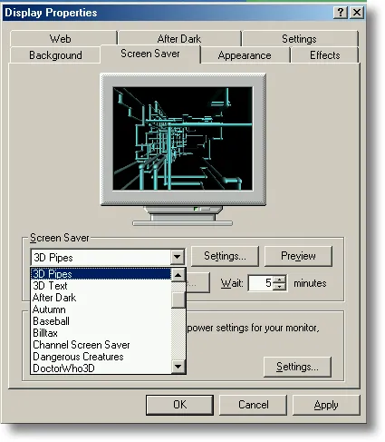

**3D Pipes**

---

There was a time when **personalizing your computer** meant opening Display Properties, clicking the **Screen Saver** tab, and choosing who you were for the next five minutes of idle time.

Flying toasters. Starfield. Mystify. **3D Pipes**—cyan tubes crawling through black space like plumbing in a fever dream. You picked one, set the wait timer, maybe hit **Preview** and watched your monitor pretend it was a showroom floor. That was not decoration. That was **identity**.

Today the screensaver still exists, but mostly as a **default**: a lock screen, a dim photo, a corporate policy. Some people still play with them—Matrix rain on a second monitor, `cmatrix` in a terminal, a nostalgic `.scr` copied from an old XP install. The culture around them has thinned. The old ritual—_which saver are you?_—has largely passed.

I missed the pipes enough to rebuild them. Not as a `.scr`, but as a **browser demo** with [Three.js](https://threejs.org/) and a small React shell on [CodePen](https://codepen.io/maggiben/pen/NPbXeoX). Same hypnotic grid logic. Same metallic joints. And yes: **teapots**, because the original had an easter egg and nostalgia without the teapot is incomplete.

## See it live

Full viewport. Black background. One pipe at a time, growing segment by segment until the scene fills or gets stuck—then a fade and a fresh lattice.

<link rel="stylesheet" href="assets/demo/styles.css" />

<div class="blog-embed blog-embed--codepen">
<iframe height="300" style="width: 100%;" scrolling="no" title="Pipes" src="https://codepen.io/jkantner/embed/GgNWLMz?default-tab=" frameborder="no" loading="lazy" allowtransparency="true">
  See the Pen <a href="https://codepen.io/jkantner/pen/GgNWLMz">
  Pipes</a> by Jon Kantner (<a href="https://codepen.io/jkantner">@jkantner</a>)
  on <a href="https://codepen.io">CodePen</a>.
</iframe>
</div>

<p><em>Click inside the embed so the canvas can render. If WebGL is blocked, <a href="https://codepen.io/maggiben/pen/NPbXeoX">open the pen on CodePen</a>.</em></p>

Wait thirty seconds. Watch a joint become a **Utah teapot** instead of a sphere. That two-and-a-half percent chance is deliberate—it is the wink the Windows version gave anyone who dug into **Settings** and enabled teapots at joints.

## When screensavers mattered

Screensavers were born from **hardware**, not aesthetics. CRT phosphors could **burn in** static images—menu bars, taskbars, the Lotus 1-2-3 grid left on overnight. A moving image spread the glow and saved the tube.

Then they became something else entirely.

| Era               | What changed                                                       | What it felt like                                             |
| ----------------- | ------------------------------------------------------------------ | ------------------------------------------------------------- |
| **1980s–90s**     | Burn-in protection, then After Dark and third-party `.scr` culture | Your desk had _personality_; savers were shareware and jokes  |
| **Windows 95–XP** | Built-in OpenGL and Direct3D demos shipped with the OS             | **3D Pipes** in Display Properties = you cared about graphics |
| **Flat LCD**      | Burn-in largely gone; panels always on                             | Savers become optional, then invisible                        |
| **Today**         | Lock screen, sleep, phone always-on displays                       | Motion is **security** or **ambient**, rarely self-expression |

The cover image above is the ritual frozen in amber: **Display Properties → Screen Saver → 3D Pipes → Wait: 5 minutes**. Dropdown full of names—_After Dark_, _Autumn_, _Dangerous Creatures_—each one a tiny statement. Nobody talks about their screensaver at lunch anymore. But mention **3D Pipes** to someone who ran Windows NT or 95, and they know exactly which tubes you mean.

Raymond Chen [told the origin story](https://devblogs.microsoft.com/oldnewthing/20240611-00/?p=109881) on _The Old New Thing_: the Windows OpenGL team had shipped hardware-accelerated OpenGL in NT 3.5, but **nothing in the product showed users it existed**. A team screensaver contest produced 3D Text, 3D Maze, 3D Flying Objects, and 3D Pipes. Marketing saw them and said, in effect: _skip the vote—we are shipping all of them_. Low risk, high visibility. If a saver crashed, support could say _do not use that one_—this was before auto-update culture.

That is how a **demo became folklore**.

## How the original worked (the short technical version)

The file was `sspipes.scr`. From **Windows NT 4.0 through Me**, it ran on **OpenGL**; **Windows XP** rebuilt it for **Direct3D**. Vista dropped the classics; fans still copy `.scr` files from old installs and hope for the best on modern GPUs.

Under the hood, the idea is simpler than the hypnotic result suggests:

1. **Discrete 3D grid** — Space is carved into cells. Each cell knows whether it is empty or occupied. A pipe cannot cross itself or another pipe’s path.
2. **Growing segments** — A pipe starts at a random free cell, picks a cardinal direction, and extends a fixed number of grid steps. Cylinders stretch between joints; **spheres** (or flex joints, depending on settings) connect corners.
3. **Turn rules** — At each joint, the next direction must not be the **180° opposite** of the current one—otherwise the pipe would fold back on itself. Among valid turns, pick one with clear cells ahead.
4. **Multiple pipes, then reset** — Several pipes grow in parallel until the scene is crowded or stuck. The screen clears—originally with a **checkerboard wipe** on older builds, a **fade** on XP—and the cycle restarts.
5. **Materials and lighting** — Phong-style shading on metal-ish surfaces; palette colors from the classic 16-color VGA set. Settings exposed resolution, joint style (elbow vs. ball), and speed.

The OpenGL implementation used **`gluCylinder`** and **`gluSphere`** (and friends) from the GLU utility library—immediate-mode 3D that felt cutting-edge on a Pentium with a passable graphics card. Source samples lived in the old SDK under paths like `MSTOOLS\SAMPLES\OPENGL\SCRSAVE` for developers who wanted to study or extend them.

The **teapot easter egg** is the graphics in-joke: the [Utah teapot](https://en.wikipedia.org/wiki/Utah_teapot) is the hello-world of 3D rendering. Enable teapots in the Windows 2000+ settings, and joints occasionally spawn teapots instead of spheres. My rebuild keeps that spirit with a **2.5% chance** per joint.

## How the browser version works

The CodePen is **React + Three.js via ESM**, no build step—same spirit as my other [UI experiments from 2013](../ui-experiments-d3-snapsvg-css-codepen-2013/), but with WebGL instead of CSS 3D transforms.

The core loop mirrors the original’s grid logic:

```typescript
const GRID_SIZE = 20;
const BOUNDS = 400;
const occupiedPositions = new Set<string>();

// Each cell keyed as "x,y,z" — collision is O(1)
const getPosKey = (v: THREE.Vector3) =>
  `${Math.round(v.x)},${Math.round(v.y)},${Math.round(v.z)}`;
```

**Path planning** walks the grid before committing: `isPathClear` steps cell by cell; `reservePath` marks cells taken so pipes never overlap. **Turn selection** filters out the reverse direction, shuffles the rest, and picks the first path with enough free cells.

**Geometry** is primitive but faithful:

| Piece        | Three.js                                    | Role                                                          |
| ------------ | ------------------------------------------- | ------------------------------------------------------------- |
| Pipe segment | `CylinderGeometry` scaled on Z              | Grows incrementally each frame (`scale.z = distanceTraveled`) |
| Joint        | `SphereGeometry`                            | Corner connector                                              |
| End cap      | Larger sphere                               | Start/end of a run                                            |
| Teapot       | `TeapotGeometry`                            | Easter egg at joints                                          |
| Reset        | Full-screen black plane with rising opacity | Fade instead of checkerboard wipe                             |

**Materials** use `MeshPhongMaterial` with modest shininess—close enough to the metallic pipes you remember on a CRT. **Lighting** is a simple ambient + directional pair; no image-based lighting, no PBR. This is a saver, not a Pixar still.

**Motion**: one active pipe (`MAX_PIPES = 1` in this pen—tighter and cleaner than the original’s four-to-six), speed in world units per frame, random segment lengths between 2–6 grid cells, random cap on total segments before the pipe stops and respawns. Every **32 seconds** the scene clears, the camera’s Y rotation gets a slight random nudge, and a new pipe begins.

The render loop is the same contract as every Three.js app—and every old OpenGL screensaver:

```
update pipe positions → grow or turn → maybe fade → render → requestAnimationFrame
```

No UI. No orbit controls. You watch. That restraint is the point.

## Old stack vs new stack

|               | **Windows `sspipes.scr`**         | **This CodePen**                                       |
| ------------- | --------------------------------- | ------------------------------------------------------ |
| Runtime       | Native `.scr`, OpenGL / Direct3D  | Browser, WebGL via Three.js                            |
| Grid          | Internal occupancy map            | `Set` of string keys on a 20³-style lattice            |
| Primitives    | GLU cylinders/spheres             | `CylinderGeometry`, `SphereGeometry`, `TeapotGeometry` |
| Reset         | Checkerboard or fade              | Alpha fade on a camera-facing plane                    |
| Customization | Display Properties, teapot toggle | Fork the pen, tweak `TEAPOT_CHANCE`                    |
| Purpose       | Show off OS 3D + save CRTs        | Nostalgia + learn WebGL in a tab                       |

Three.js does not make the algorithm easier—it makes the **delivery** easier. One URL, no `.scr` signing, no copying binaries from XP. The hard part is still the grid, the turns, and the grow-until-stuck rhythm.

## Why rebuild a screensaver at all?

Because some demos are **time capsules**. 3D Pipes advertised OpenGL in an era when that mattered. It also happened to be beautiful—industrial, pointless, meditative. The same qualities that made it a good saver make it a good **creative coding exercise**: finite state, clear rules, immediate visual payoff.

Screensavers as culture may not come back. Always-on displays and sleep modes won that war. But the **impulse** behind them—_make idle time beautiful_—shows up elsewhere: ambient mode on a TV, generative art in a terminal tab, a WebGL pen left running while the coffee brews.

I run this one sometimes on a second monitor. Not because the pixels need saving. Because the pipes still know how to fill a room with quiet motion.

## Try it yourself

Fork the pen or paste the logic into a Vite project:

- **Pen:** [codepen.io/maggiben/pen/NPbXeoX](https://codepen.io/maggiben/pen/NPbXeoX)
- **Tweak:** `SPEED`, `MAX_PIPES`, `TEAPOT_CHANCE`, `PALETTE`
- **Extend:** Multiple simultaneous pipes, flex joints that bend instead of hard elbows, checkerboard wipe shader for the reset

If you remember the Display Properties dialog, open the embed and wait for a teapot. If you do not, wait anyway—the pipes were always worth the wait.

---

_Cover: Windows Screen Saver settings with 3D Pipes selected. Demo: [CodePen](https://codepen.io/maggiben/pen/NPbXeoX). Related: [Rings — WebGL playground](../rings-webgl-threejs-experiment/)._
