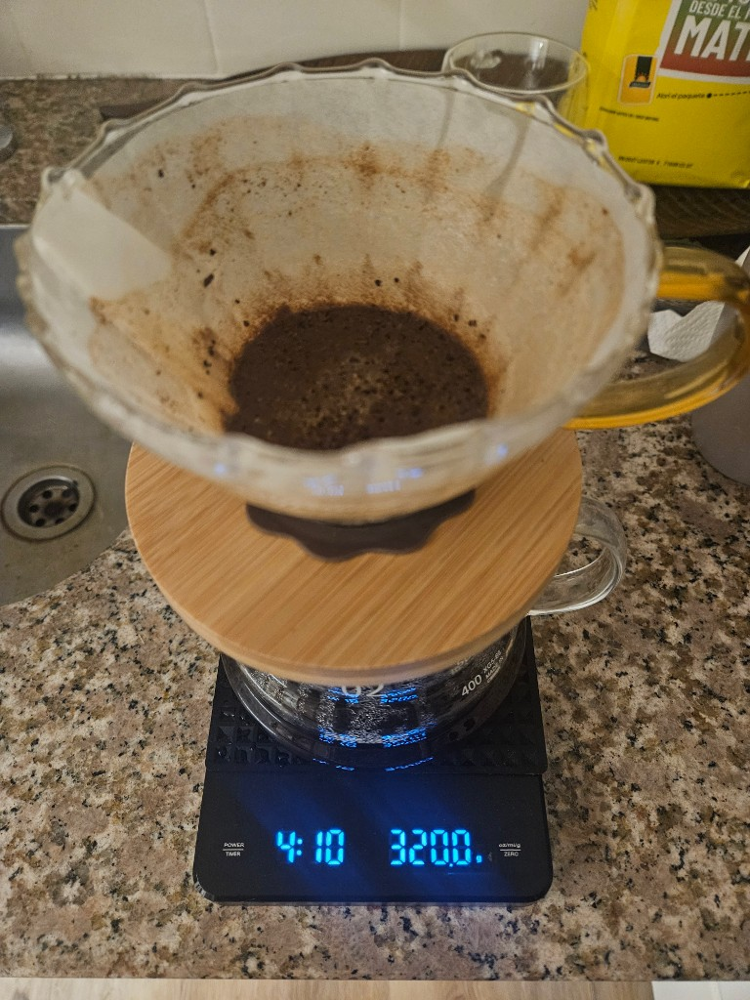

**Pour over · V60 · Ceremony**

---

I make pour-over coffee **once, maybe twice a day**. Not because I am precious about beans (okay, a little), and not because instant coffee committed a crime against humanity in a past life (debatable). I do it because the **ceremony** forces me to slow down.

For four-ish minutes the world shrinks to: hot water, wet paper, the smell of fresh grounds, and a scale that displays my life choices in grams. That window is my **meditation**—breathe in the aroma, watch the bloom rise like a tiny brown soufflé, and mentally line up whatever chaos the day plans to throw at me. By the time the drawdown finishes, I am calmer. Caffeinated, yes. But calmer.

I did not always brew this way. I spent a long chapter chasing the **perfect espresso** on a bean-to-cup machine—and learned that, for me, the chase was the wrong sport.

## The bean-to-cup chapter (and why it ended)

For a while I was convinced that **real coffee** meant espresso: crema, pressure, the satisfying thunk of a portafilter—or, in my case, the seductive promise of a **bean-to-cup** machine that would grind, tamp, extract, and deliver café vibes at the press of a button. I tuned recipes. I cleaned screens. I waited for that shot that would taste like the posters.

Here is that machine doing its thing—one last appearance before it lost the countertop war:

  <video controls playsinline preload="metadata" poster="assets/cover.png" width="720">
    <source src="assets/bean-to-cup.mp4" type="video/mp4" />
  </video>

<em>Bean-to-cup in action: impressive choreography, underwhelming cup—for my taste and my patience.</em>

Player not loading? <a href="assets/bean-to-cup.mp4">Download the clip</a>.

The video looks like success. The cup often did not. Slowly—shot after shot, descale after descale—I admitted what my palate and my calendar were already screaming:

| What I wanted | What I got |
|---------------|------------|
| Café-quality espresso | **Inconsistent** shots—good day, meh day, why day |
| Set-and-forget luxury | **Thorough maintenance**: descaling, brew unit cleaning, grinder burrs, drip trays, guilt |
| A grinder I could trust | **Lots of fines**—dusty particles that over-extract and muddy the cup |
| Stable extraction | **Irregular temperature**—home thermoblocks and shortcuts are not the steady 93 °C fairy tale |
| A morning ritual | **A button**—beans in, beverage out, soul still in airplane mode |

The taste never quite got there. Not terrible. Not *worth* the machine footprint, the noise, the vinegar smell of descaling day, or the mental load of keeping another appliance happy. And underneath all of that: **it was not a ritual**. It was automation wearing a barista costume. I was not breathing with the coffee—I was waiting for a beep.

Pour-over gave me the opposite trade. Slower. Hands-on. Repeatable. The grinder I use now is **my choice**, not a sealed chamber I cannot tune. The water is **my kettle**, not a mystery curve inside plastic. The time is **mine**—four minutes where the only notification is the scale timer. That is when I actually smell the beans, actually pause, actually show up for the day.

So the bean-to-cup went quiet. The V60 stayed. No hard feelings; we had a phase. I just prefer to **take my time** and make the cup I want, not the cup a button guesses I want.

## Why ceremony beats "just hit brew"

The technique I follow is basically **[James Hoffmann](https://www.youtube.com/@jameshoffmann)**'s gospel, filtered through a home kitchen and a yellow bag that says *desde el mat* (from the farm, more or less—my Spanish is fueled by coffee, not Duolingo). Hoffmann is the world's most convincing man in an apron: precise without being preachy, nerdy without being unbearable. If you want the **source sermons**, search his channel for the **Ultimate V60** technique and the one-cup pour-over guides. What follows is my lived ritual, with his numbers as the spine.

Pod machines, bean-to-cup boxes, drive-throughs, and the "I'll chug whatever is hot" school of survival all have their place. Pour-over is different. It is **deliberately inefficient** in the best way:

| Fast coffee | Pour-over ceremony |
|-------------|-------------------|
| Button → cup | Kettle → scale → patience |
| Background noise | Foreground ritual |
| Fuel | **Preparation** |

The slowness is the feature. You cannot doom-scroll effectively while pouring in concentric circles—well, you can, but you will overshoot 250 g and Hoffmann's ghost will sigh audibly. The ritual asks for **attention**: grind size, water temp, pour height, timing. That attention is what clears my head.

Twice a day is enough. Morning: armor up for meetings and code reviews. Mid-afternoon (optional second round): reset before the final boss level of the day. More than that and I'd vibrate through the floorboards.

## The cast of characters

You do not need a lab. You need consistency:

- **V60 dripper** (plastic, ceramic, or glass—glass looks heroic in photos)
- **Paper filters** sized for your dripper
- **Gooseneck kettle** (temperature-controlled if you are feeling fancy; otherwise boil and wait ~30 seconds)
- **Digital scale with a timer** (non-negotiable; this is your coach)
- **Fresh coffee**, whole bean, roasted within weeks not geological eras
- **Grinder** (burr > blade; blade grinders produce "random particle size distribution" which is engineer for "sadness")

My setup in the photo: V60 on a wooden stand, server underneath, scale reading **4:10** and **320 g**—because I was mid-drawdown and apparently living dangerously on total yield. Hoffmann's classic ratio is closer to **15 g coffee → 250 g water**; I sometimes stretch for a larger mug. The scale does not judge. Much.

## How to choose coffee and grind

**Beans:** Buy from a roaster you trust, or a bag with a roast date—not just "best before the heat death of the universe." Lighter roasts = more acidity and fruit; darker = chocolate and bitterness. For V60, **light to medium** is the playground Hoffmann loves.

**Grind:** Aim for **medium-fine**—like coarse sand, not powder, not gravel. Too fine → bitter, slow drawdown, existential dread. Too coarse → sour, watery, "why did I get out of bed."

If you own a burr grinder, rejoice. If you buy pre-ground, buy **small bags** and use them fast; ground coffee goes stale faster than your New Year's resolutions.

**Ratio starting point:** **1:16** (15 g coffee, 250 g water). Adjust to taste once you can repeat the ritual without flooding the kitchen.

## The ceremony, step by step

This is the Hoffmann-shaped workflow I actually use. Total time: about **3½–4½ minutes** after the kettle is ready.

### 1. Heat water

Bring water to a boil, then let it sit **30–60 seconds** off boil. Target roughly **95 °C / 203 °F**. Boiling water directly on delicate grounds can scorch; lukewarm water makes tea cosplay.

### 2. Weigh and grind

Weigh **15 g** of beans. Grind fresh. Inhale. This is the **first meditation hit**—the smell of fresh coffee is unfairly good. Breathe it in. Your nervous system already thinks the day might be okay.

### 3. Rinse the paper (do not skip)

Place the filter in the V60. Rinse with hot water—**at least a cup's worth**. This:

- Washes away **paper taste** (yes, it is real)
- **Preheats** the dripper and your mug/server
- Reminds you that you are doing ritual, not rush

Dump the rinse water. Put the V60 on the server/mug **on the scale**. Tare to zero.

### 4. Add grounds and make a well

Add the 15 g of grounds. Level the bed. Optional: a small divot in the center so water does not stage a coup on the first pour.

### 5. Bloom (the fun part)

Start the scale timer. Pour **50 g** of water over the grounds (roughly **3× the coffee weight**). Give the dripper a **gentle swirl** so all grounds get wet. Wait **45 seconds**.

Watch the bloom puff up. This is CO₂ escaping and chemistry doing poetry. Breathe. You are not "making coffee"; you are **transitioning state**.

### 6. The main pour

Pour steadily until you reach **250 g total** on the scale. Hoffmann's style uses a controlled spiral from center outward, keeping the bed even—not blasting one spot like a fire hose of regret.

Let it **draw down**. Stop pouring when you hit target weight; let gravity finish the extraction. Total brew time often lands around **3:00–3:30** on the timer by the end—your mileage varies with grind and altitude and whether Mercury is in retrograde.

### 7. Serve and exist

Remove the V60. Swirl the server if you are fancy. Pour into a warmed mug. **Do not gulp.** You earned four minutes; take thirty seconds to actually taste it.

## What Hoffmann taught me that no machine did

A few lines I keep from his school of thought:

- **Weigh everything.** Volume lies; grams tell the truth.
- **Rinse the filter.** Every time. You are not too busy for paper-flavor insurance.
- **Bloom is not decoration.** It sets extraction up for success.
- **Grind and water temp matter as much as origin story on the bag.**
- **Repeatability** beats heroics—a boring good cup every day beats a lottery cup once a month.

He also convinced me that coffee is **one of the few daily crafts** where amateur equipment still produces world-class results if you respect the variables. You do not need a $3,000 espresso machine to have a moment of quiet excellence. You need a kettle, a V60, and the willingness to stand still.

## My twice-a-day mental prep

**Morning brew:** Before Slack, before email, before the todo list metastasizes. The ritual says: *you control the first minutes of the day.* Grind, rinse, bloom, pour—each step a tiny gate you choose to walk through slowly.

**Optional afternoon brew:** When the brain is porridge. Same steps, shorter internal monologue. The smell alone reboots focus; the pause prevents reactive clicking.

Neither session is about perfectionism. Some cups are brighter, some murkier. The win is **showing up to the process**—breathing, smelling, pouring, waiting—so the challenges ahead meet someone who already practiced patience at the kitchen counter.

## Troubleshooting without drama

| Symptom | Likely cause | Fix |
|---------|----------------|-----|
| Bitter, harsh | Too fine / too hot / too slow | Coarser grind, slightly cooler water, pour gentler |
| Sour, weak | Too coarse / under-extracted | Finer grind, ensure full bloom, check total time |
| Drawdown forever | Grind too fine or clogged filter | Coarser grind, avoid stirring mud |
| Tastes like paper | Skipped rinse | Rinse the filter. Apologize to Hoffmann. |

## Go forth and pour slowly

If you have never tried pour-over, start with Hoffmann's **[Ultimate V60 Technique](https://www.youtube.com/results?search_query=james+hoffmann+ultimate+v60)** video and one bag of beans you actually like. Accept that the first week is practice. Accept that the scale is your friend. Accept that **four minutes of ceremony** might do more for your head than four minutes of scrolling.

Me? I'll be at the counter once or twice a day—timer ticking, steam rising, bloom swelling—getting ready for whatever comes next. One gram at a time.
