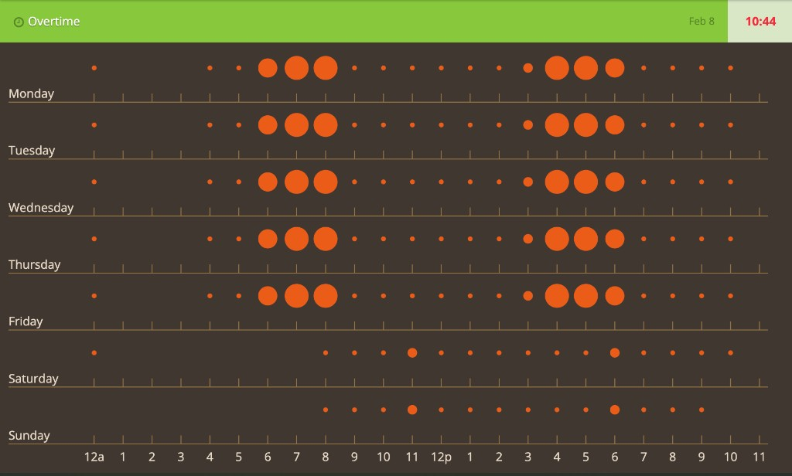

**Punch card**

---

Before dashboards had seventeen chart types and a “AI insights” button, there was a quieter question: **when** does stuff actually happen?

Not “how much this quarter,” but **which hours on which days** light up. Factory floors answered that with literal punch cards—paper strips stamped by the clock. Data people borrowed the name for a chart that never really went away: **rows for days, columns for hours, marks where the work landed.**

I built one years ago on [CodePen](https://codepen.io/maggiben/pen/jOWoPx): an “Overtime” panel in green and brown, **D3** scales, and orange circles whose **radius tracks intensity** in each day–hour cell. Hover a dot and you get the raw count. It is still one of the fastest ways I know to **feel** a work week without reading a table.

## Try it live — CodePen embed

The iframe keeps the pen’s own styles isolated from this site’s theme. Move across the grid and watch tooltips report the value behind each circle.

<link rel="stylesheet" href="assets/demo/styles.css" />

<div class="blog-embed blog-embed--codepen">
  <iframe
    height="644"
    style="width: 100%;"
    scrolling="no"
    title="PunchCard"
    src="https://codepen.io/maggiben/embed/jOWoPx?default-tab=result"
    frameborder="no"
    loading="lazy"
    allowtransparency="true"
  >
    See the Pen <a href="https://codepen.io/maggiben/pen/jOWoPx">PunchCard</a> by Benjamin (<a href="https://codepen.io/maggiben">@maggiben</a>) on <a href="https://codepen.io">CodePen</a>.
  </iframe>
</div>

<p><em>Blank iframe? <a href="https://codepen.io/maggiben/pen/jOWoPx" target="_blank" rel="noopener noreferrer">Open the pen on CodePen</a>.</em></p>

The sample data is synthetic—same weekday rhythm repeated with a lighter weekend—but the **shape** is what you see in real logs: quiet nights, a morning ramp, a fat afternoon block, then tapering off.

## What a punch card is (and is not)

A **punch card** is a **calendar heatmap on a clock**:

| Axis | Meaning |
|------|---------|
| **Y (rows)** | Day of week (Monday at the bottom or top—pick a convention and stick to it) |
| **X (columns)** | Hour of day (0–23 or 12a–11p labels) |
| **Mark** | Event count, duration, or rate in that cell |

It is **not** a Gantt chart (no task bars across time). It is **not** a line chart (you are not claiming continuity between 3 p.m. and 4 p.m.). You are showing **occupancy of slots**—like seats punched on a card.

That makes it ideal when the question is rhythmic:

- When do deploys land?
- When do users file tickets?
- When does “overtime” actually start?

GitHub’s contribution graph answers “which **days** were busy.” A punch card answers “which **hours on those days**.”

## Why circles instead of color alone

Heatmaps encode value with **color**. Punch cards often use **size** (or both). In this pen:

```javascript
max = Math.max(...all cells);
.attr("r", function (d) { return (d / max) * 14; })
```

Linear radius against the week’s peak keeps the chart honest: a quiet hour stays a speck; a heavy hour swells. Color is reserved for brand (`#E95B18` on `#403830`) so the grid stays readable on projectors and in screenshots—important when the chart lives in a **widget chrome** (header, KPI strip, footer) rather than a full-page viz.

Tooltips on hover close the loop: pattern first, **number on demand**.

## The stack (CodePen era)

- **[D3 v3](https://d3js.org/)** — `d3.scale.linear`, SVG axes, enter/update for circles
- **jQuery** — width of `#punchcard`, tooltip fade-out
- **Bootstrap-ish layout** — green “Overtime” header, clock icon, date and total time in the corner
- **CodePen** — shareable, zero build step

The drawing code is deliberately imperative: nested loops over seven days and twenty-four hours, one circle per non-empty cell. No Vega, no React—just scales, lines for the grid, and labels (`12a`, `1`…`11`, `12p`).

Data order matters: the array is **Monday-first**, then reversed before drawing so **Sunday sits on top** and the eye reads bottom-to-top like a wall calendar. Document that in your README if you fork it; future-you will thank you.

## Punch card vs cousins

| Chart | Best for |
|-------|----------|
| **Line chart** | Trends over continuous time |
| **Calendar heatmap** | Which days were active |
| **Punch card** | Which **hours** repeat across the week |
| **Histogram** | Distribution of one variable |
| **Gantt** | Task start, end, and overlap |

Reach for a punch card when **periodicity within the week** is the story—shift work, on-call pages, commute traffic, gym check-ins. Reach for something else when you need exact timestamps or long-range trends.

## What I would change today

If I refreshed the pen now:

- **D3 modules** — `d3-scale`, `d3-selection`; drop the v3 global
- **Real data pipe** — `fetch` commits or ticket timestamps, bin into day/hour in the client or server
- **Accessibility** — keyboard focus per cell, `aria-label` with “Wednesday 3 p.m.: 5 events”
- **Color scales** — optional sequential scale for color-blind-safe intensity; keep size as a second channel
- **Empty cells** — skip radius-0 circles or show faint grid dots so structure does not collapse on sparse weeks
- **Time zones** — bin in the viewer’s zone or the business’s; document which

None of that changes the core idea: **the week is a matrix, and your behavior punches holes in it.**

## The lesson I still keep

The best time charts do not fight how people already think about work. They use **days and hours**—the same grid on a paper timesheet—and add one extra channel (dot size) before they ask you to read a legend.

This pen was never analytics-as-a-service. It was a **visual habit tracker** for overtime: see the block from 8 a.m. to 6 p.m., see Saturday shrink, feel the imbalance before HR sends a spreadsheet.

Fork it, pipe your CI or calendar into the matrix, and watch your “always on” hours swell. You will argue with your schedule sooner—and with better evidence—than from another pie chart.

---

*CodePen: [codepen.io/maggiben/pen/jOWoPx](https://codepen.io/maggiben/pen/jOWoPx)*
