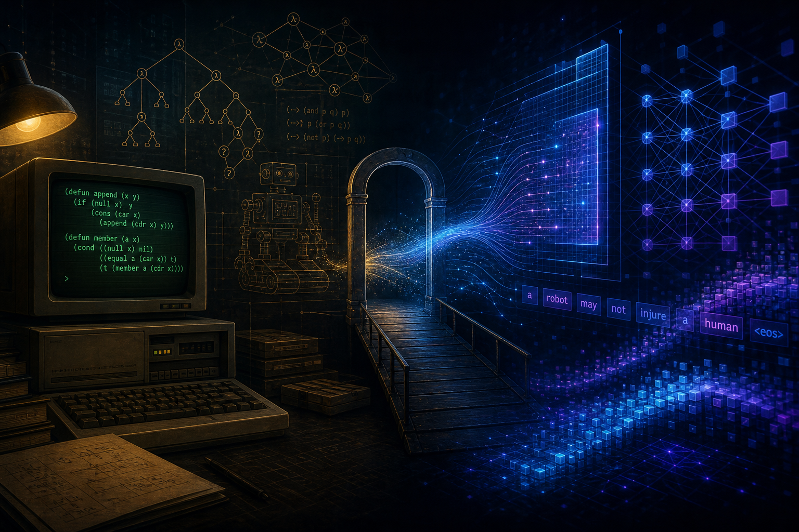

**After the Golden Age**

---

I have been reading my way backward through AI: Hans Moravec on mind and embodiment, Gregory Chaitin on incompleteness and compression, Roger Penrose on whether computation can explain consciousness, Minsky and Papert on perceptrons, the MIT AI Lab memos, Papert’s *Mindstorms*, McCarthy’s Lisp and the dream of machines that **reason in symbols** rather than merely react. It is a strange time to read that literature. We live in the loudest connectionist victory in history—large language models everywhere—while some of the people who built the modern deep-learning stack publicly argue that **this stack is not enough**.

This essay is not nostalgia for Lisp machines (though I would not say no to an afternoon with one). It is an attempt to connect three threads: what the **golden era of symbolic AI** actually was, what the **AI winter** taught us, and what we should expect from the current explosion—plateau, robotics, art, mundane labor—and whether a **revival of symbolic AI** is plausible, and what it would have to look like to matter.

## The golden era: symbols, Lisp, and the feeling that thought was formal

Roughly from the mid-1950s through the late 1970s—and in pockets well into the 1980s—**symbolic AI** was the mainstream bet. Intelligence, on this view, is **manipulation of representations**: predicates, rules, frames, semantic networks, plans, grammars. You do not learn everything from pixels; you **encode** what you know and **infer** what follows.

The cast is familiar because they wrote the mythology:

| Figure | Contribution (symbolic era) |
|--------|------------------------------|
| **John McCarthy** | Coined “artificial intelligence”; **Lisp** as the language of symbolic programs; time-sharing; logic and common-sense formalisms |
| **Marvin Minsky** | Frames, society of mind; later, with Papert, the limits of simple perceptrons |
| **Seymour Papert** | LOGO, constructionism; *Mindstorms*—how children think with computational objects |
| **Allen Newell & Herbert Simon** | Physical symbol systems; GPS-style problem solving |
| **Patrick Winston, Terry Winograd** | Blocks world, SHRDLU—language tied to a microworld |
| **Edward Feigenbaum** | Expert systems—knowledge as rules in industry |

Hardware mattered culturally, not only technically. **Lisp machines** (Symbolics, LMI, later Texas Instruments Explorer) were workstations built to run Lisp fast—to edit, compile, and debug symbolic programs in an environment that felt like **thought made inspectable**. A knowledge base was not a weight matrix; it was something you could **browse**, **patch**, and **justify**.

Moravec’s paradox was not yet named, but the gap was already visible: what looked “hard” for humans (chess, algebra) looked **easy** to formalize; what looked easy for humans (seeing, walking, folding laundry) resisted neat rules. Symbolic systems excelled in **toy worlds** and **closed domains**. They struggled in the open world.

Still, the era had a coherent aesthetic: **transparency**, **compositionality**, **explicit structure**. A program that proved a theorem or parsed a sentence could, in principle, show its steps. That aesthetic never went away—it went underground.

## Perceptrons, connectionism, and the first great schism

The other lineage is older than the hype: **Rosenblatt’s perceptron** (1950s) treated intelligence as **adaptive weights**, not hand-authored rules. Minsky and Papert’s [*Perceptrons* (1969)](https://direct.mit.edu/books/book/3301/Perceptrons) showed severe limitations of single-layer networks. The book is often misread as a kill shot on all neural approaches; it was a kill shot on **certain claims** about what simple linear classifiers could represent without hidden layers.

The schism hardened:

```
Symbolists:  knowledge is explicit → logic, rules, search
Connectionists: knowledge is distributed → learning, gradients, emergence
```

Chaitin and Penrose enter from different angles—**not** as ML engineers but as warning labels on hubris. Chaitin: even in mathematics, **compression and randomness** set limits on what “simple description” can capture. Penrose: human understanding may involve something **not reducible** to algorithmic symbol pushing (controversial, but useful as a stress test). Moravec: **evolution spent billions of years** on sensorimotor competence; high-level reasoning is the cheap late add-on. Read together, they caution against identifying “intelligence” with whatever we can currently formalize in a thesis or a benchmark.

The golden era did not “fail” because symbols are useless. It hit **engineering and epistemic walls**: brittleness, knowledge acquisition bottlenecks, combinatorial explosion, and microworlds that did not scale to street-level reality.

## The AI winter: when promises outran proof

Funding and attention contracted in the 1970s and again in the late 1980s and early 1990s—the periods people call **AI winters**. Causes were mundane and human:

1. **Overpromising** — Demonstrations in blocks worlds became press releases about general intelligence.
2. **Underdelivering** — Expert systems were expensive to maintain; one rule wrong and trust collapsed.
3. **Rival paradigms** — Desktop computing, databases, and the web offered clearer ROI.
4. **Theoretical limits** — Not only perceptrons; symbolic search itself scales badly without the right representations.

Winters are not punishments from the universe for loving Lisp. They are **credit cycles** for research: enthusiasm → deployment → disappointment → retrenchment → (sometimes) sober advance.

The lesson is not “symbols lost, therefore symbols are false.” The lesson is **do not confuse a representation with a world model**, and **do not confuse fluency with reliability**. That lesson applies again today.

## The connectionist triumph—and the return of the same questions

AlexNet (2012), then transformers, then ChatGPT reset the center of gravity. Deep learning won **perception, translation, speech, and open-domain language** in ways symbolic pipelines never could at scale. The stack is real: data, compute, architectures, RLHF, agents, tools.

Yet the questions the symbolic era asked—**robustness, grounding, planning, causality, common sense**—did not dissolve. They were masked by **statistical fluency**.

Yann LeCun has argued for years that autoregressive LLMs are a **dead end** for human-level AI in the strong sense: impressive but missing **world models**, **persistent state**, **hierarchical planning**, and **objective-driven behavior** that learns from interaction, not only from text. He pushes **JEPA**-style architectures and systems that predict in representation space, not token space—closer to how an agent might build internal structure.

Yoshua Bengio, who co-authored the deep-learning manifesto with LeCun and Hinton, has voiced related concerns about **systematic generalization**, **understanding**, and **safety** as we scale models that optimize for plausible continuations rather than grounded truth. The tone is not anti-AI; it is **anti-magic**: scaling alone does not automatically yield cognition.

This rhymes with earlier voices—Gary Marcus on hybrid systems, Judea Pearl on **causation** versus correlation—but now it comes from architects of the current stack, not only from skeptics outside it.

If you want a time capsule from just before the ChatGPT era mainstreamed “reasoning” as marketing copy, I clipped [LeCun on whether neural networks can reason](../../2025/can-neural-networks-reason-yann-lecun-lex-fridman/) from Lex Fridman’s podcast. The question aged; the **answer shape** he cared about (world models, not prompts) aged better.

## What can we expect from this explosive growth?

### Will we hit a plateau?

Probably **several** plateaus, not one cliff.

| Layer | Plateau risk | Why |
|-------|----------------|-----|
| **Raw capability** | Diminishing returns on pretraining alone | Data and compute curves are not infinite; synthetic data has its own pathologies |
| **Reliability** | Persistent gap | Hallucination, jailbreaks, distribution shift—fluency without guarantees |
| **Economics** | Commoditization | Models converge; margin moves to workflow, data moats, vertical integration |
| **Embodiment** | Slow | Robotics, supply chains, safety—Moravec’s bill still comes due |

Plateau does not mean “useless.” It means the **easy miracles** (write my email, summarize this PDF, generate a logo) get cheap, and the **hard miracles** (run my hospital, drive my city, prove my code correct in all cases) stay hard.

### Laundry, dishes, food—or music, art, and leaving us the mundane?

History suggests a split, not a single answer.

**Near term, likely automated or heavily assisted:** language-heavy knowledge work (drafts, code, support, legal first passes), image and audio production at commodity quality, scheduling, tutoring drills, parts of software engineering.

**Medium term, uneven:** driving in constrained domains, warehouse robotics, kitchen devices that do **one** task well—not a humanoid that loads the dishwasher from your pile of mismatched plates.

**Slow, still symbolic-and-embodied:** general household manipulation, elder care with true judgment, scientific discovery that requires **instruments and causal models**, not only literature synthesis.

Art and music are already **flooded** with machine output. The interesting future is not “AI replaces artists” but **bifurcation**: infinite mediocre content versus work where **authorship, context, and embodiment** matter. We may outsource **first drafts** and keep **taste, curation, and live performance**—or we may drown in slop and pay premium for human slowness. Both futures are visible now.

The Moravec-flavored prediction: **we will get more machine Shakespeare before we get a reliable machine that empties the dryer**—because language was over-represented in training data and under-priced in evolutionary difficulty.

## Lessons to move AI forward (without repeating the winter)

1. **Separate fluency from understanding** — LLMs are extraordinary **semantic compressors**; they are not automatically **world models**. Treat them as interfaces, not oracles.

2. **Bring back structure where structure earns its keep** — Types, grammars, planners, solvers, databases, proof assistants. Not as religion—as **tools** the learner invokes.

3. **Grounding beats bigger context windows** — Agents that act, sensors that lie, simulators that push back. Text-only training is a **map**; intelligence needs **territory**.

4. **Maintainability over demo** — Expert systems died from **knowledge engineering cost**. Neural nets risk dying from **opaque drift**. Hybrid systems must be **auditable** when stakes are high.

5. **Epistemic humility** — Chaitin: not everything compresses cleanly. Pearl: intervention ≠ observation. Papert: people learn by **doing**, not only by being told.

6. **Avoid the winter cycle** — Underpromise on **safety and generality**; overdeliver on **narrow, verified wins**. Winters hurt everyone, including the serious.

I touched related themes in [From Theory to Application](../../2025/from-theory-application-navigating-ai-era/) and, in another register, [twelve theses on amplification and meaning](../tesis-sobre-la-amplificacion-inteligencia-y-el-error-contemporaneo/)—production of symbols is not the same as sense.

## What would a revival of symbolic AI look like?

Not a return to 1975. Not “delete the GPUs and install Prolog.” A serious revival is **neuro-symbolic** in practice even if the label is unfashionable:

```
Perception & language  →  neural (vision, speech, LLMs)
Structure & guarantees →  symbolic (logic, types, graphs, constraints)
Memory & facts         →  retrieval, databases, knowledge graphs
Action                 →  planners, controllers, tool APIs
Learning               →  gradients where data is messy; search where rules are sharp
```

Concrete shapes we already see:

- **LLM + tool use** — The model proposes; the calculator, SQL engine, or verifier disposes.
- **Retrieval-augmented generation** — Facts anchored to documents, not invented from priors.
- **Formal methods in the loop** — Specs, types, model checking for code and protocols.
- **Differentiable reasoning layers** — Neural modules that approximate search or satisfy constraints.
- **World-model agents** — Prediction in latent space (LeCun’s direction), simulation for planning.

A revival would also revive the **cultural virtues** of the golden era: **inspectability**, **explicit assumptions**, **microworlds used honestly** as testbeds—not as demos sold as universals. Lisp machines are gone; the need for **environments where you can see what the system believes** is not.

Penrose and Chaitin remind us that some questions may sit **outside** our favorite formalism. Moravec reminds us that **bodies and time** matter. Minsky’s “society of mind” hints that monolithic models may need **specialized parts** and conflict, not one giant softmax.

The winter taught us that **one paradigm hegemony** breeds hype and backlash. The way forward is **composition**: learn what is learnable; represent what must be guaranteed; ground what must be true; and stay honest about which problems we have actually moved.

## Conclusion

The golden era of symbolic AI was not a detour—it was the period when we learned what **explicit knowledge** could and could not do. The AI winter was not proof that thought is only statistics—it was proof that **timeline and rhetoric** matter. Today’s LLM boom is a genuine revolution in **symbol production** and **pattern completion** at scale; it is not yet a revolution in **reliable understanding**, **embodied competence**, or **causal judgment**.

LeCun and Bengio are not Luddites; they are veterans saying the current road **runs out**. A revival of symbolic AI, if it comes, will not look like SHRDLU in your browser. It will look like **systems that learn like nets and think like tools**—hybrids we name awkwardly until one name sticks.

Until then, read the old books. Not because the answers are all there, but because the **questions** are—and we are asking them again, louder, with more electricity.

## Further reading

- McCarthy, J. (1960s–2000s). Collected works on Lisp, AI, and common sense — [Stanford archive](https://jmc.stanford.edu/).
- Minsky, M., & Papert, S. (1969). [*Perceptrons*](https://direct.mit.edu/books/book/3301/Perceptrons). MIT Press.
- Papert, S. (1980). [*Mindstorms: Children, Computers, and Powerful Ideas*](https://mitpress.mit.edu/9780262531370/mindstorms/). MIT Press.
- Moravec, H. (1988). *Mind Children: The Future of Robot and Human Intelligence*. Harvard University Press.
- Penrose, R. (1989). *The Emperor's New Mind*. Oxford University Press.
- Chaitin, G. J. (1998). *The Limits of Mathematics*. Springer.
- LeCun, Y., Bengio, Y., & Hinton, G. (2015). [Deep learning](https://www.nature.com/articles/nature14539). *Nature*, 521, 436–444.
- Pearl, J., & Mackenzie, D. (2018). [*The Book of Why*](https://www.basicbooks.com/titles/judea-pearl/the-book-of-why/9780465097609/). Basic Books.
- Marcus, G., & Davis, E. (2019). *Rebooting AI: Building Artificial Intelligence We Can Trust*. Pantheon.

---

*Cover illustration generated for this post.*
