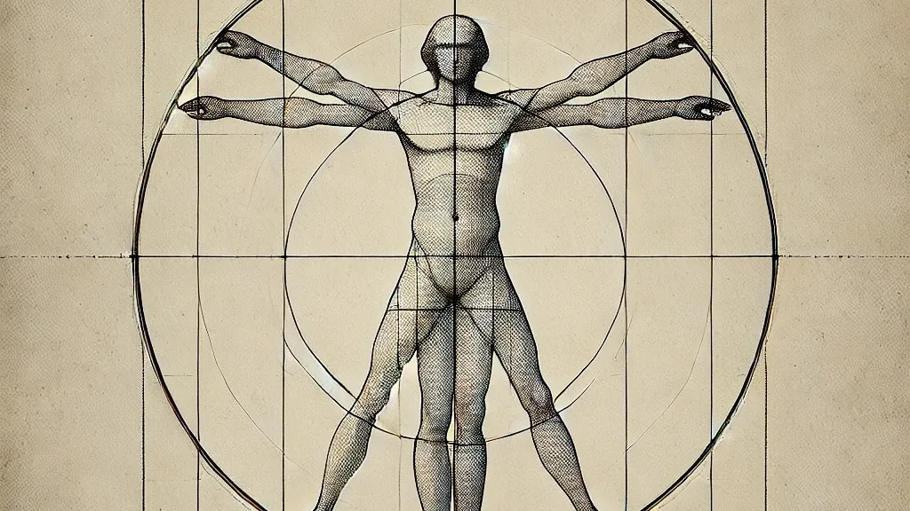

*Hombre de Vitruvio*

---

**I.** Toda amplificación presupone un dominio estable. Cuando el dominio es inestable, como el sentido, la amplificación deja de ser potencia y se vuelve distorsión.

**II.** Las máquinas que amplifican fuerza o energía no interpretan el mundo; las que amplifican símbolos simulan hacerlo. Esta diferencia no es cuantitativa, sino ontológica.

**III.** El error en los sistemas físicos es ruido; el error en los sistemas simbólicos es significado falso. Confundir ambos es una forma moderna de analfabetismo epistemológico.

**IV.** Una excavadora no es peligrosa por su potencia, sino por su indiferencia al contexto. La inteligencia artificial comparte esa indiferencia, pero opera en el plano del sentido.

**V.** No todo lo que puede acelerarse debería hacerlo. La lentitud no es una limitación del pensamiento humano, sino una de sus condiciones.

**VI.** La idea de que la inteligencia puede amplificarse como una señal eléctrica supone que el pensamiento es lineal, separable y formalizable. Ninguna de estas suposiciones ha sido demostrada.

**VII.** La inteligencia artificial no amplifica el pensamiento: amplifica la producción simbólica. Confundir producción con comprensión es el sesgo productivista de nuestra época.

**VIII.** Toda traducción es una interpretación situada. Delegarla a un sistema sin mundo es abdicar del conflicto que hace a la traducción significativa.

**IX.** La precisión extrema en dominios físicos fue posible gracias a teorías de control rigurosas. En el dominio del significado, dichas teorías no existen, pero se actúa como si existieran.

**X.** La historia técnica avanza integrando potencia y control; la historia reciente de la IA avanza integrando potencia y fe.

**XI.** Eliminar la fricción cognitiva, la duda, el error, el silencio, no libera al pensamiento: lo aplana.

**XII.** No estamos presenciando la amplificación de la inteligencia humana, sino la aparición de una prótesis semántica poderosa cuyo uso indiscriminado revela más sobre nuestros sesgos que sobre su supuesta inteligencia.

---

Publicado originalmente en [LinkedIn](https://www.linkedin.com/pulse/tesis-sobre-la-amplificaci%C3%B3n-inteligencia-y-el-error-benjamin-maggi-gz74f/).
