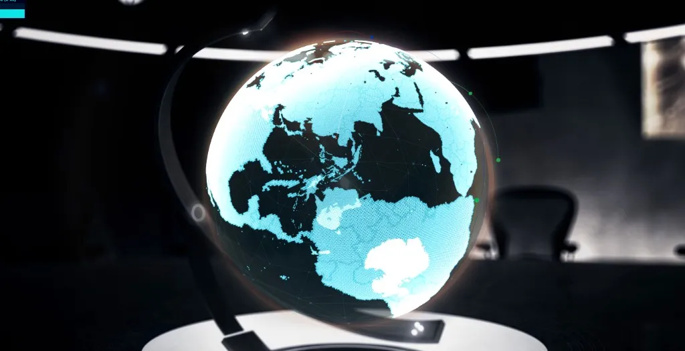

**Threat Globe · Globex**

---

At a cybersecurity firm years ago, we had the cliché that is also the truth: a **big screen with a spinning Earth** and colored lines showing hostile traffic. It was not cinema—it was how analysts **felt scale**. Your SIEM might say “47,000 events,” but a arc from Eastern Europe to a sensor in Virginia makes the same fact **spatial**. You stop counting rows and start seeing **geography**.

I never forgot that wall. Recently I rebuilt it as [**Globex**](https://github.com/maggiben/threat-globe)—a full-screen **3D threat globe** in the browser, live at [threat-globe.vercel.app](https://threat-globe.vercel.app/). Land masses are a TopoJSON point cloud; great-circle arcs animate from **real blocklisted IPs** toward fixed “sensor” cities. Drag to orbit. Right-drag to pan. The planet slowly rotates whether or not anyone is watching—which is exactly the point.

## See it live

Click inside the embed once so orbit controls capture the pointer. Demo arcs start immediately; the live pool swaps in after the server finishes geolocation (often **10–20 seconds** on first load).

<link rel="stylesheet" href="assets/demo/styles.css" />

<div class="blog-embed blog-embed--threat-globe">
  <iframe
    src="https://threat-globe.vercel.app/"
    title="Globex — live threat globe on Vercel"
    loading="lazy"
    allowfullscreen
  ></iframe>
</div>

<p><em>Blank embed or WebGL blocked? <a href="https://threat-globe.vercel.app/" target="_blank" rel="noopener noreferrer">Open the threat globe in a new tab</a>.</em></p>

**Tiling** still works if you ever span multiple displays—same query params as the older globex experiments:

```
https://threat-globe.vercel.app/?fullWidth=1920&fullHeight=1080&x=0&y=0
```

## What you are actually looking at

The visualization is honest about its limits—and I think that matters more than pretending we tapped a backbone.

| Layer | Source | What it means |
|-------|--------|----------------|
| **Globe geometry** | [world-atlas](https://github.com/topojson/world-atlas) 50m TopoJSON → ~150k land points on a sphere | Geography you can orbit, not a flat Mercator poster |
| **Arc sources** | Open blocklists: [Feodo Tracker](https://feodotracker.abuse.ch/), [Emerging Threats compromised IPs](https://rules.emergingthreats.net/blockrules/compromised-ips.txt), [FireHOL level1](https://github.com/firehol/blocklist-ipsets) | Known-bad IPv4 addresses, batch-geolocated via [ip-api.com](https://ip-api.com/docs/api:batch) |
| **Arc destinations** | Hard-coded `SENSOR_TARGETS` in the API handler | Chosen for **visual spread**, not because we own those honeypots |

So each arc is **not** a live packet capture between two real endpoints. It shows: *this IP was recently seen on abuse feeds* → *draw a plausible great-circle path toward a representative sensor city*. That is the right tradeoff for a **free, zero-auth demo** you can open in a tab. For production SOC walls you plug in **your** honeypot, GreyNoise, OTX, or TAXII feed and keep the same `{ sources, targets }` response shape.

Under the hood:

1. **`Main.js`** mounts `Globe` on the stage.
2. **`Maps.js`** rasterizes land and borders into a `THREE.Points` cloud.
3. **`AttackFeed.js`** polls `GET /api/attacks?mode=pool` every ~90s and spawns arcs (~4/sec, max 50 active).
4. **`attacks-handler.js`** (Vite dev middleware + Vercel serverless) builds and caches the geolocated pool.

Console tells the story: `Attack pool: demo arcs (starting) until live pool loads` → `Attack pool loaded: N sources (feodo:…, …)`.

## Why real-time attack maps still matter

Cybersecurity has become **ambient noise** for everyone who is not paid to read logs. Headlines mention “ransomware,” “state-sponsored,” or “zero-day,” but the **felt** risk stays abstract. A globe does one thing spreadsheets cannot: it turns abuse data into **motion and place**.

### For the general public

You do not need to understand STIX or Suricata rules to grasp **“machines in country A are probing sensors in country B, continuously.”** That picture supports healthier habits: patch your router, turn on MFA, treat weird emails as normal weather rather than personal drama. It also counters **security theater**—if the map is quiet while your inbox is not, you learn that **visibility is partial**. No consumer globe replaces endpoint protection; it teaches **humility about what you can see**.

### For government agencies

Nation-state activity is discussed in geopolitical terms, but defenders live in **flows**: scanners, botnets, credential stuffing, DDoS reflectors. Shared blocklists and community feeds are imperfect—biased toward what gets reported, blind to encrypted channels—but they are still **early weather**. Agencies use similar views for **situational awareness**, coordination with ISPs, and public communication when an incident has a clear geographic signature. The policy lesson is dual: invest in **sensor networks and responsible sharing**, and do not confuse a pretty arc with **attribution** (IPs lie, proxies abound).

### For companies

Inside a SOC, the wall map is a **shared heartbeat**. Junior analysts notice spikes; executives stopping by for a demo absorb that attacks are **ongoing**, not quarterly projects. The business takeaway is operational: **defense is a stream**, not a ticket closed in Q3. Maps pair well with runbooks—when Feodo-sourced arcs cluster, someone checks email gateways; when FireHOL lights up, firewall teams validate egress rules. The globe is the **ambient monitor**; the work is still in logs, EDR, and identity.

| Audience | What the map gives | What it does *not* replace |
|----------|-------------------|---------------------------|
| Public | Intuition, urgency, skepticism of “we’re fine” | Personal device hygiene, backups, MFA |
| Government | Shared picture, outreach, resource arguments | Legal attribution, classified sources |
| Enterprise | Culture, triage hints, exec education | SIEM rules, IR playbooks, patching |

## Digital archaeology—with AI as the trowel

This project is not greenfield. It is the latest life of **globex**, an older WebGL experiment I carried between jobs—same aesthetic lineage as [Rings](../rings-webgl-threejs-experiment/), which I later split out as a smaller scene. The archive had scars you only see when you reopen a repo after years:

- Legacy folders (`src/Rings`, `src/Charts`, old `server/index.js`) that **no longer boot** but still confuse imports.
- **macOS case-insensitivity** (`Globe` vs `globe`) that breaks clones on Linux and GitHub Actions until you `git mv` through a temp name.
- Dependencies and build tooling from another era—grunt-era habits, pre-Vite bundling assumptions, tween import paths that rotted.
- A photographic background that must **align pixel-perfect** with the WebGL sphere via `backgroundLayout.js`—fragile, magical, infuriating.

Reviving it in 2026 was **software archaeology**: read the strata, guess what still runs, patch forward without rewriting the soul. I used AI assistants the way you’d use a patient senior engineer who has read every migration guide—**not** to replace judgment, but to accelerate the tedious parts:

- Tracing which modules the active app actually imports vs. museum pieces.
- Migrating to **Vite 7**, wiring dev/preview middleware for `/api/attacks`, and matching **Vercel** serverless shape.
- Updating **Three.js** (r180), OrbitControls, and geography helpers (`d3`, `topojson-client`, `turf`) without flattening the point-cloud aesthetic.
- Documenting the attack API, blocklist ethics, and ip-api’s **non-commercial** license so the next me does not mis-deploy.

That last point matters: **AI did not invent the globe.** It helped me **excavate and stabilize** something I already built when the stack was younger. “Archaeology with AI” is not romantic—it is **diffs, tests, and shameless questions** about why `backgroundLayout.js` uses those constants. The [`webgl-smoke` test](https://github.com/maggiben/threat-globe) (Playwright + headless Chromium) exists because revived code deserves the same distrust as new code: fail if the framebuffer is black.

If you maintain old creative-tech repos, consider this permission slip: **you do not have to rewrite from scratch.** You have to separate live paths from fossils, fix casing, pin modern tooling, and add one smoke test so CI tells you when the dig collapsed.

## Stack (current)

| Layer | Choice |
|-------|--------|
| Build | Vite 7 |
| 3D | Three.js r180, `@tweenjs/tween.js` |
| Geography | d3 projection, topojson-client, turf |
| API | Vercel serverless (`api/attacks.js`, 60s max duration) |
| Data | Feodo, Emerging Threats, FireHOL → ip-api batch geolocation |
| Test | Playwright `npm run test:webgl` on port 3000 |

Clone and run locally:

```bash
git clone https://github.com/maggiben/threat-globe.git
cd threat-globe
npm install
npm run dev
# http://localhost:3000 — pool API at /api/attacks?mode=pool
```

Extend `buildSourcePool()` in `server/attacks-handler.js` if you have real honeypot telemetry—keep `{ sources, targets }` and `AttackFeed.js` stays untouched.

## Ethics and expectations

Open blocklists are a **community immune system**, not a court verdict. IPs change hands; Tor exits look malicious; commercial geolocation has terms. The README is explicit: ip-api’s free tier is **non-commercial**—use a paid GeoIP or self-hosted MMDB for production walls.

Use the globe to **teach and monitor**, not to **name and shame** individuals. Arc density rises with global scanning noise; a quiet map does not mean you are safe, and a loud map does not mean you are doomed.

## Closing thought

The cybersecurity wall map was always part theater, part instrument. Theater gets executives to fund patching; instruments get analysts to ask the next question. A browser tab cannot secure your network—but it can remind you that **the internet is an active place**, that abuse is continuous, and that the work of defense is still human even when the lines are drawn by code.

I am glad the old globe breathes again—and glad the shovel had help.

---

*Live demo: [threat-globe.vercel.app](https://threat-globe.vercel.app). Code: [github.com/maggiben/threat-globe](https://github.com/maggiben/threat-globe). Related: [Rings WebGL experiment](../rings-webgl-threejs-experiment/).*
