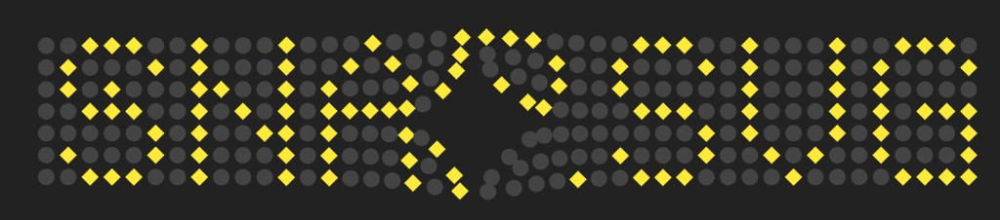

**UI experiments · 2013**

---

None of these pens was ever meant to ship as a product. They were **sketches**: a slider that pretends to be physical, a thermometer built from nested circles, a progress ring drawn thick enough to feel like metal, buttons that squish when you press them, a clock that lives inside an app icon, particles that spell your name in Snap.svg, and an iris made of springs that tear when they stretch too far.

Individually they are too small for a blog post. Together they tell a story about **how we explored UI in 2013**—before design systems, before React won the default stack, when **D3**, **Snap.svg**, **Canvas**, and **`-webkit-` everything** were the tools you reached for when you wanted an interface to feel *designed* rather than *assembled*.

Every pen below is embedded live—not screenshots. Dates are from CodePen’s own metadata; the aesthetics are unmistakably of their time. The tricks inside them are not.

## Playing the embeds

Each block is a **CodePen result preview** (`default-tab=result`): JavaScript runs, animations tick, and pointer events work **inside the iframe**.

1. **Click once inside the embed** before you drag, toggle, or type—otherwise the parent page keeps focus.
2. **Drag** the 3D budget slider handle; **click** the squishy toggles and the circular progress ring (resets the arc); **move the mouse** over Snap.svg physics and the iris canvas.
3. **Iris only:** with the canvas focused, press **↑** / **↓** to turn spring breakage on or off.
4. The **thermometer** is the exception—pure CSS, no controls; it is visual only.

If an embed is blank (network filter, privacy extension, or old mixed-content CDN), use **Open on CodePen** under that section—the pens are public and unchanged.

## The timeline

| When | Pen | Stack | What it explores |
|------|-----|-------|------------------|
| Jan 2013 | [3D budget slider](#1-3d-budget-slider-january-2013) | jQuery UI · CSS 3D | Fake depth on a range control |
| Jan 2013 | [CSS3 thermometer](#2-css3-thermometer-january-2013) | Pure CSS | Skeuomorphism without images |
| Mar 2013 | [Circular progress](#3-circular-progress-march-2013) | Canvas · CSS layers | Progress as a thick arc |
| Mar 2013 | [Squishy toggles](#4-squishy-toggle-buttons-march-2013) | Sass · Compass | Tactile press states |
| Nov 2013 | [Clock icon](#5-clock-icon-november-2013) | D3 v3 · SVG | Time inside a flat icon |
| Nov 2013 | [Snap.svg physics](#6-snapsvg-physics-november-2013) | Snap.svg · Traer.js | SVG driven by a particle engine |
| Nov 2013 | [Iris](#7-iris-november-2013) | Canvas 2D · Traer.js | Organic breakage from spring stress |

That arc—**January sketches in CSS and jQuery, November dives into SVG and physics**—matches how many of us learned: polish the chrome first, then ask what happens when the drawing itself moves.

## What we were optimizing for

In 2013 the browser *could* do surprising things, but not reliably. You prefixed properties, polyfilled `requestAnimationFrame`, and often chose **SVG or Canvas** when DOM layout was not enough. Libraries filled the gaps:

- **[D3 v3](https://d3js.org/)** — scales, arcs, and the data join; perfect for clocks, charts, and anything polar. (I later pushed that further in [hex scatterplots](/2026/hex-scatterplot-d3-hexbin-visualization/) and [punch cards](/2026/punch-card-d3-overtime-visualization/).)
- **[Snap.svg](https://snapsvg.io/)** — Adobe’s jQuery-flavored SVG layer; animate attributes and transforms without fighting the raw DOM.
- **[Traer Physics](http://traer.physics.cs.princeton.edu/)** — a tiny particle/spring engine that made “UI physics” approachable in the browser.

**CodePen** was the showroom. Zero build step, instant fork, comments from strangers who cared about `line-width` on a canvas arc. These pens lived there; this post brings them home.

---

## 1. 3D budget slider (January 2013)

Inspired by a [Dribbble budget-slider concept](https://dribbble.com/shots/435827-Concept-for-budget-price-slider) and an early [JSFiddle](http://jsfiddle.net/sutherland/dKhC9/), this pen asks: *what if a horizontal slider had a front face and a top face, like a bar of soap?*

The trick is **CSS 3D**, not WebGL: `#bar` sets `-webkit-perspective` and `preserve-3d`; `#top` rotates with `rotateX(70deg)` so the fill reads as both a front panel and a lid. **jQuery UI’s slider** drives `.background` width—one number, two surfaces updated in sync.

<link rel="stylesheet" href="assets/demo/styles.css" />

  <iframe
    height="480"
    style="width: 100%;"
    scrolling="no"
    title="3D budget slider"
    src="https://codepen.io/maggiben/embed/DEVELy?default-tab=result&height=480"
    frameborder="no"
    loading="eager"
    allowtransparency="true"
    allow="accelerometer; camera; encrypted-media; geolocation; gyroscope; microphone; midi; clipboard-read; clipboard-write"
  >
    See the Pen <a href="https://codepen.io/maggiben/pen/DEVELy">3D budget slider</a> by Benjamin (<a href="https://codepen.io/maggiben">@maggiben</a>) on <a href="https://codepen.io">CodePen</a>.
  </iframe>

<em>Interact: drag the slider below the 3D bar. Blank iframe? <a href="https://codepen.io/maggiben/pen/DEVELy" target="_blank" rel="noopener noreferrer">Open on CodePen</a>.</em>

Today you might reach for CSS `transform-style: preserve-3d` without prefixes, or skip 3D entirely and use a single track with a gradient. The lesson remains: **bind one logical value (budget %) to multiple visual layers** and the control feels physical.

---

## 2. CSS3 thermometer (January 2013)

A pure-CSS thermometer by [Daniel Stancu](https://birkof.ro) (© 2013), forked on my pen as a study in **nested rings**: `.de` → `.den` → `.dene` → `.deneme`, each a `border-radius: 100%` shell with inset shadows and gradients. No SVG, no canvas—only stacked circles and typography (`Dosis`) for the degree readout.

  <iframe
    height="400"
    style="width: 100%;"
    scrolling="no"
    title="CSS3 Thermometer"
    src="https://codepen.io/maggiben/embed/kMaVXW?default-tab=result&height=400"
    frameborder="no"
    loading="lazy"
    allowtransparency="true"
    allow="accelerometer; camera; encrypted-media; geolocation; gyroscope; microphone; midi; clipboard-read; clipboard-write"
  >
    See the Pen <a href="https://codepen.io/maggiben/pen/kMaVXW">CSS3 Thermometer</a> on <a href="https://codepen.io">CodePen</a>.
  </iframe>

<em>Display only (no controls)—CSS rings and gradients. <a href="https://codepen.io/maggiben/pen/kMaVXW" target="_blank" rel="noopener noreferrer">Open on CodePen</a>.</em>

Before CSS could do conic gradients cleanly, **fake depth with box-shadow and linear-gradient** was the craft. Flat design later made this look “old”; as a exercise in restraint and layering, it is still excellent.

---

## 3. Circular progress (March 2013)

I wanted a **circular progress meter** without fighting pure CSS arcs (this was the pre-`conic-gradient` era). The solution stacks **DOM rings** for the bezel and a **Canvas 2D** arc for the fill: `context.arc` with a huge `lineWidth` so the stroke reads as an annulus, animated on a `setInterval` loop. Click anywhere to reset—crude but satisfying.

  <iframe
    height="560"
    style="width: 100%;"
    scrolling="no"
    title="Circular progress"
    src="https://codepen.io/maggiben/embed/AGZqeO?default-tab=result&height=560"
    frameborder="no"
    loading="lazy"
    allowtransparency="true"
    allow="accelerometer; camera; encrypted-media; geolocation; gyroscope; microphone; midi; clipboard-read; clipboard-write"
  >
    See the Pen <a href="https://codepen.io/maggiben/pen/AGZqeO">Circular progress</a> on <a href="https://codepen.io">CodePen</a>.
  </iframe>

<em>Interact: click anywhere in the embed to reset the arc after it fills. <a href="https://codepen.io/maggiben/pen/AGZqeO" target="_blank" rel="noopener noreferrer">Open on CodePen</a>.</em>

The pattern—**HTML/CSS chrome + canvas for the hard part**—still appears in dashboards. Modern SVG `stroke-dasharray` or a single conic-gradient often replaces the canvas layer; the split of concerns does not.

---

## 4. Squishy toggle buttons (March 2013)

Inspired by elastomer-style button concepts on Dribbble, these toggles are **Sass + Compass** all the way down: nested `box-shadow` stacks, `:active` and `:checked` siblings (`~ .button`, `~ .label`), and a hidden checkbox as the only input. Press and the disc **compresses**; release and the shadows read as height again.

  <iframe
    height="420"
    style="width: 100%;"
    scrolling="no"
    title="Squishy Toggle Buttons"
    src="https://codepen.io/maggiben/embed/DZWpVB?default-tab=result&height=420"
    frameborder="no"
    loading="lazy"
    allowtransparency="true"
    allow="accelerometer; camera; encrypted-media; geolocation; gyroscope; microphone; midi; clipboard-read; clipboard-write"
  >
    See the Pen <a href="https://codepen.io/maggiben/pen/DZWpVB">Squishy Toggle Buttons</a> on <a href="https://codepen.io">CodePen</a>.
  </iframe>

<em>Interact: click each disc to toggle (+ / − / %). <a href="https://codepen.io/maggiben/pen/DZWpVB" target="_blank" rel="noopener noreferrer">Open on CodePen</a>.</em>

No JavaScript. That was the flex: **stateful UI from CSS alone**. Design systems today ship `<Switch>`; this pen reminds you that **micro-interaction is often shadow math**, not framework choice.

---

## 5. Clock icon (November 2013)

A **live clock inside a rounded square icon**—the kind of detail you’d expect in iOS 6-era UI. **D3 v3** maps wall time to angles with linear scales (`domain` in minutes/seconds, `range` in `[0, 2π]`), then draws three hands with `d3.svg.arc()`—each arc’s `startAngle` and `endAngle` pinned to the same value so the “hand” is a wedge from center to rim. `setInterval` re-renders every second.

  <iframe
    height="340"
    style="width: 100%;"
    scrolling="no"
    title="Clock Icon"
    src="https://codepen.io/maggiben/embed/nPdYEb?default-tab=result&height=340"
    frameborder="no"
    loading="lazy"
    allowtransparency="true"
    allow="accelerometer; camera; encrypted-media; geolocation; gyroscope; microphone; midi; clipboard-read; clipboard-write"
  >
    See the Pen <a href="https://codepen.io/maggiben/pen/nPdYEb">Clock Icon</a> on <a href="https://codepen.io">CodePen</a>.
  </iframe>

<em>Runs live—hands update every second (no input needed). <a href="https://codepen.io/maggiben/pen/nPdYEb" target="_blank" rel="noopener noreferrer">Open on CodePen</a>.</em>

Same D3 mindset as the [event-density calendar](/2026/calendar-event-density-time-widget/) and punch-card work: **time → angle → shape**. Here the data are just `new Date()` fields, not event logs—but the pipeline is identical.

---

## 6. Snap.svg physics (November 2013)

**Snap.svg** drives the visuals; **Traer.js** drives the motion. Particles sit on a grid defined by a bitmap map (`PARTICLE_MAP`); each particle is anchored with springs and repelled from a fixed mouse particle. Circles and squares are Snap elements (`stage.circle`, `stage.rect`) updated every frame via `Snap.Matrix` for rotation.

The pen spells patterns in yellow particles when you move the cursor—closer particles grow and fade in. It was my most-loved experiment of the batch (68 hearts on CodePen at last count), and it cemented the idea that **SVG is a scene graph you animate**, not a static export from Illustrator.

  <iframe
    height="520"
    style="width: 100%;"
    scrolling="no"
    title="Snap.svg Physics"
    src="https://codepen.io/maggiben/embed/AmzLpj?default-tab=result&height=520"
    frameborder="no"
    loading="lazy"
    allowtransparency="true"
    allow="accelerometer; camera; encrypted-media; geolocation; gyroscope; microphone; midi; clipboard-read; clipboard-write"
  >
    See the Pen <a href="https://codepen.io/maggiben/pen/AmzLpj">Snap.svg Physics</a> on <a href="https://codepen.io">CodePen</a>.
  </iframe>

<em>Interact: click inside, then move the mouse—the particle grid repels and highlights. <a href="https://codepen.io/maggiben/pen/AmzLpj" target="_blank" rel="noopener noreferrer">Open on CodePen</a>.</em>

Snap.svg is quiet today; the architecture—**physics in JS, presentation in SVG**—survives in React + Framer Motion, Rive, and Lottie. Separate simulation from drawing and you can swap renderers without rewriting the model.

---

## 7. Iris (November 2013)

The iris is **Canvas 2D + Traer**, not Snap: a 2D lattice of particles on concentric rings, connected by radial and circumferential springs. Each frame, the simulation ticks; white lines draw the fibres. When a spring stretches past a threshold, `removeSprings` culls the most stressed links—**gaps open in the mesh** like cracks in a biological iris. Arrow keys toggle whether breakage runs.

  <iframe
    height="520"
    style="width: 100%;"
    scrolling="no"
    title="Iris"
    src="https://codepen.io/maggiben/embed/DmzQzw?default-tab=result&height=520"
    frameborder="no"
    loading="lazy"
    allowtransparency="true"
    allow="accelerometer; camera; encrypted-media; geolocation; gyroscope; microphone; midi; clipboard-read; clipboard-write"
  >
    See the Pen <a href="https://codepen.io/maggiben/pen/DmzQzw">Iris</a> on <a href="https://codepen.io">CodePen</a>.
  </iframe>

<em>Interact: click the canvas, then ↑/↓ toggles spring breakage; animation runs continuously. <a href="https://codepen.io/maggiben/pen/DmzQzw" target="_blank" rel="noopener noreferrer">Open on CodePen</a>.</em>

This is the odd one out: no D3, no Snap—just **rules that feel organic**. It pairs naturally with the Snap physics pen: one renders with SVG primitives, one with line segments, both trust the same physics library.

---

## What aged—and what did not

**Aged:** vendor prefixes, `-webkit-gradient`, jQuery UI for a slider, CoffeeScript-flavored D3 pens, global `d3` on a CDN, skeuomorphic shadows that read as 2011–2013 Dribbble.

**Still sharp:**

- **One source of truth per control** (slider value → two faces; time → three arcs).
- **Layered visuals** (CSS rings, DOM bezels, canvas cores).
- **Simulation separated from drawing** (Traer + Snap or Traer + Canvas).
- **Stateful micro-interaction without JS** where CSS can carry it.

If you are building interfaces in 2026, you will not copy these files into production. You might still copy the **questions**: How does this control lie to the eye? Where does math replace bitmaps? What breaks if we let physics run?

## Try them yourself

| Pen | Link |
|-----|------|
| 3D budget slider | [codepen.io/maggiben/pen/DEVELy](https://codepen.io/maggiben/pen/DEVELy) |
| CSS3 thermometer | [codepen.io/maggiben/pen/kMaVXW](https://codepen.io/maggiben/pen/kMaVXW) |
| Circular progress | [codepen.io/maggiben/pen/AGZqeO](https://codepen.io/maggiben/pen/AGZqeO) |
| Squishy toggles | [codepen.io/maggiben/pen/DZWpVB](https://codepen.io/maggiben/pen/DZWpVB) |
| Clock icon | [codepen.io/maggiben/pen/nPdYEb](https://codepen.io/maggiben/pen/nPdYEb) |
| Snap.svg physics | [codepen.io/maggiben/pen/AmzLpj](https://codepen.io/maggiben/pen/AmzLpj) |
| Iris | [codepen.io/maggiben/pen/DmzQzw](https://codepen.io/maggiben/pen/DmzQzw) |

Fork any of them. Break the springs. Replace D3 v3 with modules. Swap Traer for Matter.js. The gallery is not a museum—it is a **notebook page** from a year when the web UI was still something you could invent on a lunch break.

---

*All pens: [@maggiben on CodePen](https://codepen.io/maggiben). Thermometer concept: Daniel Stancu. Physics: [Traer](http://traer.physics.cs.princeton.edu/). Snap.svg: Adobe.*
