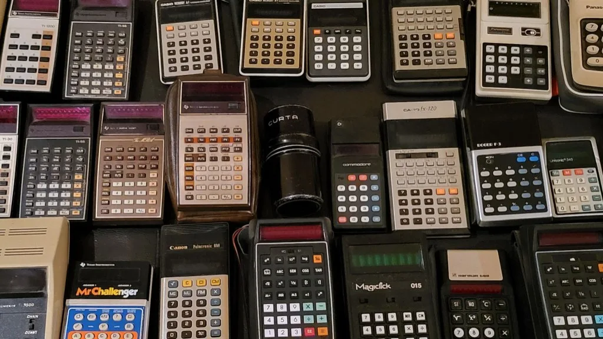

**Calculators**

---

There is a particular smell to old electronics: warm plastic, faint ozone from a display that hasn't slept in forty years, and the quiet arrogance of a device that thinks **2 + 2** is the most important problem in the universe.

This table is my answer to that smell. Roughly thirty calculators—mechanical, LED, VFD, early LCD—laid out like a timeline you can pick up with both hands. No app store. No subscription. Just buttons, digits, and the story of how humanity outsourced arithmetic to things that fit in a shirt pocket.

## The pepper grinder that could do calculus (sort of)

Dead center sits the outlier: a **Curta**.

Black, cylindrical, covered in little sliders and a crank on top. Nicknamed the *math grenade* or *pepper grinder*, it is the last great mechanical calculator—a masterpiece of gears and levers invented by **Curt Herzstark** in a Nazi concentration camp, refined after the war, and sold until the early 1970s. No batteries. No display. You **crank** and the digits advance with a satisfying mechanical certainty that silicon still hasn't quite replicated.

Everything else on this table is electronic. The Curta is the ancestor they all politely nod to before glowing green.

## When numbers learned to glow red

The **Texas Instruments** cluster in this photo is basically a museum of the **LED era** (roughly 1972–1978):

| Model (in the collection) | Why it matters |
|---------------------------|----------------|
| **TI-1200** | Cheap, cheerful, four-function—calculators for everyone, not just engineers |
| **TI-55** | Scientific pocket power; red digits that drank batteries like espresso |
| **TI-58 / TI-59** | Programmable beasts; the **59** in its leather case is the crown jewel—magnetic cards, serious keys, "I have homework and a personality" energy |
| **Mr. Challenger** | TI's playful side: a children's math toy dressed as a calculator, because the 70s believed learning should beep |

TI didn't just sell calculators—they **collapsed prices** and triggered the **Calculator Wars** of the mid-70s: pocket devices went from hundreds of dollars to under $20 in a few years. Engineers cheered. Slide-rule companies filed for emotional damages.

Red LED displays were gorgeous and terrible: bright in the dark, nearly invisible in sunlight, and always hungry for AA batteries. You learned to cup your hand over the display like you were telling a secret.

## The green glow: Casio, Canon, and the VFD dynasty

Pan to the **Casio** and **Canon** units and the palette shifts from red to **electric green**.

That's the **vacuum fluorescent display (VFD)**—a tiny neon-ish tube behind digits that look like they belong on a spaceship console. Casio leaned into it hard: models like the **fx-120** and **Memory A-1** feel like they were designed by someone who watched *2001* once and decided banking should feel futuristic.

The **Canon Palmtronic 8M** with its cheerful blue, yellow, and white keys is peak "we put a computer in your pocket, please don't drop it." **Magiclick 015** leans into the same vibe—big green readout, chunky keys, the aesthetic that said *portable* before *portable* meant *thinner than your wallet*.

VFDs burned less power than LEDs and looked cooler. They also broke hearts when LCDs arrived and didn't need to glow at all.

## Everyone else in the pile

A collection this dense is a **brand map of the 70s**:

- **Commodore** — yes, *that* Commodore, before the C64: sober black case, colorful function keys, proof that everyone wanted a piece of the pocket-math gold rush
- **Panasonic** — white, chunky, reliable in the way consumer electronics pretended to be eternal
- **Unisonic 940** — one of a thousand respectable also-rans in an industry exploding faster than anyone could trademark a name
- **Rockwell** — aerospace pedigree, calculator division; because if you can land on the Moon, you can surely sell a four-function box

Each one is a slightly different bet on the same question: *How many keys can we fit before the human thumb files a complaint?*

## Three displays, one revolution

If you squint at the photo, you're watching display technology race itself:

```text
Mechanical digits (Curta)
        ↓
Red LED — power-hungry, romantic, doomed
        ↓
Green VFD — brighter, cooler, still a little thirsty
        ↓
Gray LCD — boring, victorious, still here
```

The **Curta** computes with metal. The **TI-55** lights up red filaments. The **Casio** line glows green plasma. Later slim models in the pile whisper with **liquid crystal**—no halo in a dark room, but batteries that last long enough to forget where you put them.

That progression isn't trivia. It's the same arc as watches, radios, and laptops: **visibility vs efficiency**, until efficiency wins and we miss the glow.

## Why collect these at all?

Phones do math better, faster, and with spell-check.

But a phone doesn't have **tactile guilt** when you press `=` wrong. It doesn't have a leather case that smells like someone's engineering school years. It won't sit on a shelf and silently argue that **1974** was a peak aesthetic year.

I collect these because they're **finished objects**—designed, manufactured, sold, and abandoned on a known schedule. No firmware update will add a subscription. No cloud will delete your memories of compound interest. The TI-59 doesn't ping you at 2 a.m. asking for a rating.

They're also humble. Every one of them solved the same ancient human problem—*I don't want to do this arithmetic in my head*—with whatever chips and displays the decade could afford. The Curta did it with precision machining. The TI-59 did it with a program store. The TI-1200 did it with optimism and six AAA cells.

## If you're starting a shelf of your own

You don't need thirty. You need **three eras**:

1. **One mechanical or early electronic oddity** — Curta if you're brave; any 60s desktop is a lesson in scale
2. **One red LED scientific** — TI-50-something territory; buy spare batteries
3. **One green VFD Casio or Canon** — turn off the lights, accept the grin

Check for **battery corrosion** before you fall in love. Respect the **key feel**—some membranes are dead and can't be resurrected with nostalgia. And read the model number: the Calculator Wars produced a hundred variants with names that sound like droids.

## Conclusion

This table isn't really about arithmetic. It's about a twenty-year window when **computation left the desk**, visited the pocket, and learned to glow.

The Curta cranks. The TI-59 waits in its case like a briefcase from the future. The Casios still look like they could dock with a station. And somewhere in the pile, a Mr. Challenger is still daring a child to beat it at multiplication.

We live in the age of apps now. But for a while, math had buttons—and some of us still like pressing them.
